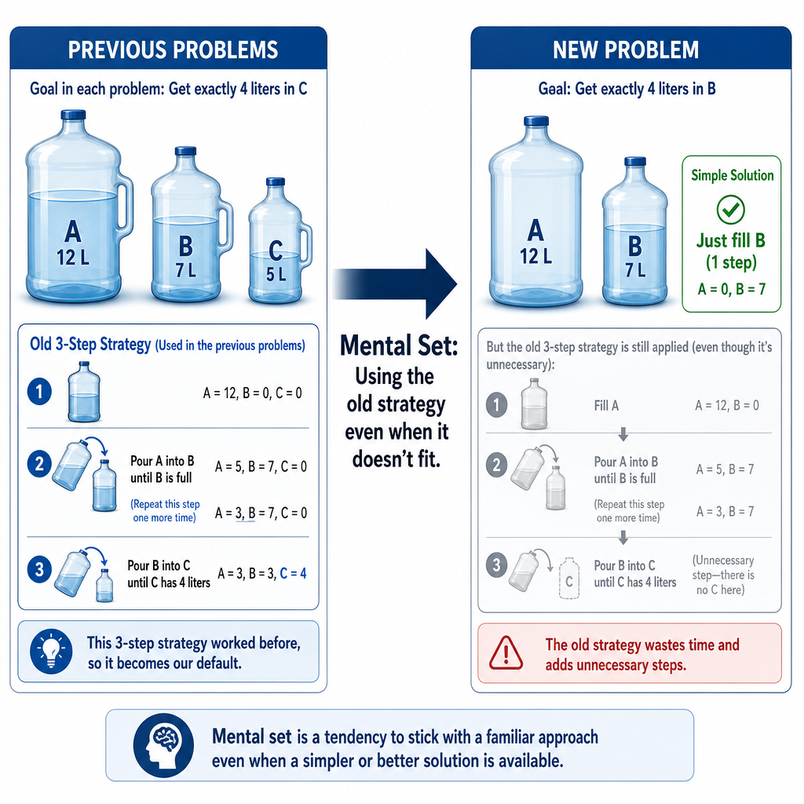
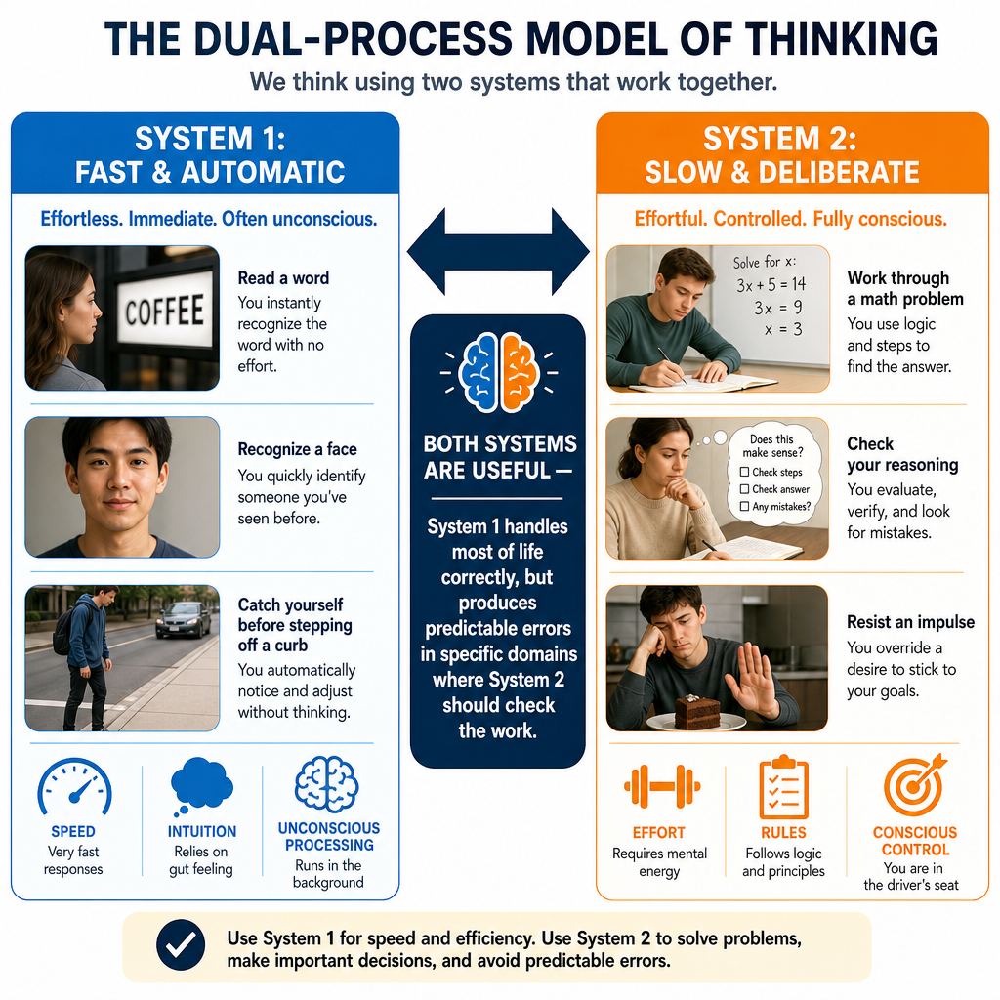
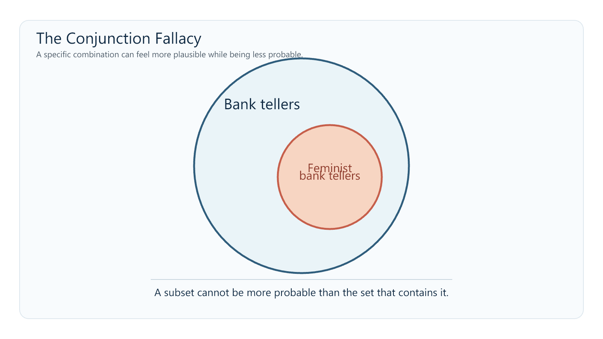
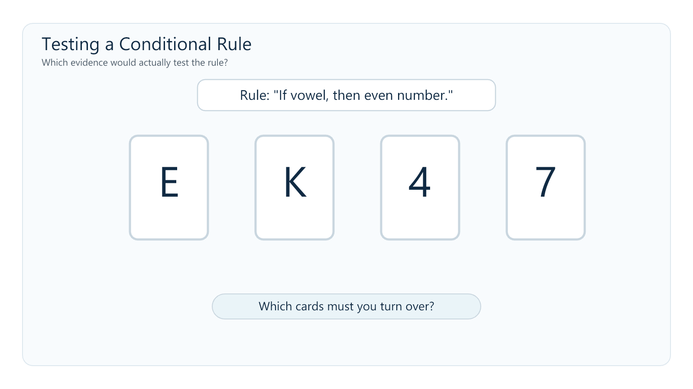
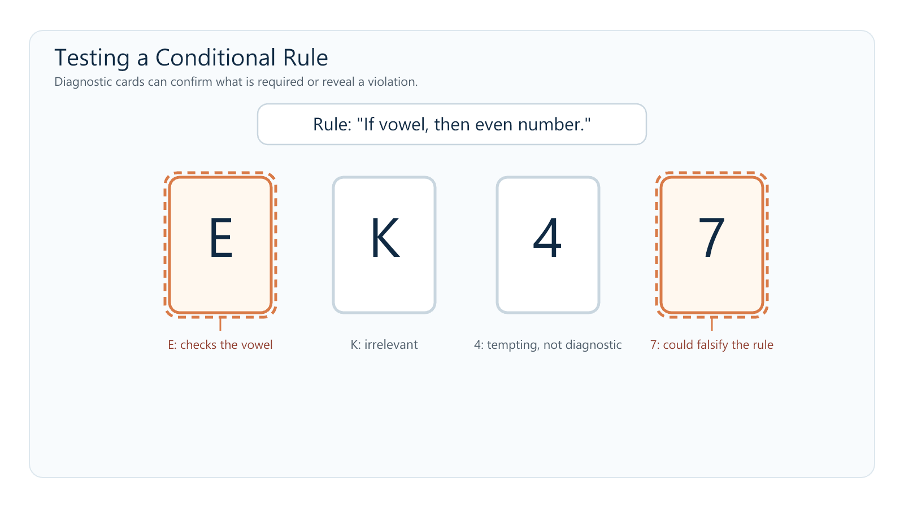

# Chapter 9: Thinking, Language & Intelligence

> Canonical revised source. The pre-revision chapter is preserved in `_archive/ch09-thinking-language-intelligence.md`; drafting history and provenance are in `_provenance/ch09-thinking-language-intelligence.md`.

---

## Misconception Opener: Do You Trust Your Own Thinking?

You likely believe you are a fairly rational person. You pay attention to evidence, consider the facts, and think decisions through. Most people believe this about themselves—and most people are wrong in a specific, measurable way.

Human reasoning is not usually a slow, impartial weighing of every relevant fact. It is often fast, pattern-based, and shaped by shortcuts that serve us well but sometimes lead us astray. We overestimate events that come easily to mind. We judge a description by how well it fits a familiar type rather than by the relevant probabilities. We remain influenced by the first number we hear, even when it should be irrelevant. Most of the time, none of this feels like taking a shortcut. It just feels like thinking.

This is not a character flaw. A limited cognitive system cannot analyze every possibility from scratch. It must use prior experience to make quick, good-enough judgments under uncertainty. As you work through this chapter, try to catch yourself using the very shortcuts we discuss. It is harder than it sounds.

**Stop and Predict:** Without looking anything up, write down your answer: are there more English words that begin with *k*, or more English words that have *k* as the third letter? Also write one sentence explaining how you made the judgment. You will return to this after reading Section 2.

---

## Where This Fits

**Why is one good concept worth more than a hundred memorized facts?** Chapter 8 explored how memory encodes, stores, and reconstructs experience. This chapter asks what happens when we use what memory has retained: we form concepts, solve problems, make judgments, communicate, and attempt to measure cognitive performance.

The connection is constraint. Working memory can hold only a small amount at once, and long-term memory does not preserve every episode as a complete recording. The mind therefore extracts useful regularities from experience. Throughout this chapter, **compression is a learning metaphor for that process, not a claim that concepts, language, and intelligence all share one literal cognitive mechanism**. The metaphor ties this chapter to the limited system developed across the book: cognition works by retaining enough structure to guide the next judgment while leaving much of the original detail behind.

Language belongs here because it is both a cognitive tool and the medium through which much of what we know was acquired. Intelligence follows because intelligence tests sample several of the abilities involved in learning, reasoning, and adapting to new problems.

**Connections to other chapters:** Working memory (Ch. 8) is the active workspace for reasoning and problem-solving. Attention and perception (Ch. 4) shape what information enters a judgment in the first place. Learning (Ch. 7) changes the expectations and strategies we bring to later problems. Development (Ch. 10) changes concepts, language, and cognitive performance across the lifespan. Social cognition (Ch. 11) applies many of the same judgment processes to people and groups.

---

## Learning Objectives

By the end of this chapter, you should be able to:

1. **Distinguish** concepts, prototypes, and exemplars, and explain how category structure supports generalization.
2. **Contrast** algorithms and heuristics and explain how mental set, functional fixedness, and insight affect problem solving.
3. **Use** the System 1/System 2 framework to compare availability, representativeness, confirmation bias, framing, and anchoring without assuming that they all arise from one mechanism.
4. **Describe** the structure of language and explain why language acquisition is best understood through biological preparedness, statistical learning, and social experience rather than any one factor alone.
5. **Distinguish** linguistic determinism from weaker forms of linguistic relativity and evaluate the strength of different examples.
6. **Compare** *g*, fluid and crystallized intelligence, Gardner's and Sternberg's proposals, and explain how standardization, reliability, validity, and the Flynn Effect constrain the interpretation of IQ scores.

---

## Section 1: Concepts, Categories, and Problem Solving

### Concepts, Prototypes, and Exemplars

Your brain does not treat every experience as an isolated event. It organizes knowledge into **concepts**—mental categories that group objects, events, or ideas. Concepts let you recognize a dog you have never seen before without consciously checking a complete list of features.

Many natural concepts are organized around a **prototype**, the most typical or representative member of a category. When you hear “bird,” you may picture something like a robin or sparrow rather than a penguin or ostrich—even though all are birds. New cases can feel more or less category-like depending on how closely they resemble that prototype (Rosch, 1975).

People also use **exemplars**: specific remembered members of a category. An unusual dog may be classified by comparison with one particular dog you have encountered rather than with an abstract average. Prototype and exemplar accounts are not mutually exclusive. Which information matters depends on the category, the task, and your experience.

Concepts can also be organized hierarchically. “Animal” is a **superordinate** category, “dog” is a **basic-level** category, and “golden retriever” is a **subordinate** category. The basic level is often the default in everyday naming: specific enough to guide action, but broad enough to generalize.

*Figure 9.1. Categories can be organized from broad superordinate groups to everyday basic-level names and more specific subordinate groups. The basic level is often the everyday naming default. Original figure.*

The compression metaphor helps connect these ideas to Chapter 8. Repeated encounters leave behind regularities: what usually predicts category membership, which examples are typical, and where one category sits relative to others. “Apple” becomes connected with fruit, food, sweetness, trees, seeds, pie, and many specific episodes. The resulting concept is useful because it preserves structure across experiences. It can also mislead because whatever was common enough to shape the representation may be a poor guide to an unusual case.

*Figure 9.2. From specific episodic encounters to general semantic knowledge. The “average dog” is a teaching shorthand, not a claim that every concept is stored as one literal prototype. Original figure.*

Huth and colleagues (2016) found that related meanings produce organized patterns across broad regions of cortex. This supports a relational model of semantic representation, not the claim that concepts are stored as literal coordinates.

Concepts also change with development and expertise. **Assimilation** uses an existing concept to interpret a new case; **accommodation** changes the concept when the case does not fit. Repeated prediction errors sharpen a toddler's overextended “doggie” category, while expertise creates distinctions that novices compress together.

> **Worked Example: How the Concept of Reinforcement Changes**
> Many students begin Chapter 7 with a crude prototype: reinforcement means reward, and rewards feel good. That model handles obvious cases until it meets *negative reinforcement*, which removes something unpleasant rather than adding something pleasant. The old prototype misclassifies the case. The concept must be rebuilt around the defining relation: a reinforcer is a consequence that makes a behavior more likely to recur. Once the concept is organized around behavior change rather than pleasantness, it can classify cases the student has never memorized.

### Algorithms and Heuristics

Problems can be approached with procedures that emphasize certainty or with shortcuts that emphasize speed.

An **algorithm** is a step-by-step procedure that produces the correct result when the procedure applies and is followed correctly. Long division is an algorithm. Systematically testing every possible combination can also be algorithmic. The advantage is reliability; the disadvantage is that exhaustive procedures can be slow, cognitively expensive, or impossible when the problem is poorly defined.

A **heuristic** is a shortcut or rule of thumb that often produces a useful answer without guaranteeing the best one. “Start with the most likely diagnosis” is a heuristic. “If it looks like a duck and quacks like a duck, treat it as a duck” is a heuristic for category assignment. Heuristics are not failed algorithms. They are often the only practical way for a limited system to act in time.

The compression metaphor again helps: a heuristic retains a relationship that has predicted well often enough to become useful, while ignoring some of the detail. That trade-off explains both its efficiency and its characteristic errors.

### Problem Solving: Strategies and Obstacles

Problem solving often depends on how the problem is represented. You might work forward from the current state, backward from the goal, or reduce the largest gap between them through **means-ends analysis**. The wrong representation creates the wrong search space, no matter how hard you search within it.

A **mental set** is the tendency to use a strategy that worked before even when a new problem permits a better one. In Luchins' (1942) water-jar studies, people first solved several problems with the same multi-step formula. Many then applied that formula to a later problem that could be solved in one simple step. Prior success had made the old strategy easier to retrieve than the new structure was to see.

*Figure 9.3. Mental set demonstrated with Luchins' (1942) water-jar problems. Original figure.*

**Functional fixedness** is a related failure to see an object outside its conventional use. In Duncker's (1945) candle problem, participants receive a candle, matches, and a box of thumbtacks and must mount the candle on a wall without dripping wax on the table. The solution is to empty the box, tack it to the wall, and use it as a platform. The difficult step is not finding a hidden object. It is seeing the box as something other than a container.

*Figure 9.4. Functional fixedness demonstrated with Duncker's candle problem. Original figure.*

**Insight** is a sudden shift in representation—the “aha” moment when the box becomes a shelf or two previously separate pieces of information combine into a solution. Insight can feel instantaneous, but the important change is in how the problem is organized, not in the sudden appearance of information that was never there (Jung-Beeman et al., 2004).

**Stop and Retrieve:** How are mental set and functional fixedness similar? What changes at the moment of insight?

---

## Section 2: Heuristics, Biases, and the Two-Mode View

### System 1 and System 2

One influential framework distinguishes two broad processing modes (Kahneman, 2011). **System 1** is fast, automatic, associative, and often outside awareness. **System 2** is slower, deliberate, attention-demanding, and capable of following explicit rules. Both are constrained by the information available to them.

These labels are summaries, not two literal brain structures or a complete theory of judgment. Different automatic processes can produce different errors, and deliberate thought does not guarantee a correct conclusion.

> **Do Not Confuse: System 1 ≠ Irrational; System 2 ≠ Rational**
> System 1 is fast and associative, not inherently defective. It recognizes a friend's face, reads a familiar word, and detects many patterns accurately. System 2 is slow and deliberate, but it can rationalize a preferred conclusion or apply the wrong rule with great care. Treat the distinction as two processing modes, not as a good system fighting a bad one.

*Figure 9.5. The System 1/System 2 framework as a distinction between processing modes. Original figure.*

### The Availability Heuristic

When estimating how frequent or probable something is, people often use the ease with which examples come to mind. This is the **availability heuristic** (Tversky & Kahneman, 1973).

Availability often works because common events usually are easier to recall. But ease of recall is also affected by vividness, recency, media coverage, and personal relevance. A dramatic event may be mentally available even when it is rare. A common but uneventful risk may be difficult to picture and therefore underestimated.

**Return to your prediction from the opener.** Most people report that English has more words beginning with *k* than words with *k* in the third position. In fact, the third-position words are more common. Words beginning with *k*—*king, key, kite*—are easier to search for because dictionaries and memory organize words strongly by their initial sound. Ease of retrieval is mistaken for frequency (Tversky & Kahneman, 1973).

### The Representativeness Heuristic

When judging whether something belongs to a category, people often rely on how closely it resembles the category prototype while neglecting base rates or set relations. This is the **representativeness heuristic** (Tversky & Kahneman, 1974).

The best-known demonstration is the Linda problem:

> *Linda is 31 years old, single, outspoken, and very bright. She majored in philosophy. As a student, she was deeply concerned with discrimination and social justice and participated in anti-nuclear demonstrations.*
>
> *Which is more probable?*
>
> *A. Linda is a bank teller.*
>
> *B. Linda is a bank teller and is active in the feminist movement.*

Many participants choose B. The description makes “feminist” feel representative of Linda. But every feminist bank teller is also a bank teller, so the conjunction can never be more probable than the larger category that contains it. This is the **conjunction fallacy** (Tversky & Kahneman, 1983).

*Figure 9.6. The conjunction fallacy shown as a nested-set relationship. Original figure.*

> **Classic Study Walkthrough: The Linda Problem**
> Participants ranked “bank teller and feminist” above “bank teller” because the conjunction better matched Linda's description. Frequency and diagrammatic formats often reduce the error (Gigerenzer, 1991), showing that reasoning depends partly on how a problem is represented.

### Confirmation Bias and Testing a Rule

**Confirmation bias** is the tendency to seek, interpret, or remember evidence in ways that favor an existing belief. Once an explanation feels plausible, supportive cases attract attention and contradictory cases become easier to dismiss.

Wason's (1968) selection task shows how difficult it can be to test a rule by searching for what would prove it false. Four cards display E, K, 4, and 7. Each has a letter on one side and a number on the other. The rule is: “If a card has a vowel on one side, it must have an even number on the other.” Which cards must be turned over to test the rule?

*Figure 9.7. The Wason selection task. Original figure.*

E must be checked: an odd number behind it would violate the rule. The 7 must also be checked: a vowel behind it would violate the rule. The 4 is tempting, but an even number is allowed to have either a vowel or consonant behind it. The rule says “if vowel, then even,” not “if and only if vowel, then even.”

*Figure 9.8. The diagnostic cards in the Wason selection task. Original figure.*

The task is often taught as confirmation bias because people choose a card that could support the rule and omit one that could falsify it. That interpretation is useful but incomplete: wording, content, and simple matching also affect performance. The task shows difficulty identifying diagnostic evidence, not one pure mechanism (Klayman & Ha, 1987).

### The Framing Effect

A **framing effect** occurs when equivalent outcomes produce different choices because they are described from different reference points. In Tversky and Kahneman's (1981) Asian disease problem, people tended to prefer a certain option when outcomes were described as lives saved but preferred a gamble when the same outcomes were described as deaths. The probabilities were equivalent; the gain-versus-loss frame changed the decision.

Framing matters in medical decisions when survival rates and mortality rates describe the same outcome. It matters in public communication when the same change is presented as a gain, a loss, or an opportunity forgone. Framing should not be confused with every effect of presentation. For example, organ-donation differences between opt-in and opt-out systems primarily demonstrate the power of defaults and the status quo, not the gain/loss framing effect.

### Anchoring

When making a numerical estimate, people remain influenced by an initial value, even when it is arbitrary. This is **anchoring**. In Tversky and Kahneman's (1974) classic demonstration, participants watched a wheel of fortune land on a number and then estimated the percentage of United Nations members that were African nations. Higher arbitrary numbers produced higher estimates.

Anchoring appears in negotiations, pricing, diagnosis, and everyday estimation. The first value does not mechanically determine the final answer, but adjustment away from it is often incomplete.

### Different Shortcuts, Related Vulnerabilities

The biases in this section do not require one common mechanism. Each gives the limited system a different way to simplify a judgment.

| Judgment pattern | What becomes easy to use | What may be neglected |
|---|---|---|
| Availability | An example that comes to mind | Actual frequency or probability |
| Representativeness | Resemblance to a prototype | Base rates and set inclusion |
| Confirmation bias | Evidence compatible with a belief | Diagnostic disconfirmation and alternatives |
| Framing | A gain/loss reference point | Equivalence of the underlying outcomes |
| Anchoring | An available starting value | An estimate constructed independently of the anchor |

### The AI Connection: Fluency Is Not Accuracy

> AI-generated writing is often grammatical, organized, and confident. Those qualities make text easy to process—and easy processing can feel like evidence that a claim is true. The danger is not that polished prose switches off rational thought. It is that a smooth answer may give you no immediate reason to slow down and inspect its parts.
>
> An answer can contain one invented citation, an outdated fact, or a confident causal claim while the surrounding prose remains coherent. Judging the whole response by how intelligent it sounds is therefore a reasoning shortcut.
>
> Use the chapter's distinction deliberately: let a fluent explanation generate a possible answer, then check the claims that matter. Find the original source. Verify recent or unfamiliar facts. Ask whether the evidence supports the conclusion rather than merely appearing beside it.
>
> It is tempting to call an AI system “System 1” because its output is fast and pattern-based. Do not take that analogy literally. System 1 describes a mode of human cognition. The useful lesson concerns your response to fluent output: confidence of tone is not evidence of accuracy.

**A bridge from heuristics to language.** The framing effect demonstrates that language does not merely report a decision problem. It helps determine which features become prominent. “Two hundred people will be saved” and “four hundred people will die” describe equivalent outcomes, but they direct attention toward different reference points. We now turn from the effects of particular wordings to the larger system that makes shared meaning possible.

---

## Section 3: Language — From Private Meaning to Shared Symbols

Every person builds meaning from a different history. Language lets private minds coordinate through public symbols. In this chapter's compression metaphor, a word is a low-cost signal pointing toward a richer network of meaning. That economy makes teaching and culture possible, but two people can use the same word while carrying somewhat different assumptions.

Language and thought interact without being identical. People with severe language impairment can retain substantial nonlinguistic reasoning, although language may still support some forms of complex thought (Fedorenko, Piantadosi, & Gibson, 2024).

### The Structure of Language

Human language builds an enormous range of messages from a small set of reusable units.

| Level | What it is | Example |
|---|---|---|
| **Phoneme** | The smallest sound unit that can distinguish meaning | /p/ versus /b/ in “pin” and “bin” |
| **Morpheme** | The smallest unit that carries meaning | *un-* + *break* + *-able* |
| **Syntax** | Rules for arranging words and phrases | “The cat chased the mouse” differs from “The mouse chased the cat” |
| **Semantics** | Conventional meanings of words and sentences | “Bank” can refer to money or the side of a river |
| **Pragmatics** | How context and social expectations shape meaning | “Could you pass the salt?” functions as a request |

English uses roughly 40 to 45 phonemes, depending on dialect. Those sounds combine into morphemes; morphemes combine under syntactic rules; semantics and pragmatics allow the resulting sequences to refer, imply, request, joke, and deceive. A limited set of components can therefore generate an effectively unlimited set of messages.

**Stop and Retrieve:** In the sentence “Dogs barked,” identify the morphemes. Then explain why “Can you open the window?” can be grammatically a question but pragmatically a request.

### How Children Acquire Language

Behaviorism offered one early scientific account. Skinner (1957) proposed that imitation and reinforcement gradually shape children's speech toward adult language. Learning from caregivers clearly matters, but imitation and direct reinforcement cannot explain the entire process. Children routinely produce novel forms such as “I goed,” applying a rule they were not directly taught.

Chomsky (1965) argued that the child's input is too limited and ambiguous to account for the abstract grammatical knowledge children acquire. This **poverty of the stimulus** argument motivated the proposal that humans possess **universal grammar** and a specialized **Language Acquisition Device**. These proposals were historically important because they forced psychology to explain children's active rule generation rather than treating language as a list of reinforced phrases.

The poverty-of-the-stimulus claim is an argument, not a direct measure of how much innate grammar must exist. Rapid development, children's rule generation, and parallels between signed and spoken language support biological preparedness without establishing a fully specified universal grammar or discrete LAD.

Infants also track statistical regularities across syllables and use them to detect probable word boundaries (Saffran, Aslin, & Newport, 1996). Statistical learning matters, but it operates with attention, memory, biological development, and social input.

Kuhl, Tsao, and Liu (2003) provide a vivid example. English-learning infants exposed to live Mandarin speakers improved their discrimination of Mandarin speech contrasts, while infants exposed to the study's recorded presentations did not show the same learning. The result shows that social interaction can powerfully gate phonetic learning in that setting. It should not be expanded into the claim that every component of language requires face-to-face teaching or that recorded language can never support learning.

The most defensible account is distributed: biological preparedness, statistical learning, social experience, and developmental constraints all contribute. No single mechanism carries the explanation.

> **Current Debate: What Do Language Models Show?**
> Large language models can produce grammatical language without a hand-coded universal grammar, which demonstrates that substantial linguistic structure can be learned from statistical input. It does not directly show how children learn. Models receive far more text than children, under very different conditions, and success at producing well-formed sentences is not identical to reasoning about the world.
>
> Mahowald and colleagues (2024) distinguish **formal linguistic competence**—sensitivity to patterns of language—from **functional linguistic competence**—using language to reason, refer, and act in context. The distinction is useful for both humans and AI. Fluent grammar is evidence of linguistic pattern learning. It is not, by itself, evidence of every capacity we associate with understanding.

### Linguistic Relativity: Granularity, Not Determinism

Does the language you speak influence how you notice, remember, or organize experience? This is the **linguistic relativity hypothesis**, associated with Benjamin Lee Whorf (1956).

The strong version, **linguistic determinism**, claims that language limits what a person can think. If a language lacks a word or grammatical form, the corresponding thought would be unavailable. Evidence does not support that strong claim. People reason about concepts their language does not encode in one convenient word, and translation is possible precisely because meanings are not imprisoned inside individual vocabularies.

The weaker version asks whether habitual language makes some distinctions easier, faster, or more likely to be noticed. That is a claim about granularity and attention, not about walls around thought.

Color provides a useful example. Russian has separate basic terms for lighter and darker blue where English uses the broader category “blue.” Russian speakers were faster than English speakers at discriminating colors that crossed this lexical boundary, and verbal interference eliminated the advantage (Winawer et al., 2007). The color spectrum did not change. A practiced linguistic boundary changed the efficiency of a particular discrimination.

Some languages rely on absolute directions such as north and east rather than left and right. Their speakers habitually maintain orientation information that speakers of egocentric languages often ignore (Levinson et al., 2002). This supports differences in practiced attention, not a general navigation superiority.

Research with the Pirahã and Mundurukú suggests that approximate quantity does not require exact number words, while stable exact matching of larger sets depends heavily on a conventional counting system (Gordon, 2004; Pica et al., 2004). Number words are a cultural tool, not a measure of intelligence.

Other famous examples, including grammatical gender and time metaphors, have replicated inconsistently. The broader theory therefore requires converging evidence rather than one memorable result.

> **Do Not Confuse: Linguistic Relativity vs. Linguistic Determinism**
> Linguistic determinism says that language makes certain thoughts impossible. The evidence does not support that claim. Weak linguistic relativity says that practiced linguistic categories can make some distinctions easier to notice, remember, or communicate. The size and reliability of that effect must be evaluated separately for color, space, number, and every other proposed domain.

---

## Section 4: Intelligence — Measuring Cognitive Performance

**Intelligence** refers to a broad and contested family of abilities involved in learning, reasoning, solving unfamiliar problems, and adapting knowledge. The chapter's model-building metaphor is most useful for detecting structure and transferring what was learned; it is not the formal definition of intelligence. Tests sample selected capacities under standardized conditions rather than measuring a fixed substance inside the person.

### The Question of General Intelligence

Spearman (1904) observed that different cognitive tests correlate positively, a pattern called the **positive manifold**. He summarized their shared variance with **g**, or general intelligence. *g* is a latent statistical factor inferred from test correlations; it is not directly observed, and the factor alone does not identify its biological or cognitive causes.

Specific verbal, spatial, quantitative, memory, and processing-speed abilities still matter. The compression metaphor can help with the measurement logic: *g* preserves what many tests share while leaving task-specific performance out. It is not literally “compression ability.”

### Fluid and Crystallized Intelligence

Horn and Cattell (1966) distinguished two broad forms of cognitive performance.

**Fluid intelligence** (*Gf*) is the capacity to detect relations and solve unfamiliar problems without depending heavily on previously learned content. Abstract matrix problems are designed to emphasize this form of reasoning.

**Crystallized intelligence** (*Gc*) is accumulated knowledge and the ability to use it: vocabulary, facts, learned procedures, and expertise. Fluid reasoning contributes to new learning, and what is learned can later become part of crystallized knowledge, so the two are distinguishable but not independent.

Age trends differ across abilities and tasks. Many speeded and fluid-reasoning measures begin to decline across adulthood, while vocabulary and knowledge often remain stable or improve into later adulthood before declining. There is no single age at which “intelligence” as a whole peaks, because its components follow different trajectories.

A cleaner comparison avoids turning age into the explanation. The same experienced programmer may use fluid reasoning to infer the rule in an unfamiliar logic puzzle and crystallized intelligence to diagnose a familiar class of software failure. The tasks differ in how much they depend on stored domain knowledge.

**Practice this in the lab:** Fluid intelligence is easiest to understand when you must infer a rule yourself. Try the [Finding the Rule lab](../../docs/labs/ch09/fluid-intelligence-rule-finding.html). Before seeing feedback, write down your predicted rule and the evidence that would prove it wrong. Then explain why the task depends on both pattern detection and working-memory control.

### Gardner's Multiple Intelligences

Howard Gardner (1985) argued that conventional IQ tests sample too narrow a range of valued human abilities. His theory proposed several relatively independent intelligences:

1. **Logical-mathematical** — reasoning with numbers and logical relations
2. **Verbal-linguistic** — sensitivity to language and verbal expression
3. **Visual-spatial** — perceiving and manipulating spatial relations
4. **Musical-rhythmic** — sensitivity to pitch, rhythm, and musical structure
5. **Bodily-kinesthetic** — skilled control and use of the body
6. **Interpersonal** — understanding other people's motives and emotions
7. **Intrapersonal** — understanding one's own internal states
8. **Naturalistic** — recognizing and classifying patterns in the natural world

Gardner's framework reminds educators that academic test performance is not the whole of human competence. As a psychometric theory of independent intelligences, however, it is weakly supported (Waterhouse, 2006). The proposed abilities are not cleanly independent, and several resemble talents, personality characteristics, or expertise more than parallel cognitive factors.

> **Do Not Confuse: Multiple Intelligences and Learning Styles**
> Gardner's theory does not show that students learn best when instruction is matched to a fixed “visual,” “auditory,” or “kinesthetic” style. Different content may require different representations, and students can have preferences, but the learning-styles matching claim is a separate idea and lacks strong evidence.

### Sternberg's Triarchic Theory

Robert Sternberg (1985) proposed three broad aspects of intelligent performance:

- **Analytic intelligence:** analyzing, evaluating, comparing, and solving structured problems
- **Creative intelligence:** generating novel approaches and responding to unfamiliar situations
- **Practical intelligence:** adapting knowledge to real-world contexts that do not arrive as clearly defined test questions

The theory highlights a real limitation: structured test performance is not identical to effective action in a complex environment. Yet practical and creative abilities are difficult to define and measure independently. Gardner and Sternberg are therefore best treated as critiques of what conventional tests omit, not established replacements for psychometric models.

### IQ: Standardization, Reliability, Validity, and Limits

Alfred Binet developed an early practical intelligence test in 1905 to identify French schoolchildren who needed additional educational support. The original **intelligence quotient** compared mental age with chronological age. Modern IQ tests instead report **standardized scores**, usually scaled to a mean of 100 and a standard deviation of 15 in the norming sample.

*Figure 9.9. The standardized distribution used to interpret modern IQ scores. Scores are meaningful relative to a norming sample; the graph does not imply that intelligence exists as an absolute quantity with natural 15-point units. Original figure.*

**Standardization** makes an individual's performance interpretable relative to a reference group tested under comparable conditions. An IQ of 115 means approximately one standard deviation above the mean of the relevant norming sample. It does not mean that the person possesses 15 more units of an underlying substance than someone scoring 100.

**Reliability** asks whether scores are sufficiently consistent. **Validity** asks whether a particular interpretation or use is supported by evidence. Modern intelligence tests are generally reliable and predict outcomes such as academic performance and some training or work performance. Prediction does not make them exhaustive: creativity, motivation, opportunity, and practical knowledge also matter. IQ is a standardized summary, not a complete person.

### The Flynn Effect

Across much of the twentieth century, average performance on many intelligence-test tasks rose across successive cohorts—the **Flynn Effect** (Flynn, 1987). Its size varied by nation, period, test, and ability; some recent populations show slowing or reversal (Bratsberg & Rogeberg, 2018).

Gene frequencies cannot explain large changes across a few decades. Nutrition, health, schooling, disease burden, family size, test familiarity, and exposure to abstract problems may all contribute. The result shows that population test performance responds to historical environments. It also illustrates that heritability within a population does not imply immutability across time.

**Stop and Retrieve:** What does standardization allow an IQ score to mean? Why can a highly reliable test still have an incomplete interpretation? What does the Flynn Effect establish, and what does it leave unresolved?

---

## Chapter Summary

**Thinking:** Concepts allow a limited system to generalize across experience. Natural categories may draw on prototypes, exemplars, hierarchical relations, rules, and context. Algorithms emphasize reliable procedures; heuristics emphasize speed and workable approximation. Mental set and functional fixedness preserve an old representation when a problem requires a new one; insight is the shift that makes the solution visible.

**Judgment:** System 1 and System 2 describe useful processing modes, not literal brain modules or a simple battle between irrational and rational thought. Availability uses ease of recall, representativeness uses resemblance, confirmation bias favors belief-consistent evidence, framing changes reference points, and anchoring pulls estimates toward a starting value. These errors are related by cognitive constraint, but they do not all require one mechanism. Fluent AI output creates a practical version of the same problem: ease of processing is not evidence of truth.

**Language:** Language builds an open-ended communication system from phonemes, morphemes, syntax, semantics, and pragmatics. Language acquisition cannot be reduced to imitation and reinforcement, but evidence for biological preparedness does not establish every detail of Chomsky's universal grammar or LAD. Statistical learning and social interaction contribute alongside biological and developmental constraints. Linguistic determinism is not supported; weaker linguistic relativity is most credible when it predicts limited, replicable changes in attention, memory, or processing efficiency.

**Intelligence:** Cognitive tests show a positive manifold summarized statistically by *g*. Fluid intelligence emphasizes novel reasoning; crystallized intelligence emphasizes accumulated knowledge. Gardner and Sternberg identify abilities and forms of competence that conventional tests may neglect, but their proposals do not have the same psychometric support as hierarchical models. IQ scores are standardized, reliable, and valid for selected predictions while remaining incomplete summaries. The Flynn Effect shows that population-level cognitive performance can change substantially with historical environments.

Across the chapter, compression remains a learning tool. A concept preserves regularities rather than every episode. A heuristic preserves a useful shortcut rather than every relevant variable. A word points toward more meaning than it can fully contain. A test score summarizes selected performances rather than the whole person. Thinking well does not require escaping these summaries. It requires knowing what each one preserves, what it discards, and when the discarded information matters.

---

## Key Terms

- **Algorithm** — a step-by-step procedure that produces the correct result when it applies and is followed correctly
- **Anchoring** — the influence of an initial value on a later numerical judgment
- **Availability heuristic** — estimating frequency or probability from how easily examples come to mind
- **Concept** — a mental category used to organize objects, events, or ideas
- **Confirmation bias** — seeking, interpreting, or remembering evidence in ways that favor an existing belief
- **Exemplar / prototype** — a specific remembered category member versus a typical category representation
- **Fluid and crystallized intelligence (*Gf* / *Gc*)** — novel relational reasoning versus accumulated knowledge and its use
- **Flynn Effect** — historical changes in average intelligence-test performance across successive cohorts
- **Framing effect** — a change in judgment produced by describing equivalent outcomes from different reference points
- **Functional fixedness** — difficulty seeing an object outside its conventional use
- ***g* (general intelligence)** — a latent factor summarizing the shared variance among diverse cognitive tests
- **Heuristic** — a fast shortcut or rule of thumb that does not guarantee the best answer
- **IQ** — a standardized score indicating performance relative to a norming sample on selected cognitive tasks
- **Linguistic relativity** — the hypothesis that habitual language can influence some aspects of attention, memory, or thought
- **Mental set** — persistence in using a previously successful problem-solving strategy
- **Morpheme** — the smallest unit of language that carries meaning
- **Phoneme** — the smallest sound unit that can distinguish meaning in a language
- **Representativeness heuristic** — judging probability or category membership from resemblance while potentially neglecting base rates or set relations
- **Syntax** — rules governing how words and phrases are arranged
- **System 1/System 2** — shorthand for relatively fast, automatic processing and relatively slow, deliberate processing

---

## Review Questions

**1.** Distinguish a concept, a prototype, and an exemplar using one category of your own.

Why this matters
A concept is the category, a prototype is a typical representation, and an exemplar is one remembered member. Classification may use all three.

**2.** Contrast an algorithm with a heuristic. How can a mental set turn a useful procedure into an obstacle?

Why this matters
An algorithm emphasizes a reliable procedure; a heuristic trades certainty for speed. Mental set keeps an old method active after the problem has changed.

**3.** What does the System 1/System 2 distinction explain, and what should you not infer from it?

Why this matters
The distinction contrasts automatic and deliberate processing; it does not identify two isolated brain systems or equate deliberation with correctness.

**4.** A person estimates that a disease is common because three recent news stories described it. Another decides that a quiet person is more likely to be a librarian than a salesperson. Identify the shortcut in each case and the information being neglected.

Why this matters
The news example is availability; the librarian example is representativeness. One neglects frequency data, the other base rates.

**5.** Why must E and 7 be checked in the Wason task? Why is the task not a pure measure of confirmation bias?

Why this matters
E and 7 could reveal violations. Because wording, matching, context, and conditional reasoning also matter, the task does not isolate one bias.

**6.** Explain the difference between framing and anchoring. Give one example in which two descriptions are equivalent and one in which an initial number pulls a later estimate.

Why this matters
Framing changes the reference point for equivalent outcomes; anchoring pulls an estimate toward an initial number.

**7.** How do phonemes, morphemes, syntax, semantics, and pragmatics contribute different information to language? Why can neither reinforcement nor an innate LAD alone provide a complete acquisition account?

Why this matters
Language combines sounds, meaningful units, structural rules, conventional meanings, and context. Acquisition draws on biological, statistical, and social processes.

**8.** Distinguish linguistic determinism from weak linguistic relativity. What would count as stronger evidence for the weak version?

Why this matters
Determinism claims language limits possible thought; weak relativity predicts smaller processing effects. Replication and converging methods strengthen the latter case.

**9.** What is *g*, and how do fluid and crystallized intelligence differ? Where do Gardner's and Sternberg's theories add value, and where is their evidence weaker?

Why this matters
*g* summarizes shared test variance; fluid intelligence emphasizes novel reasoning and crystallized intelligence acquired knowledge. Gardner and Sternberg broaden the construct but have weaker psychometric support.

**10.** What do standardization, reliability, and validity each contribute to interpreting an IQ score? What does the Flynn Effect add?

Why this matters
Standardization supplies the comparison group, reliability concerns consistency, and validity concerns interpretation. The Flynn Effect shows that population performance changes with historical environments.

---

## Connections Table

| Topic in this chapter | Connected to | How |
|---|---|---|
| Concepts and semantic knowledge | Ch. 8 (Memory) | Repeated episodes support general knowledge while many episodic details are lost or reconstructed |
| Working memory and reasoning | Ch. 8 (Memory) | Problem solving depends on a limited active workspace for goals, intermediate states, and competing possibilities |
| Top-down expectation | Ch. 4 (Sensation & Perception) | Prior knowledge guides perception just as prototypes and heuristics guide classification and judgment |
| Reinforcement concept | Ch. 7 (Learning) | Rebuilding the concept around increased behavior corrects the common reward/pleasantness misconception |
| Language acquisition | Ch. 10 (Development) | Biological preparedness, statistical learning, and social experience operate across a developmental timetable |
| Confirmation and social judgment | Ch. 11 (Social Psychology) | Beliefs about people and groups can direct attention toward confirming cases and away from diagnostic alternatives |
| Framing and health decisions | Ch. 12 (Emotion, Stress & Coping) | Survival and mortality descriptions can change choices even when the numerical outcomes are equivalent |
| IQ assessment | Ch. 13 (Psychological Disorders) | Standardized cognitive assessment contributes to some diagnoses and support decisions, but scores require contextual interpretation |

---

## References

Bratsberg, B., & Rogeberg, O. (2018). Flynn effect and its reversal are both environmentally caused. *Proceedings of the National Academy of Sciences*, *115*(26), 6674–6678.

Chomsky, N. (1965). *Aspects of the theory of syntax*. MIT Press.

Deary, I. J. (2001). *Intelligence: A very short introduction*. Oxford University Press.

Duncker, K. (1945). On problem-solving. *Psychological Monographs*, *58*(5, Whole No. 270).

Fedorenko, E., Piantadosi, S. T., & Gibson, E. A. F. (2024). Language is primarily a tool for communication rather than thought. *Nature*, *630*(8017), 575–586.

Flynn, J. R. (1987). Massive IQ gains in 14 nations: What IQ tests really measure. *Psychological Bulletin*, *101*(2), 171–191.

Gardner, H. (1985). *Frames of mind: The theory of multiple intelligences*. Basic Books.

Gigerenzer, G. (1991). How to make cognitive illusions disappear: Beyond “heuristics and biases.” *European Review of Social Psychology*, *2*(1), 83–115.

Gordon, P. (2004). Numerical cognition without words: Evidence from Amazonia. *Science*, *306*(5695), 496–499.

Horn, J. L., & Cattell, R. B. (1966). Refinement and test of the theory of fluid and crystallized general intelligences. *Journal of Educational Psychology*, *57*(5), 253–270.

Huth, A. G., de Heer, W. A., Griffiths, T. L., Theunissen, F. E., & Gallant, J. L. (2016). Natural speech reveals the semantic maps that tile human cerebral cortex. *Nature*, *532*(7600), 453–458.

Jung-Beeman, M., Bowden, E. M., Haberman, J., Frymiare, J. L., Arambel-Liu, S., Greenblatt, R., Reber, P. J., & Kounios, J. (2004). Neural activity when people solve verbal problems with insight. *PLOS Biology*, *2*(4), e97.

Kahneman, D. (2011). *Thinking, fast and slow*. Farrar, Straus and Giroux.

Klayman, J., & Ha, Y.-W. (1987). Confirmation, disconfirmation, and information in hypothesis testing. *Psychological Review*, *94*(2), 211–228.

Kuhl, P. K., Tsao, F.-M., & Liu, H.-M. (2003). Foreign-language experience in infancy: Effects of short-term exposure and social interaction on phonetic learning. *Proceedings of the National Academy of Sciences*, *100*(15), 9096–9101.

Levinson, S. C., Kita, S., Haun, D. B. M., & Rasch, B. H. (2002). Returning the tables: Language affects spatial reasoning. *Cognition*, *84*(2), 155–188.

Luchins, A. S. (1942). Mechanization in problem solving: The effect of Einstellung. *Psychological Monographs*, *54*(6, Whole No. 248).

Mahowald, K., Ivanova, A. A., Blank, I. A., Kanwisher, N., Tenenbaum, J. B., & Fedorenko, E. (2024). Dissociating language and thought in large language models. *Trends in Cognitive Sciences*, *28*(4), 311–324.

Pica, P., Lemer, C., Izard, V., & Dehaene, S. (2004). Exact and approximate arithmetic in an Amazonian indigene group. *Science*, *306*(5695), 499–503.

Rosch, E. (1975). Cognitive representations of semantic categories. *Journal of Experimental Psychology: General*, *104*(3), 192–233.

Saffran, J. R., Aslin, R. N., & Newport, E. L. (1996). Statistical learning by 8-month-old infants. *Science*, *274*(5294), 1926–1928.

Skinner, B. F. (1957). *Verbal behavior*. Appleton-Century-Crofts.

Spearman, C. (1904). “General intelligence,” objectively determined and measured. *American Journal of Psychology*, *15*(2), 201–292.

Sternberg, R. J. (1985). *Beyond IQ: A triarchic theory of human intelligence*. Cambridge University Press.

Tversky, A., & Kahneman, D. (1973). Availability: A heuristic for judging frequency and probability. *Cognitive Psychology*, *5*(2), 207–232.

Tversky, A., & Kahneman, D. (1974). Judgment under uncertainty: Heuristics and biases. *Science*, *185*(4157), 1124–1131.

Tversky, A., & Kahneman, D. (1981). The framing of decisions and the psychology of choice. *Science*, *211*(4481), 453–458.

Tversky, A., & Kahneman, D. (1983). Extensional versus intuitive reasoning: The conjunction fallacy in probability judgment. *Psychological Review*, *90*(4), 293–315.

Wason, P. C. (1968). Reasoning about a rule. *Quarterly Journal of Experimental Psychology*, *20*(3), 273–281.

Waterhouse, L. (2006). Multiple intelligences, the Mozart effect, and emotional intelligence: A critical review. *Educational Psychologist*, *41*(4), 207–225.

Whorf, B. L. (1956). *Language, thought, and reality: Selected writings of Benjamin Lee Whorf* (J. B. Carroll, Ed.). MIT Press.

Winawer, J., Witthoft, N., Frank, M. C., Wu, L., Wade, A. R., & Boroditsky, L. (2007). Russian blues reveal effects of language on color discrimination. *Proceedings of the National Academy of Sciences*, *104*(19), 7780–7785.

---

## Further Reading

- Kahneman, D. (2011). *Thinking, fast and slow.* Farrar, Straus and Giroux. — An influential synthesis of research on judgment and decision making. Read it as a productive framework rather than the final word on every bias or dual-process mechanism.
- Pinker, S. (1994). *The language instinct.* William Morrow. — An accessible case for a strong biological and nativist account of language, best read alongside statistical-learning and interactionist perspectives.
- Nisbett, R. E. (2003). *The geography of thought.* Free Press. — A broad argument about culture and cognition that connects to linguistic relativity while also illustrating the need to separate memorable claims from strongly replicated effects.
