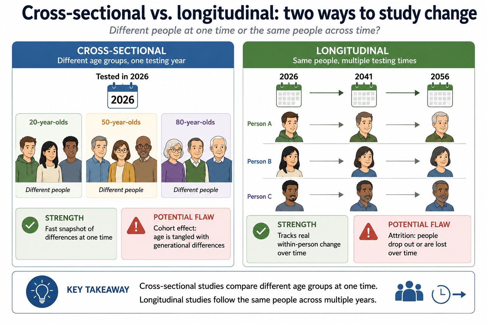
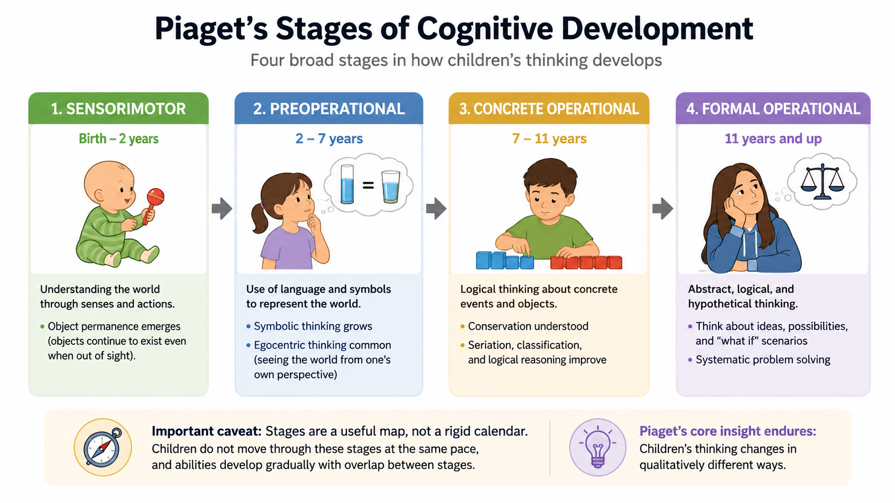

# Chapter 10: Lifespan Development

> Canonical revised source. The pre-revision chapter is preserved in `_archive/ch10-lifespan-development.md`; drafting history and provenance remain in `_provenance/ch10-lifespan-development.md`.

---

## Misconception Opener

A newborn cannot hold a conversation, solve a math problem, or explain why she is angry. An adult can do all three. So the obvious story is that development is addition: children start with a few basic mental tools and pile on facts and skills until the adult set is complete.

That story is wrong in a way that matters. Children do not simply know less than adults—they represent the world with different tools. Pour water from a short, wide glass into a tall, thin one, and many four-year-olds will insist the tall glass now holds more. The child is not careless and is not a broken adult. She is solving the problem with the tools she has, centering on height because she cannot yet coordinate height and width at once.

Piaget read changes like this as evidence for broad cognitive stages. The real pattern is more textured: some changes look stage-like, others arrive gradually, and performance often depends on the task. But the durable lesson holds. Development does not just add facts; it rebuilds how a person represents and solves a problem. Teaching and parenting work when they meet the learner who is actually in the room—not a shrunken version of the adult we are waiting for.

---

## Where This Fits

Why do humans take so long to grow up? That question runs underneath this chapter. The biological machinery from Chapter 3 develops for years; the learning processes from Chapter 7 tune it; the memory systems from Chapter 8 become usable on different schedules; and the social behavior in Chapter 11 grows from early relationships and increasingly complex social worlds. We will follow that construction process from before birth through late adulthood using three recurring tensions: How do biology and experience interact? Does change occur gradually or in stages? And what remains stable while the person changes?

---

## Learning Objectives

By the end of this chapter, students should be able to:

1. **Distinguish** cross-sectional from longitudinal research and explain cohort effects, attrition, and practice effects.
2. **Explain** how timing, dose, biology, and context shape the effects of prenatal teratogens.
3. **Compare** Piaget's active-construction account with Vygotsky's socially supported account, including assimilation, accommodation, stages, the ZPD, and scaffolding.
4. **Interpret** attachment classifications as probabilistic relationship patterns measured during reunion—not fixed traits or destinies.
5. **Apply** differential susceptibility and parenting-style research without treating correlational patterns as one-way causes.
6. **Distinguish** moral motivation from moral reasoning.
7. **Explain** adolescence and aging as uneven developmental reorganizations shaped by biology, experience, opportunity, and social context.

---

## Section 1: Development as Construction

### Three questions that organize the lifespan

Every developmental psychologist eventually runs into the same three tensions.

The first is **nature and nurture**. By now the answer “both” should feel automatic—but that is where the interesting part starts, not where it ends. Biology changes which environments a person notices, provokes, and seeks out. Experience changes which biological potentials get expressed and which pathways get practiced. Development is a transaction: the child shapes the environment, and the environment shapes the child, over and over.

The second is **continuity versus stages**. Does a capacity grow gradually, like a tree trunk thickening, or reorganize into something qualitatively new, like a caterpillar becoming a moth? It depends on what you measure. General knowledge accumulates gradually; the insight that solves a conservation problem can appear almost abruptly. A stage can be a useful map without being a strict calendar.

The third is **stability and change**. A reactive infant may become a cautious adult, yet how that reactivity shows up shifts with self-control, relationships, and context. Fluid abilities follow average age trajectories, but individuals scatter widely around those averages. Stability never means the absence of development.

### Why humans take so long to grow up

Start with a hard constraint: an organism has a finite energy budget, and it cannot spend the same calorie twice. A calorie spent on growth cannot also be spent on maintenance or reproduction. **Life history theory** studies how organisms allocate that budget—fast or slow, cheap or expensive, many offspring or few. A fruit fly lives fast and dies young: mature in days, reproduce immediately, invest nothing in parenting. Humans sit near the opposite extreme. We take the slow, expensive strategy to its limit—an unusually large and energetically expensive brain, the longest childhood, late first reproduction, extreme parental investment, and the longest lifespan of any primate (Kaplan et al., 2000; Oxford & Geary, 2019). Developmental psychology exists because humans spend so much of life becoming human.

One consequence of that long developmental period is that a human infant is remarkably expensive. In most primates, the mother bears nearly all direct care. Humans distribute the cost across fathers, grandparents, siblings, and other kin. That is why human family networks reach in both directions. It really does take a village to raise a human. Shared care also allows mothers to support dependent children of different ages at the same time (Isler & van Schaik, 2012). You have brothers and sisters because someone helped pay the energetic and caregiving bill.

That village is necessary because each human infant arrives profoundly underdeveloped. We essentially finish gestating outside the womb—a pattern called **secondary altriciality**. Human newborns arrive socially prepared but physically helpless. A newborn chimpanzee can cling to its mother while she moves; a human newborn cannot even hold up its own head. Humans also build brain before body. Around ages four to five, a child's brain burns roughly two-thirds of the body's resting energy—nearly double the share an adult brain takes (Kuzawa et al., 2014). That long immaturity leaves a wide window for the local social ecology to tune neural networks for the world they live in.

*Figure 10.1. Human childhood is long, plastic, and expensive. Extended postnatal brain development creates opportunities for learning, while shared caregiving helps support a long period of dependence. The figure summarizes a supported coevolutionary model, not a complete or uniquely established origin story.*

### How to study change across time

This chapter introduces two new methods to study change over time.

A **cross-sectional study** compares people of different ages at one moment—say, testing 20-, 50-, and 80-year-olds this year. It is fast and relatively cheap, but age is tangled up with **cohort effects**: those three groups grew up in different worlds. Differences in schooling, nutrition, technology, or hardship can masquerade as effects of aging.

A **longitudinal study** follows the same people across years or decades. It measures real within-person change, but it is slow, expensive, and prone to **attrition**—the people who stay in a decades-long study tend to be healthier and better resourced than those who drop out. Repeated testing also breeds practice effects, so later scores mix genuine development with growing familiarity.

*Figure 10.2. Cross-sectional studies compare different age groups at one moment, which is efficient but vulnerable to cohort effects. Longitudinal studies follow the same people across time, which measures within-person change but is slower and vulnerable to attrition and repeated-testing effects.*

> **Stop and Retrieve:** A study tests 20-, 50-, and 80-year-olds today. Another tests the same people every five years. Which design is which, and what is the signature weakness of each?

### Before birth: timing and dose

The construction project begins before birth. **Teratogens** are chemical, biological, or physical agents that can disrupt prenatal development—alcohol, nicotine, certain medications, high-dose radiation, and infections such as rubella or cytomegalovirus among them.

What a teratogen does depends less on its name than on two things. **Timing** matters because different organs and neural systems are built on different schedules, so a disruption during a system's active construction can do outsized damage. **Dose and pattern** matter because risk generally climbs with the amount and frequency of exposure. The pregnant person's and the fetus's own biology, nutrition, and stress shape the outcome too.

Alcohol deserves a hard line. No amount and no stage of prenatal alcohol exposure has ever been shown to be safe. Exposure early on can disrupt facial and organ development, and brain growth is vulnerable across the entire pregnancy. That is why current public-health guidance is simply to avoid alcohol during pregnancy rather than hunt for a safe threshold that does not exist (Centers for Disease Control and Prevention, 2026).

### Brain development after birth: building, pruning, and myelinating

By birth, almost all of the brain's neurons are already in place—but their connections are exploding. During **synaptogenesis**, neurons sprout dendrites and form far more synapses than the mature brain will keep. A synapse is the junction where neurons communicate—hence *synapto-genesis*, “making synapses.” Then the brain carves. **Synaptic pruning** follows the overgrowth, removing many less-active connections while repeatedly recruited pathways stabilize.

We use the shorthand *use it or lose it*. The broad logic resembles long-term potentiation (Chapter 7): repeated activity strengthens and stabilizes some pathways; connections that rarely join active circuits are more likely to be pruned. Experience is not acting alone. Developmental programs, spontaneous activity, hormones, immune processes, and local cellular signals also help decide what remains. The result is a brain increasingly tuned to the patterns it actually encounters—optimized, in the end, for the child's own local ecology.

That tuning has a price. A system that gets more efficient at familiar input becomes less flexible with unfamiliar input. Development is not just adding capacity; it is committing resources—and commitment always closes some doors.

*Figure 10.3. Development includes both growth and selective stabilization. Activity helps strengthen some pathways, while biological maturation and local cellular processes also shape pruning. Greater specialization can improve efficiency while reducing some forms of plasticity.*

**Myelination** wraps axons in a fatty sheath that makes signaling faster and more reliable. It is also a commitment: myelinating a circuit stabilizes its efficiency and makes its organization harder to rewrite. In effect, the brain cashes in some flexibility for speed and stability. That is one reason the brain holds off on fully myelinating some systems until much of their tuning is done. Myelination and the reorganization of long-range networks continue through adolescence and into the twenties. Many trajectories reach adult-like plateaus around the mid-twenties, especially those coordinating self-regulation—but there is no single birthday on which the whole brain is finished (Somerville, 2016).

A **sensitive period** is a window when a developing system is especially hungry for a particular kind of input. “Sensitive” does not mean “all-or-none.” Learning a language remains possible in adulthood, but it takes more effort and often lands differently than it would have in childhood.

A useful way to understand social development is as a series of shifting sensitive periods. Early childhood is organized around attachment figures. Repeated interactions teach the child whether distress brings comfort, whether other people are dependable, and whether the social world is safe enough to explore. By about age five, those expectations have acquired real stability. They can still change, but they are less labile than during the first years.

In middle childhood, much of that social plasticity shifts toward peers. Children learn how to enter groups, maintain friendships, handle rejection, and locate themselves within a social hierarchy. During adolescence, romantic partners begin to enter the attachment system. The brain's social target shifts, but each new phase builds on the last. These are periods of emphasis, not hard deadlines.

Extreme cases such as Genie—a child raised in severe isolation—are consistent with real limits on late language development, but they can never be clean experiments. Deprivation, malnutrition, trauma, and unstable care came bundled together.

> **Think About It:** Compare a skill you started early with one you picked up recently. Is the difference really a sensitive-period effect, or could practice time, motivation, instruction, and opportunity explain most of it?

---

## Section 2: Cognitive Development—The Baby Scientist and the Social Learner

### Piaget's durable insight

Jean Piaget saw children not as empty vessels but as active investigators, building and revising **schemas**—mental models that organize experience. A schema is a small working theory of the world, and the child runs it the way any model-builder does. In **assimilation**, the child interprets something new through a model she already has: the toddler who calls every four-legged animal “dog” is assimilating. In **accommodation**, the model itself has to change: learning to tell dogs from cats, horses, and bears forces the schema to split and sharpen. Assimilation is using the model; accommodation is updating it.

> **Do Not Confuse:** Assimilation changes how you interpret the experience to fit the schema. Accommodation changes the schema to fit the experience. One diagnostic question settles it: *Which one changed?*

Piaget proposed four broad stages:

| Stage | Approximate age in Piaget's theory | Central development | Important boundary |
|---|---:|---|---|
| **Sensorimotor** | Birth–2 | Knowledge through perception and action; object permanence develops | Looking-time measures suggest some expectations about hidden objects earlier than search tasks do |
| **Preoperational** | 2–7 | Symbolic thought expands; perspective taking and conservation remain difficult | Performance varies with task demands, language, and familiarity |
| **Concrete operational** | 7–12 | Logical operations become reliable for concrete problems; conservation and reversibility improve | Competence is not equally general across every domain |
| **Formal operational** | About 12 onward | Systematic hypothetical and abstract reasoning becomes possible | Not every adolescent or adult uses formal reasoning consistently in every context |

*Figure 10.4. Piaget's stages are a useful map of broad changes in children's reasoning, not a rigid calendar. Abilities emerge at different rates, overlap across stages, and can appear earlier when tasks reduce memory, language, or motor demands.*

Piaget's greatest legacy is the idea of active construction, like a baby scientist. His hard stage boundaries have aged less well. Baillargeon's violation-of-expectation studies found that infants stared longer when a hidden object seemed to pass through a solid barrier—evidence that they expected the object to keep existing and behaving lawfully, far earlier than Piaget thought. Staring longer is not the same as holding an older child's fully articulated concept, but it shows the starting kit is richer than “blank” (Baillargeon, 1987).

False-belief tasks make the child predict behavior from someone else's mistaken model of the world. Sally puts a marble in a basket and leaves the room. Anne moves it to a box. When Sally returns, where will she look? The correct answer is the basket. The child has to separate what Sally believes from what the child knows.

By about age four, many children pass this task. Piaget's three-mountains task suggested that children remained egocentric until around seven, but the false-belief task asks the perspective question in a simpler, more concrete form. That is the deeper point about developmental tasks: they never simply reveal a hidden competence. To pass, a child has to understand the instructions, hold information in mind, inhibit the tempting answer, and produce a response. Fail any one of those, and a real competence can stay invisible.

Core-knowledge research pushes the starting line earlier still. Infants come equipped with early systems for tracking objects, quantities, geometry, and agents (Spelke, 2000; Wynn, 1992). These are not miniature adult theories; they are structured starting conditions that experience builds on. Piaget was right that children construct their knowledge. He underestimated how much structure they start with.

### Vygotsky: minds develop between people

Piaget's child can look like a lone scientist. Lev Vygotsky moved other people to the center. Long before a child can perform a cognitive act alone, she performs it with someone—and that shared performance is where the ability is born.

The **zone of proximal development (ZPD)** is the band between what a learner can do alone and what she can do with well-aimed help. **Scaffolding** is the temporary support that makes performance inside that band possible—and then fades as the learner takes over. Imagine a child who cannot finish a puzzle alone. An adult places the first piece, points to the next corner, then gives fewer hints on each attempt. The help worked only if the child can eventually solve a new puzzle without it. The word *scaffolding* came later, from Wood, Bruner, and Ross in 1976, but it captures Vygotsky's idea exactly.

*Figure 10.5. The ZPD is the instructional sweet spot: the task is just beyond what the learner can do alone but achievable with calibrated support. Effective scaffolding fades, leaving the learner more capable after the support disappears.*

Vygotsky also treated a child's private speech as a tool, not idle chatter. A child muttering “first this piece, then that one” is internalizing the dialogue that an adult once used to organize the task. What starts as conversation between people becomes part of the child's own control system.

> **AI Connection:** An AI becomes a scaffold only when it responds to what the learner actually understands, withholds the steps she can take herself, and then fades. Hand her the finished essay or proof and you may improve the product while leaving the learner exactly where she started. The only real test comes after the support is gone: can you now solve a new problem without it?

**Try it yourself:** [Compare complete-answer support, graduated hints, and performance after support fades](../../docs/labs/ch10/zpd-fading-support.html). The activity illustrates different forms of support; it does not diagnose or measure you.

> **Stop and Retrieve:** Piaget and Vygotsky both describe an active learner. Where does each put the main engine of development, and what would count as evidence that scaffolding actually worked?

---

## Section 3: Relationships, Temperament, and Moral Development

### Attachment is a relationship pattern

John Bowlby argued that **attachment** is a biologically prepared system for keeping a vulnerable infant close to a protective caregiver—the same solution evolution reaches for again and again in animals whose young cannot survive alone. Across the first years, repeated interactions build an **internal working model**: a running prediction about whether comfort and help will be there when needed. By about age five, that model has acquired stability and begins shaping peer relationships.

Mary Ainsworth's **Strange Situation** made Bowlby's theory observable. It watches how a 12- to 18-month-old organizes attachment behavior across brief separations from and reunions with a familiar caregiver—and it is the reunion, not the separation, that reveals the pattern.

- **Secure:** The infant seeks contact or reassurance and is soothed enough to return to exploring.
- **Anxious-ambivalent/resistant:** The infant seeks contact but also resists it, and stays hard to soothe.
- **Anxious-avoidant:** The infant plays down attachment behavior and avoids or ignores the caregiver at reunion.
- **Disorganized:** The infant shows contradictory, disoriented, frozen, or frightened behavior with no coherent strategy.

These labels describe behavior in one relationship and one procedure.

There is a mechanism underneath the behavior. Caregiver and infant fall into a physiological duet—**biobehavioral synchrony**—coordinating gaze, vocal timing, arousal, and physiology (Feldman, 2007). For a while, the caregiver's regulated body is the infant's regulation system, borrowed from the outside. Over months and years, the child internalizes capacities that were first shared. Caregiver sensitivity helps build attachment security; temperament, stress, resources, and culture shape the same process. Attachment is a relationship history, not a destiny.

*Figure 10.6. Strange Situation classifications are read most clearly at reunion. Secure infants seek comfort and are soothed; anxious-ambivalent infants both seek and resist comfort; anxious-avoidant infants minimize visible attachment behavior; disorganized infants show contradictory or frightened behavior. These are probabilistic relationship patterns whose distribution and meaning vary with culture and context.*

> **Classic Study: The Strange Situation**
>
> **Setup:** Ainsworth's Baltimore study combined repeated home observations with a structured laboratory procedure at about 12 months.
>
> **Procedure:** Across eight short episodes, the infant explored an unfamiliar room, met a stranger, went through brief caregiver separations, and reunited with the caregiver.
>
> **Key contribution:** Ainsworth turned Bowlby's ideas into something you could observe and code reliably—and caregiving sensitivity seen at home predicted attachment behavior in the lab.
>
> **Boundary:** The original sample was small and culturally narrow. Later work supports a real link between caregiver sensitivity and security, but not the tidy claim that one caregiving style mechanically stamps out one attachment type. The Strange Situation is not a culture-free personality test.

### Temperament and differential susceptibility

Infants arrive already different—**temperament** is the early, biologically rooted variation in reactivity, attention, activity, and self-regulation. Temperament shapes the caregiving an infant pulls from the world, and caregiving shapes how temperament gets expressed. A highly reactive infant and an exhausted caregiver can spiral into a difficult feedback loop; the same infant with steady, predictable support can develop a very different way of regulating. What matters is the fit between child and environment.

The **orchid/dandelion** metaphor captures **differential susceptibility**. Dandelion children do well across a wide range of conditions. Orchid children are more reactive in both directions—they fare worse than others under adversity, but better than others under genuinely supportive conditions. That upside is the crucial part, and it is what separates this idea from old “vulnerability” models: high sensitivity is not damage. It is a bet on the environment. When the environment carries good information, a highly sensitive child is built to take maximum advantage of it.

So do not turn the metaphor into two species of child. Susceptibility is a continuum, it can differ across outcomes and ages, and the whole point is the crossover: what looks like fragility in a harsh setting is heightened plasticity in a nurturing one. (Teach the framework; the behavioral evidence is stronger than any specific “sensitivity gene.”)

### Parenting styles: useful pattern, limited causal claim

Parenting research often sorts behavior along two dimensions—**responsiveness** and **demandingness**. Baumrind described three patterns; a later model added the uninvolved quadrant (Baumrind, 1966; Maccoby & Martin, 1983).

| Parenting pattern | Responsiveness | Demandingness | Typical description |
|---|---:|---:|---|
| **Authoritative** | High | High | Warm, responsive, and clear about expectations |
| **Authoritarian** | Low | High | Strict control with little negotiation or explanation |
| **Permissive** | High | Low | Warm and accepting with few enforced limits |
| **Uninvolved** | Low | Low | Limited warmth, monitoring, and structure |

In many Western samples, authoritative parenting is linked with academic competence, self-regulation, and fewer behavior problems. Read that link carefully, though, because it is almost entirely correlational. Children shape their parents, shared genes influence both, economic stress narrows the parenting a family can manage, and the same behavior carries different meaning in different cultures. The table names real, recurring patterns. It is not a four-box machine that stamps out outcomes.

### Moral motivation is not moral reasoning

Moral development hides two different questions inside one word. **Moral motivation** asks why a person helps or refuses to harm. **Moral reasoning** asks how a person justifies a judgment. They are not the same, and they do not develop on the same schedule.

Warneken and Tomasello (2006) found that 18-month-olds spontaneously helped adults reach simple goals, often with no reward—and young chimpanzees helped under some conditions too. Basic prosocial motivation, in other words, does not wait for a child to master an explicit moral philosophy. It shows up early, and it is not uniquely human.

Kohlberg studied moral reasoning rather than motivation. He proposed that our justifications mature from self-focused consequences, through social rules and relationships, toward abstract principles. His durable insight is that two people can reach the same verdict for structurally different reasons. His full stage ladder is shakier: the original samples were all male, the dilemmas leaned on abstract Western justice, cultural variation is large, and—importantly—sophisticated reasoning does not guarantee moral behavior.

> **Stop and Retrieve:** A toddler hands an adult a dropped object. An adolescent explains that stealing is wrong because social trust would collapse. Which example is about moral motivation, which is about moral reasoning, and why does neither alone explain moral behavior?

---

## Section 4: Adolescence and Adulthood—Reorganization, Not Completion

### Identity across changing systems

Erik Erikson's lasting contribution was to insist that development does not stop at childhood. His full sequence of eight psychosocial stages is hard to defend as a universal timetable, but his focus on **identity formation** in adolescence has held up. Puberty rewrites the body; abstract thought opens up possible selves; peers gain enormous weight; and society starts demanding commitments about school, work, love, politics, and values. “Who am I?” turns from a philosophy-class question into a lived one.

**Emerging adulthood**—roughly the late teens through the twenties in many industrialized societies—can stretch that identity exploration out before adult roles lock in. It is not a universal biological stage. Its length rises and falls with educational systems, job markets, family structure, culture, and money.

### The adolescent brain and the age-25 shorthand

Brain development does not halt at puberty. Myelination, network integration, and the coordination of systems for planning, motivation, and self-regulation keep going through adolescence and into the twenties, with many patterns reaching adult-like plateaus around the mid-twenties. That does not mean the brain is “unfinished” until a switch flips at 25, or that change stops afterward.

Adolescence is also, in evolutionary terms, a distinctly human stretch of life—barely present in great apes—and it has a job to do. The influential **dual-systems model** describes it as a period when reward, novelty, and social-motivational systems become intensely responsive before regulatory control is consistently adult-like. That temporary mismatch helps explain why risk spikes most in emotionally charged or peer-present moments—the exact settings in which a teenager is learning the adult social, economic, and reproductive world. Ultimately, teenagers reason well in calm settings, and real behavior rides on peers, incentives, stress, sleep, practice, opportunity, and culture as much as on neural development (Casey et al., 2008; Crone & Dahl, 2012; Somerville, 2016).

Leaving childhood *requires* trying unfamiliar things, testing identities, and learning which risks are worth taking. The same openness that produces danger in a harsh environment produces discovery in a supportive one—the orchid logic again, now aimed at the whole social world.

This is also where a familiar number gets misread. Car-insurance premiums often drop through the early-to-mid twenties, sometimes noticeably around 25—and people love to say the prefrontal cortex “finished.” Insurers are not scanning anyone's brain; they are pricing crashes and claims. Continuing brain development may contribute to the trend, but so do driving experience, sheer exposure, legal restrictions, and self-selection.

*Figure 10.7. One influential model proposes a temporary mismatch between highly responsive motivational systems and still-developing regulatory control. The curves are schematic averages, not biological deadlines. Peers, incentives, stress, sleep, experience, and opportunity help determine whether heightened exploration becomes learning or danger.*

> **Stop and Retrieve:** What does the dual-systems model explain well, and what does it miss when adolescent behavior is reduced to “an immature prefrontal cortex”?

### Aging is a tradeoff, not a uniform decline

Physical strength, reaction time, and sensory acuity do decline on average across adulthood, especially late in life. But even here, development stays uneven: experience compensates for slowing, health behaviors bend the trajectories, and people vary widely around the averages.

The clearest window on the tradeoff is the split between **fluid intelligence** and **crystallized intelligence**. Fluid abilities—processing speed, working memory, and cracking unfamiliar problems—tend to fall across adulthood. Crystallized abilities—vocabulary, accumulated knowledge, and expertise—hold steady far longer and can keep growing. An older expert may be slower on a novel puzzle yet see straight through a familiar professional problem that stops a quicker novice cold. The system is not simply winding down; it is reallocating.

*Figure 10.8. Some speeded novel-problem abilities tend to decline earlier on average, while accumulated knowledge and expertise often remain stable or increase longer. These are schematic group averages with substantial individual variation and overlap among age groups. Aging is a tradeoff, not one uniform decline, and dementia is not ordinary aging.*

Memory ages the same uneven way. Freely recalling a recent event is more fragile than recognition, habits, vocabulary, or well-worn expertise—which is why forgetting a name and retrieving it an hour later is so ordinary. Dementia is a different thing entirely: not normal aging turned up a notch, but decline severe enough to disrupt independent living.

> **Do Not Confuse:** Normal aging can include slower retrieval and the occasional lost name. Warning signs of a possible disorder include progressive change that disrupts familiar tasks, navigation, judgment, language, or daily independence. A textbook cannot diagnose either one.

Even well-being resists the decline story. Older adults often report less anger, stress, and worry, and emotional well-being as good as or better than younger adults' (Charles & Carstensen, 2010). **Socioemotional selectivity theory** offers a clean explanation: when time feels limited, people stop investing in open-ended exploration and pour their energy into the relationships and goals that matter most (Carstensen, 1999). Aging brings real losses. It can also sharpen what a person chooses to spend life on.

> **Think About It:** Picture an older adult you know well. Where do you see losses in speed or flexibility—and where do you see compensation through knowledge, routine, emotional steadiness, or selective investment?

---

## Chapter Summary

Development is a long construction project, not a pile of accumulating facts, and three tensions organize it: biology and experience continually shape each other; some changes are gradual while others look stage-like; and stability coexists with reorganization. Human childhood is long, plastic, and expensive because several features of our slow, brain-heavy life history evolved together. Secondary altriciality extends the tuning window, shared caregiving pays for prolonged dependence, and human intelligence and sociality develop as parts of the same system. Research design matters: cross-sectional studies risk cohort effects, longitudinal studies risk attrition and practice effects.

Prenatal development turns on timing, dose, and biological context. “Use it or lose it” captures the broad logic: repeated activity helps stabilize some pathways while less-active connections are more likely to be pruned. Experience works alongside developmental programs, spontaneous activity, and cellular processes.

Piaget's durable insight is that children actively build knowledge through schemas, assimilation, and accommodation; his rigid stage boundaries have held up less well, because infants start with far more structure than he assumed. Vygotsky added that cognitive tools are built between people first—and that good support within the ZPD should fade and leave the learner stronger. That is also the standard by which AI help should be judged.

Attachment classifications describe reunion behavior within a specific relationship, not permanent child traits. Biobehavioral synchrony offers a mechanism: the caregiver's regulated body scaffolds the infant's until the child can carry more of that regulation inside. Differential susceptibility reframes sensitivity as a two-way bet rather than pure vulnerability. Parenting-style patterns describe more than they explain. Moral motivation shows up before sophisticated moral reasoning.

Adolescence and adulthood continue the same construction. Identity forms inside changing biological and social systems. Regulatory development approaches adult-like plateaus in the twenties, but no single age finishes the brain. Dual-systems accounts illuminate real adolescent risk while peers and context shape most of its expression. Aging is a tradeoff: fluid speed and flexibility tend to fall, crystallized knowledge holds and grows, and emotional priorities sharpen. Development never becomes simple addition—and it never entirely stops.

---

## Connections

| Concept from this chapter | Reappears in | Why it matters there |
|---|---|---|
| [Developmental tuning](#brain-development-after-birth-building-pruning-and-myelinating) | [Chapter 3 — Biological Bases](03-neuroscience.html) | Neural systems are built through interacting biological programs and activity, not genes or experience acting alone. |
| [Sensitive periods](#brain-development-after-birth-building-pruning-and-myelinating) | [Chapter 9 — Thinking, Language & Intelligence](09-thinking-language-intelligence.html) | Language learning shows why heightened early plasticity is neither a blank slate nor a rigid deadline. |
| [Schemas and active construction](#piagets-durable-insight) | [Chapter 8 — Memory](08-memory.html) | Memory and development both depend on structures that organize and reconstruct experience. |
| [Scaffolding and the ZPD](#vygotsky-minds-develop-between-people) | [Chapter 7 — Learning](07-learning.html) | Effective support changes the learner's future performance rather than merely completing the current task. |
| [Attachment as a relationship pattern](#attachment-is-a-relationship-pattern) | [Chapter 11 — Social Psychology](11-social-psychology.html) | Expectations about availability and trust influence later social interpretation without fixing destiny. |
| [Differential susceptibility](#temperament-and-differential-susceptibility) | [Chapter 3 — Biological Bases](03-neuroscience.html) | The same environment can have different effects because individuals differ in environmental sensitivity. |
| [Adolescent motivation and control](#the-adolescent-brain-and-the-age-25-shorthand) | [Chapter 12 — Emotion, Stress & Coping](12-emotion-stress-coping.html) | Emotion, reward, stress, peers, and self-regulation interact most strongly in high-arousal decisions. |
| [Fluid and crystallized intelligence](#aging-is-a-tradeoff-not-a-uniform-decline) | [Chapter 9 — Thinking, Language & Intelligence](09-thinking-language-intelligence.html) | Aging reveals why intelligence is not one ability moving along one trajectory. |

---

## Review Questions

1. A researcher tests 20-, 50-, and 80-year-olds in 2026. Another researcher tests the same participants every five years from age 20 onward. Identify each design and its signature weakness.

Answer

The first is cross-sectional: it compares different age groups at one moment and is vulnerable to cohort effects. The second is longitudinal: it measures within-person change but is vulnerable to attrition and repeated-testing effects. The tempting error is to call any study involving age “longitudinal.” Longitudinal means following the same people over time.

2. Why can the same teratogen produce different outcomes depending on timing and dose? Why does alcohol require a stronger public-health boundary than “avoid it during the first trimester”?

Answer

Different systems are under construction at different times, so exposure during an active developmental window can disrupt the system being built. Risk also generally rises with dose and frequency, although the relationship differs by teratogen and biological context. Alcohol can affect brain development throughout pregnancy, and no safe amount or time has been established. The tempting error is to convert “the first trimester is especially important for some structural effects” into “later exposure is safe.”

3. A 4-year-old says a tall, narrow glass contains more water than a short, wide glass after watching the same water being poured between them. What does Piaget's account explain, and what would be overstated?

Answer

Piaget explains the response as failure of conservation: the child centers on height and does not coordinate height with width or mentally reverse the transformation. It would be overstated to conclude that every child of that age possesses one globally preoperational mind or that the ability appears suddenly on a fixed birthday. Task demands and domain-specific development matter.

4. A child calls a horse “dog,” then later revises the category to distinguish dogs from horses. Identify assimilation and accommodation.

Answer

Calling the horse “dog” is assimilation: the child interprets the new animal through the existing dog schema. Revising the schema to distinguish categories is accommodation. The tempting reversal is to think that any new information automatically changes the schema; sometimes the existing schema changes how the information is represented instead.

5. A student uses AI to produce a correct essay, then cannot explain the argument without the AI. Was the system functioning as a scaffold within the ZPD? Explain.

Answer

Not necessarily. A scaffold should be calibrated to the learner, provide only the support needed, and fade so the learner can perform a related task independently. The correct product demonstrates assisted performance, not learning. The tempting error is to infer competence from the quality of the artifact rather than testing what remains after assistance is removed.

6. What does the Strange Situation classify, and what are two conclusions it does **not** justify?

Answer

It classifies patterns of attachment behavior in a particular caregiver-child relationship, especially during reunion after brief separation. It does not justify treating the classification as a fixed child personality type, and it does not prove a deterministic caregiving history or adult romantic destiny. Caregiver sensitivity is associated with security, but temperament, context, culture, stress, and later relationships also matter.

7. Explain the orchid/dandelion metaphor without turning children into two biological categories. Then explain why the association between authoritative parenting and positive outcomes does not establish simple one-way causation.

Answer

The orchid/dandelion metaphor represents differences in environmental susceptibility. More susceptible children may show worse outcomes in adverse environments and better outcomes in supportive environments; susceptibility is a continuum and can vary across outcomes and developmental periods. Authoritative parenting is associated with several positive outcomes in many Western samples, but the evidence is largely correlational. Children influence their parents, shared genes affect both, economic conditions constrain parenting, and parenting practices can carry different meanings across cultures. The tempting error is to convert either framework into a fixed child type or a parenting formula that mechanically produces an outcome.

8. Warneken and Tomasello’s toddler-helping result and Kohlberg’s stages both concern morality. What different developmental questions do they answer, and why does neither by itself explain moral behavior?

Answer

Warneken and Tomasello’s result concerns moral or prosocial motivation—what moves a young child to help. Kohlberg’s stages concern moral reasoning—how a person justifies a judgment. A person can reason sophisticatedly without acting morally, and a young child can help without articulating a moral principle. The tempting error is to treat moral behavior, moral motivation, and moral reasoning as the same developmental achievement.

9. What does the dual-systems model explain about adolescent risk, and what does it miss?

Answer

The model explains why heightened motivation for reward, novelty, and social approval can temporarily outpace consistently adult-like regulatory control, especially in emotionally charged settings. It misses much if interpreted as “the prefrontal cortex is unfinished”: adolescent behavior also depends on peers, incentives, stress, sleep, experience, opportunity, and culture. Many adolescents reason well in calm conditions, and individual trajectories vary.

10. Predict the average age-related pattern for (a) a novel reasoning puzzle, (b) vocabulary, (c) rapid working-memory manipulation, and (d) expert judgment in a familiar domain. Then explain why none of these predictions diagnoses an individual.

Answer

Novel reasoning, processing speed, and rapid working-memory manipulation depend heavily on fluid abilities and tend to decline across adulthood. Vocabulary and expert knowledge depend more on crystallized abilities and remain stable longer or continue growing. These are group averages with wide individual variation; education, health, practice, occupation, and measurement all affect a person's trajectory. The tempting error is to convert an average developmental curve into a forecast for one person.

---

## Key Terms

**Accommodation** — Revising an existing schema when experience cannot be represented adequately by the old one.

**Assimilation** — Interpreting a new experience through an existing schema.

**Attachment** — A biologically prepared system of proximity seeking and emotional bonding between a child and caregiver.

**Cohort effect** — A difference associated with the historical conditions in which an age group developed, which can be mistaken for an effect of age.

**Conservation** — Understanding that quantity remains constant despite changes in appearance or arrangement.

**Cross-sectional study** — A design comparing different age groups at one point in time.

**Crystallized intelligence** — Accumulated knowledge, vocabulary, and expertise that tend to remain stable longer across adulthood.

**Differential susceptibility** — Individual variation in responsiveness to both adverse and supportive environments.

**Fluid intelligence** — Capacity for rapid processing, working-memory manipulation, and solving unfamiliar problems.

**Identity formation** — The developmental construction of coherent values, commitments, roles, and beliefs about the self.

**Longitudinal study** — A design following the same participants across time.

**Moral motivation** — Processes that move a person toward helping, cooperation, or avoidance of harm.

**Moral reasoning** — The logic used to justify a moral judgment.

**Object permanence** — Understanding that objects continue to exist when they are no longer directly perceived.

**Scaffolding** — Temporary, calibrated support that fades as the learner becomes independently capable.

**Schema** — A mental framework that organizes and interprets experience.

**Secondary altriciality** — The human pattern of being born neurologically immature, so that much brain development occurs after birth, extending the window for tuning to local ecology.

**Sensitive period** — A developmental window of heightened responsiveness to particular forms of input.

**Synaptic pruning** — Developmental weakening or elimination of some synaptic connections as neural systems reorganize and specialize.

**Teratogen** — A chemical, biological, or physical agent capable of disrupting prenatal development.

**Zone of proximal development (ZPD)** — The range between what a learner can do alone and what the learner can do with effective guidance.

---

## Further Reading

- Siegler, R. (2026). *Cognitive development in childhood.* Noba Project. — A concise evidence-based treatment of Piaget, Vygotsky, information processing, and the problem of continuous versus stage-like change.
- Bretherton, I. (1992). The origins of attachment theory: John Bowlby and Mary Ainsworth. *Developmental Psychology, 28*, 759–775. — A clear history of how evolutionary theory and careful observation produced attachment research.
- Somerville, L. H. (2016). Searching for signatures of brain maturity: What are we searching for? *Neuron, 92*, 1164–1167. — A brief corrective to the idea that the brain has one measurable maturity date.
- Boyce, W. T. (2019). *The Orchid and the Dandelion.* Knopf. — An accessible account of environmental sensitivity, best read with the reminder that susceptibility is not a simple two-type taxonomy.

---

## References

Ainsworth, M. D. S., Blehar, M. C., Waters, E., & Wall, S. (1978). *Patterns of attachment: A psychological study of the strange situation.* Erlbaum.

Baillargeon, R. (1987). Object permanence in 3½- and 4½-month-old infants. *Developmental Psychology, 23*, 655–664.

Baumrind, D. (1966). Effects of authoritative parental control on child behavior. *Child Development, 37*, 887–907.

Bowlby, J. (1969). *Attachment and loss: Vol. 1. Attachment.* Basic Books.

Boyce, W. T., & Ellis, B. J. (2005). Biological sensitivity to context: I. An evolutionary-developmental theory of the origins and functions of stress reactivity. *Development and Psychopathology, 17*, 271–301.

Carstensen, L. L. (1999). Taking time seriously: A theory of socioemotional selectivity. *American Psychologist, 54*, 165–181.

Casey, B. J., Getz, S., & Galvan, A. (2008). The adolescent brain. *Developmental Review, 28*, 62–77.

Centers for Disease Control and Prevention. (2026, April 2). *About alcohol use during pregnancy.* https://www.cdc.gov/alcohol-pregnancy/about/index.html

Charles, S. T., & Carstensen, L. L. (2010). Social and emotional aging. *Annual Review of Psychology, 61*, 383–409.

Crone, E. A., & Dahl, R. E. (2012). Understanding adolescence as a period of social-affective engagement and goal flexibility. *Nature Reviews Neuroscience, 13*, 636–650.

Erikson, E. H. (1963). *Childhood and society* (2nd ed.). Norton.

Feldman, R. (2007). Parent-infant synchrony: Biological foundations and developmental outcomes. *Current Directions in Psychological Science, 16*, 340–345.

Horn, J. L., & Cattell, R. B. (1967). Age differences in fluid and crystallized intelligence. *Acta Psychologica, 26*, 107–129.

Huttenlocher, P. R. (1979). Synaptic density in human frontal cortex—developmental changes and effects of aging. *Brain Research, 163*, 195–205.

Isler, K., & van Schaik, C. P. (2012). How our ancestors broke through the gray ceiling: Comparative evidence for cooperative breeding in early *Homo*. *Current Anthropology, 53*(S6), S453–S465.

Kaplan, H., Hill, K., Lancaster, J., & Hurtado, A. M. (2000). A theory of human life history evolution: Diet, intelligence, and longevity. *Evolutionary Anthropology, 9*, 156–185.

Kohlberg, L. (1969). Stage and sequence: The cognitive-developmental approach to socialization. In D. A. Goslin (Ed.), *Handbook of socialization theory and research* (pp. 347–480). Rand McNally.

Kuzawa, C. W., Chugani, H. T., Grossman, L. I., Lipovich, L., Muzik, O., Hof, P. R., Wildman, D. E., Sherwood, C. C., Leonard, W. R., & Lange, N. (2014). Metabolic costs and evolutionary implications of human brain development. *Proceedings of the National Academy of Sciences, 111*, 13010–13015.

Maccoby, E. E., & Martin, J. A. (1983). Socialization in the context of the family: Parent-child interaction. In P. H. Mussen (Series Ed.) & E. M. Hetherington (Vol. Ed.), *Handbook of child psychology: Vol. 4. Socialization, personality, and social development* (4th ed., pp. 1–101). Wiley.

Main, M., & Solomon, J. (1986). Discovery of an insecure-disorganized/disoriented attachment pattern. In T. B. Brazelton & M. W. Yogman (Eds.), *Affective development in infancy* (pp. 95–124). Ablex.

Oxford, J., & Geary, D. C. (2019). Life history evolution in hominins. In T. B. Henley, M. Rossano, & E. P. Kardas (Eds.), *Handbook of cognitive archaeology: Psychology in prehistory* (pp. 36–57). Routledge.

Piaget, J. (1952). *The child's concept of number.* Norton.

Piaget, J. (1954). *The construction of reality in the child.* Basic Books.

Spelke, E. S. (2000). Core knowledge. *American Psychologist, 55*, 1233–1243.

Somerville, L. H. (2016). Searching for signatures of brain maturity: What are we searching for? *Neuron, 92*, 1164–1167.

Vygotsky, L. S. (1978). *Mind in society: The development of higher psychological processes.* Harvard University Press.

Warneken, F., & Tomasello, M. (2006). Altruistic helping in human infants and young chimpanzees. *Science, 311*, 1301–1303.

Wimmer, H., & Perner, J. (1983). Beliefs about beliefs: Representation and constraining function of wrong beliefs in young children's understanding of deception. *Cognition, 13*, 103–128.

Wood, D., Bruner, J. S., & Ross, G. (1976). The role of tutoring in problem solving. *Journal of Child Psychology and Psychiatry, 17*, 89–100.

Wynn, K. (1992). Addition and subtraction by human infants. *Nature, 358*, 749–750.
