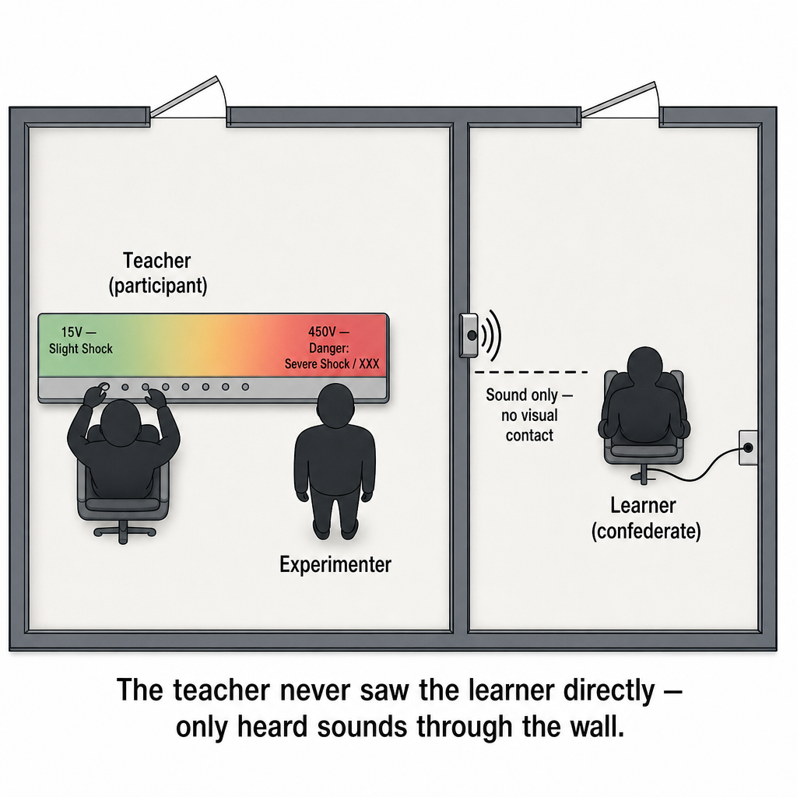
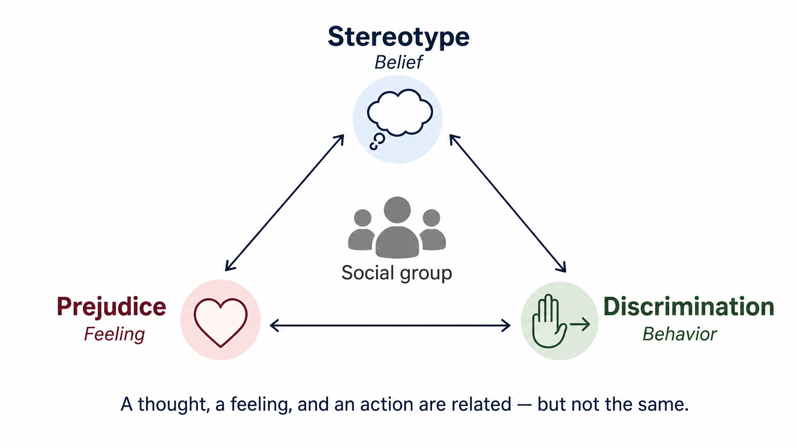
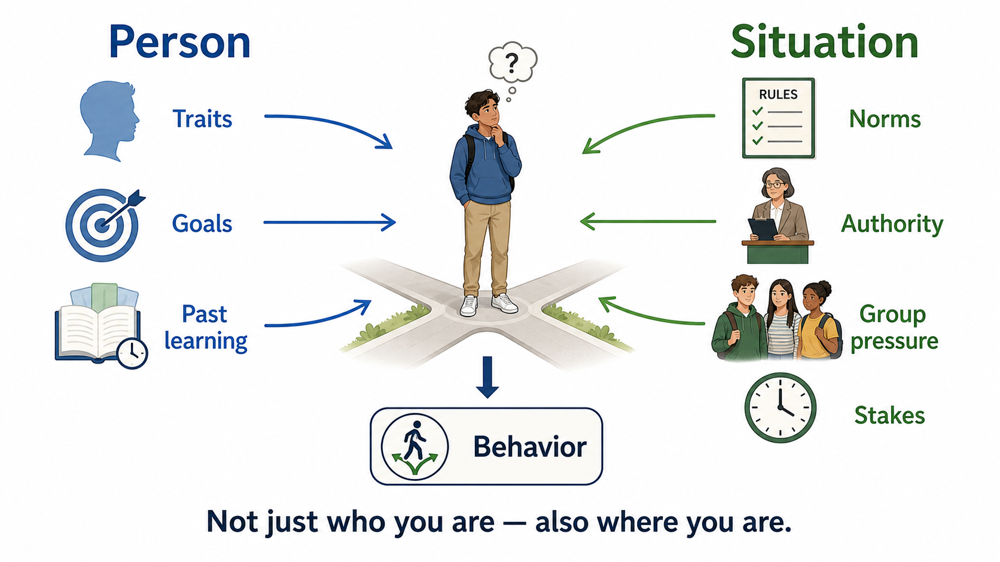

# Chapter 11: Social Psychology

> Drafting history and provenance: see `_provenance/ch11-social-psychology.md` and git history.

---

## Misconception Opener: “I Would Never Do That”

In 1963, Stanley Milgram recruited adults for what they believed was a study of memory and learning at Yale University. Each participant became the “teacher.” Every time the learner in the next room made an error, the teacher was instructed to press a switch delivering a stronger electric shock. The shocks were fake, the learner was a confederate, and the cries of pain were recorded. The participants did not know that.

Sixty-five percent continued to the final 450-volt switch. Before the study, Milgram asked psychiatrists to predict how many people would go that far. Their average prediction was about one person in a thousand.

Most people hear this result and say some version of the same thing: *I would never do that.*

Perhaps. But social psychology begins with the possibility that you do not know exactly what you would do until you know the situation. We are good at explaining behavior by character and much worse at noticing how authority, unanimity, roles, ambiguity, distance, and responsibility alter the probability of an action. Situations do not erase the person. They change what the person is likely to do.

---

## Where This Fits

The previous chapters built an individual mind: a nervous system that senses, learns, remembers, reasons, and develops. This chapter puts that mind in a room with other people. Social psychology asks how our judgments and actions change when other people are present, imagined, or implied.

The chapter returns to personality at the end. That is not an unrelated topic added to social psychology. It is the chapter’s payoff. If situations matter so much, does personality matter at all? The answer is yes—but traits predict patterns across time better than they predict one isolated act. Psychology needs the person and the situation.

---

## Learning Objectives

By the end of this chapter, you should be able to:

1. **Explain** the fundamental attribution error and self-serving bias and distinguish their directions.
2. **Explain** cognitive dissonance and distinguish central-route from peripheral-route persuasion.
3. **Distinguish** conformity from obedience and identify situational variables that change each.
4. **Distinguish** group polarization, groupthink, stereotypes, prejudice, and discrimination.
5. **Use** the bystander decision model and explain why helping and aggression require multiple levels of explanation.
6. **Describe** the Big Five as dimensions rather than types.
7. **Explain** how aggregation and situation strength resolve the person–situation debate.

---

## Section 1: Social Cognition—How We Explain Other People

### Attribution: Finding a Cause

You watch another person act, and your mind immediately begins explaining. A **dispositional attribution** places the cause inside the person: ability, motives, attitudes, or personality. A **situational attribution** places the cause in the surrounding conditions: incentives, constraints, roles, norms, or bad luck.

Neither kind of explanation is automatically correct. The problem is that we do not weigh them evenly.

### The Fundamental Attribution Error

The **fundamental attribution error** (FAE) is the tendency to overestimate dispositional causes and underestimate situational causes when explaining *other people’s* behavior.

When a driver cuts you off, “reckless jerk” arrives faster than “person rushing someone to the hospital.” When a classmate misses a deadline, “lazy” arrives faster than “working two jobs and caring for a sick parent.” The dispositional explanation is not impossible. It is simply accepted before the situation has been investigated.

Jones and Harris (1967) demonstrated the problem directly. Participants read essays supporting or opposing Fidel Castro. Some were told that the writers had freely chosen their positions. Others were explicitly told that the writers had been assigned a position. Even when the situational constraint was obvious, readers still inferred that the essay reflected the writer’s true attitude.

The FAE is not equally strong everywhere. Cultural systems that emphasize individual agency tend to encourage more dispositional explanation than systems that emphasize relationships and context (Choi, Nisbett, & Norenzayan, 1999). Even a “basic” cognitive tendency develops inside a culture.

### Self-Serving Bias

The **self-serving bias** concerns explanations of our own outcomes. We tend to explain success internally—“I earned that grade”—and failure externally—“the test was unfair.”

This is not always a deliberate excuse. Protecting a competent, coherent self-image can happen before conscious reflection. The result is an efficient moral accounting system: full credit for success, limited liability for failure.

> **Do Not Confuse: FAE vs. Self-Serving Bias**
>
> The FAE concerns how we explain **other people’s behavior**: too much person, too little situation. The self-serving bias concerns how we explain **our own outcomes**: internal credit for success, external blame for failure. You can show both biases in the same five-minute conversation.

### Cognitive Dissonance: When Behavior Changes Belief

We usually assume that beliefs cause behavior. Leon Festinger proposed that the arrow also runs backward.

**Cognitive dissonance** is the psychological discomfort produced by inconsistency among beliefs, attitudes, and known behavior. Because inconsistency is uncomfortable, people are motivated to reduce it. Sometimes they change their behavior. Sometimes they change the story they tell about the behavior.

Festinger and Carlsmith (1959) asked participants to spend an hour performing genuinely boring tasks—turning pegs and moving spools. Participants were then asked to tell the next person that the task had been interesting. Some received $20 for lying. Others received $1.

Which group later rated the task as more enjoyable?

The $1 group. Not the $20 group.

The $20 group had a strong external justification: *I said it because I was paid well.* That explanation produced relatively little dissonance. The $1 group had weak external justification. To make the behavior coherent, some participants shifted their attitude: *Maybe the task was not so bad.*

*Figure 11.1. Weak external justification can create more attitude change than strong external justification. The twenty-dollar condition involves less dissonance, not literally none.*

People can reduce dissonance by changing a belief, changing a behavior, adding a new justification, or deciding that the inconsistency does not matter. Dissonance reduction restores coherence. It does not guarantee truth.

> **Stop and Retrieve:** Why did the $1 group change its attitude more than the $20 group? Explain the result without using the phrase “because they got less money.”

### Persuasion: How Carefully Are You Processing?

The **elaboration likelihood model** (ELM) distinguishes two broad routes to persuasion (Petty & Cacioppo, 1986).

The **central route** occurs when a person has both the motivation and the ability to evaluate an argument carefully. Evidence quality matters. Attitude change produced through this route tends to be more durable and resistant to counterargument.

The **peripheral route** occurs when motivation or ability is low. The person relies more heavily on surface cues: confidence, attractiveness, familiarity, repetition, or fluent wording. Peripheral cues are not always misleading. A credible source sometimes deserves more weight. The mistake is treating a cue as if it were the argument.

> **Think About It:** Recall a claim you accepted because the speaker sounded confident. What evidence would you need before accepting the same claim through the central route?

---

## Section 2: Social Influence—Peers, Authority, and Situation

### Why We Conform

**Conformity** is a change in belief or behavior in response to a perceived group norm.

**Informational social influence** occurs when you treat other people as evidence about reality. You smell smoke in a crowded room, notice that nobody else looks concerned, and infer that the smell is probably harmless.

**Normative social influence** occurs when you go along to avoid rejection, embarrassment, or conflict. You may privately disagree while publicly matching the group.

The same outward behavior can therefore reflect different internal processes. A person who copies a group’s answer may believe the group is correct, may fear standing alone, or may experience both.

### Asch and the Power of Unanimity

Solomon Asch placed one naive participant among several confederates. The group viewed a standard line and three comparison lines. The correct match was obvious. On critical trials, every confederate gave the same incorrect answer aloud.

About 75% of participants conformed at least once, although conformity across all critical trials was closer to one-third (Asch, 1955). The more instructive result came from the variations. Conformity rose as the majority grew to about three or four people, then leveled off. It dropped sharply when even one confederate broke unanimity.

One ally did not need to be persuasive. The ally changed the social structure of dissent.

*Figure 11.2. Asch’s study isolated the effect of a unanimous majority. The most important manipulation was not simply adding more people; it was whether the participant had to stand completely alone.*

> **Stop and Retrieve:** Why did one ally reduce conformity so much even when the ally did not provide new evidence?

### Milgram: Harmful Continuation in an Authority Relationship

> **Classic Study Walkthrough: Milgram’s Obedience Studies**
>
> **Question:** Under what conditions will people continue an action they believe is harming another person?
>
> **Setup:** Participants believed they were helping study punishment and learning. The “teacher” sat at a shock generator with 30 switches from 15 to 450 volts. The learner, actually a confederate, answered questions from another room. Each error required a stronger shock.
>
> At 300 volts, the learner pounded on the wall. At 315 volts, another pound. Then silence. When participants hesitated, the experimenter used a sequence of prods ranging from “Please continue” to “You have no other choice; you must go on.”
>
> 
>
> *Figure 11.3. The physical arrangement separated the participant from the learner while keeping the experimenter nearby.*
>
> **Results:** In the best-known condition, 65% reached the final switch. Participants commonly showed visible distress—sweating, trembling, protesting, or laughing nervously—while continuing.
>
> **Variations:** Continuation decreased when the learner was physically closer and when the experimenter was farther away. Institutional setting also mattered, although less dramatically than proximity and the ongoing relationship with the experimenter.
>
> **What it means:** Milgram demonstrated that harmful behavior can be produced by a structured social relationship: legitimate scientific purpose, incremental escalation, divided responsibility, distance from the learner, and repeated appeals to continue. The exact mechanism remains contested. Later work suggests that identification with the scientific project and appeals to its importance may explain continuation better than simple submission to direct orders; the most order-like prod was often the least effective (Haslam, Reicher, & Birney, 2014).
>
> The experiment therefore does not prove that people are evil, that authority always wins, or that participants lacked moral conflict. It shows that situational structure can substantially alter the probability of harmful continuation.
>
> **Ethical aftermath:** A full replication would not meet contemporary ethical standards. Burger’s (2009) partial replication stopped at 150 volts and still found substantial continuation.

> **Do Not Confuse: Conformity vs. Obedience**
>
> **Conformity** involves aligning with peers or a group norm. **Obedience** involves responding to an authority relationship. Authority influence can include commands, but it need not operate through a single explicit order. Asch manipulated unanimity among equals. Milgram manipulated the participant’s relationship to an experimenter, a scientific institution, and a gradually escalating task.

### The Stanford Prison Experiment—and Its Limits

In 1971, Philip Zimbardo and colleagues assigned 24 volunteers to play guards or prisoners in a simulated prison. The study was planned for two weeks and stopped after six days. Guards humiliated prisoners; prisoners became distressed and passive; Zimbardo, acting as superintendent, became part of the system he was supposed to observe.

For years, the study was taught as a clean demonstration that assigned roles transformed normal people. Archival work later showed that guards received substantial direction from the research team and that the investigators actively shaped the behavior they later described as spontaneous (Le Texier, 2019).

The broader situationist insight remains well supported: roles, norms, incentives, leadership, and institutions influence behavior. The Stanford Prison Experiment is a dramatic illustration of that claim, but not clean evidence for it. Psychology should keep the lesson and correct the evidence.

### The Presence of Other People

Other people can alter performance even without giving instructions.

**Social facilitation** refers to improved performance on simple or well-practiced tasks in the presence of others and impaired performance on difficult or unfamiliar tasks. Zajonc’s explanation was arousal: arousal strengthens the dominant response. That helps when the dominant response is correct and hurts when it is not.

**Social loafing** is reduced individual effort when contributions are difficult to identify. A six-person rope-pulling team may produce more force than one person, but less force per person. Anonymity changes the incentive structure.

| Social condition | Likely effect | Example |
|---|---|---|
| Others present; task well practiced | Better performance | Running a familiar sprint in competition |
| Others present; task unfamiliar | Worse performance | Solving a new problem while being watched |
| Individual contribution hidden | Less effort | A group project with no identifiable responsibilities |

---

## Section 3: Groups and Intergroup Relations

### Group Polarization

**Group polarization** is the tendency for discussion among like-minded people to move the group toward a more extreme version of its initial position.

Two mechanisms help produce the shift. First, group members hear additional arguments supporting the direction they already favored. Second, they compare themselves with the group norm and may move slightly beyond it to remain a good representative of the group.

The result is not simple averaging. A group of mildly cautious people can become very cautious. A group of mildly punitive people can become more punitive. Sorting people into like-minded communities can therefore change attitudes even when nobody introduces a radically new idea.

### Groupthink

**Groupthink** is a failure of decision making in which pressure for agreement suppresses realistic evaluation of alternatives. It is most likely when a cohesive group is insulated from outside information, faces high pressure, and has a directive leader signaling the preferred conclusion (Janis, 1982).

Symptoms include self-censorship, pressure on dissenters, collective rationalization, an illusion of unanimity, and “mindguards” who protect the group from inconvenient information.

The remedy is structural, not motivational. Telling people to “think independently” is weak protection. Better protections include independent initial judgments, outside review, leaders withholding their preferences, separate subgroups, and a formally assigned critic.

> **Do Not Confuse: Polarization vs. Groupthink**
>
> Group polarization changes the **extremity** of an existing tendency after discussion. Groupthink reduces the **quality of evaluation** because disagreement is suppressed. A group can show either, both, or neither.

### Stereotypes, Prejudice, and Discrimination

These terms are related, but they are not synonyms.

| Construct | Psychological form | Example |
|---|---|---|
| **Stereotype** | Belief or generalization | “Members of this group are good at mathematics.” |
| **Prejudice** | Feeling or evaluation | Disliking members of the group |
| **Discrimination** | Behavior | Treating someone differently because of group membership |

A stereotype can be statistically accurate at a group level and still be a poor basis for judging an individual. Group averages overlap, circumstances vary, and the person in front of you may not resemble the average. Categories compress information. Compression is useful—and lossy.

*Figure 11.4. Stereotype, prejudice, and discrimination describe belief, feeling, and behavior. They often occur together, but each can occur without the other two.*

### Social Identity

**Social identity theory** begins with categorization. People classify themselves and others into groups, identify with some of those groups, and compare groups in ways that can produce **positive distinctiveness** for the in-group (Tajfel & Turner, 1979).

Tajfel’s minimal-group studies showed that arbitrary group labels can produce in-group favoritism even without a history of conflict. The important lesson is not that all group membership creates hostility. It is that categorization can reorganize allocation and judgment surprisingly quickly.

Early formulations gave self-esteem a major causal role. Evidence for a simple universal self-esteem mechanism is mixed (Rubin & Hewstone, 1998). Belonging, norms, identity meaning, competition, status, and uncertainty reduction can all matter. Social identity is a framework, not a one-motive machine.

**Stereotype threat** refers to performance pressure created when a negative group stereotype becomes relevant to a task (Steele & Aronson, 1995). The effect is context-sensitive, and estimates are generally smaller in operational settings than in the laboratory (Shewach, Sackett, & Quint, 2019). That boundary does not make the mechanism imaginary. It prevents a conditional effect from becoming a universal explanation.

### Contact Between Groups

Allport’s **contact hypothesis** proposed that intergroup contact is especially likely to reduce prejudice when groups have equal status, cooperate toward shared goals, receive institutional support, and interact repeatedly rather than superficially.

Later meta-analysis found that contact often helps even when every condition is not fully present (Pettigrew & Tropp, 2006). The conditions are best understood as facilitators. Contact is not magic. Unequal, hostile, coercive, or competitive contact can reinforce the very categories it was supposed to weaken.

---

## Section 4: Helping and Harming

### The Bystander Effect

The famous story of Kitty Genovese claimed that 38 witnesses watched her murder and did nothing. That account was substantially inaccurate. The attack was not continuously visible to dozens of passive observers, and some people attempted to help (Manning, Levine, & Collins, 2007).

The **bystander effect**, however, is supported by experiments.

Darley and Latané (1968) had participants communicate by intercom and then hear another supposed participant experience a seizure. When participants believed they were the only witness, 85% sought help within 60 seconds. When they believed four other people were also listening, only 31% did so within that period.

Latané and Darley described helping as a five-step decision chain:

1. **Notice the event.**
2. **Interpret it as an emergency.**
3. **Accept personal responsibility.**
4. **Know what action to take.**
5. **Choose to act.**

Failure at any step stops the chain.

**Pluralistic ignorance** often disrupts interpretation. Everyone looks at everyone else, sees controlled expressions, and concludes that nobody else thinks the situation is serious.

**Diffusion of responsibility** disrupts personal responsibility. As the number of possible helpers grows, each person feels less uniquely responsible.

The practical lesson is concrete. Reduce ambiguity and assign responsibility directly: “You in the blue jacket—call 911.” A named person is no longer one interchangeable member of a crowd.

> **Stop and Retrieve:** At which steps do pluralistic ignorance and diffusion of responsibility operate? Why are they not simply evidence that bystanders do not care?

**Learning Lab:** [Change the Situation, Change the Probability](../../docs/labs/ch11/change-the-situation.html) asks you to predict how behavior changes when researchers alter unanimity, authority proximity, and the number of apparent bystanders. The activity compares your predictions with published group results; it does not claim to measure what you personally would do.

### Why Help at All?

Helping has explanations at different levels. Do not force them into competition when they answer different questions.

| Level | Mechanism | What it explains | Boundary |
|---|---|---|---|
| Evolutionary | **Kin selection** | Costly help to genetic relatives | Does not explain all help to nonrelatives |
| Evolutionary | **Reciprocal altruism** | Cooperation when partners meet repeatedly | Weak explanation for anonymous one-time help |
| Psychological | **Empathy–altruism** | Immediate motivation focused on another person’s welfare | Does not explain why empathic capacities evolved |

Hamilton’s rule, *rb > c*, describes when helping relatives can increase inclusive fitness: the benefit to the recipient (*b*), weighted by genetic relatedness (*r*), exceeds the cost to the helper (*c*) (Hamilton, 1964).

Trivers (1971) extended evolutionary analysis to repeated interactions among nonrelatives. Helping can be favored when partners meet again, remember previous behavior, and respond to defection.

Batson’s **empathy–altruism model** addresses a different question: what motivates helping in the moment? The model proposes that empathic concern can produce genuinely other-focused motivation (Batson, 2011). Whether every apparent case of altruism is completely free of self-interest remains debated. The important distinction is between the evolutionary function of a capacity and the immediate motivation of the actor.

### Aggression: No Single Cause

**Aggression** is behavior intended to harm someone who is motivated to avoid that harm. Intention matters. A surgeon can cause pain without aggression; a smiling insult can be aggressive.

The original frustration–aggression hypothesis claimed that frustration always produces aggression. That was too strong. Berkowitz (1989) reformulated the claim: frustration and other aversive states increase the probability of aggression, but they are neither necessary nor sufficient.

Aggression can also be learned. In Bandura’s Bobo doll studies, children reproduced aggressive actions modeled by adults (Bandura, Ross, & Ross, 1961). Observation expands the behavioral repertoire. It does not compel the behavior every time an opportunity appears.

Biological systems alter sensitivity to threat, status, provocation, and impulse control. They do not function as aggression switches. Testosterone is more consistently related to status competition under particular social conditions than to indiscriminate violence. The amygdala participates in threat-learning networks rather than serving as an aggression center. Prefrontal systems contribute to regulation but do not simply “turn off” aggression.

Classical accounts of **deindividuation** proposed that anonymity produces a loss of self-awareness and therefore antisocial behavior. The evidence supports a more precise conclusion: anonymity can increase conformity to whatever group norm is salient (Postmes & Spears, 1998). In a cruel group, anonymity may facilitate cruelty. In a prosocial group, it can facilitate cooperation. The group supplies the direction.

> **Think About It:** Choose one aggressive act from a film, news story, or personal observation. List one situational, one learned, and one biological contribution. Which explanation would become misleading if presented as the complete cause?

---

## Section 5: Personality—The Person Returns

The chapter began with a warning: do not explain behavior entirely by character. That warning can be overlearned. If situations matter, are traits imaginary?

No. Personality is real, but it is statistical. A trait predicts a distribution of behavior across time and situations better than it predicts one isolated act.

### Four Traditions, One Problem

| Approach | Central question | Durable contribution | Main limitation |
|---|---|---|---|
| Psychoanalytic | What motives operate outside awareness? | Motivated, unconscious self-protection | Specific structures and stages are difficult to test and poorly supported |
| Humanistic | How does the self develop in relationships? | Self-concept, empathy, acceptance | Broad growth claims are difficult to falsify |
| Trait | What stable dimensions describe people? | Big Five dimensions and predictive individual differences | Limited prediction of single acts |
| Interactionist | When do traits matter? | Person × situation and aggregation | More complex than assigning a type |

Freud proposed conflict among the **id**, **ego**, and **superego**, managed through **defense mechanisms**. His psychosexual stages and specific mental architecture have not held up well. The broader idea that people protect themselves through motivated processes outside awareness has survived in more testable forms (Baumeister, Dale, & Sommer, 1998).

Carl Rogers emphasized the **self-concept**, empathy, and **unconditional positive regard**. Evidence does not validate every part of Rogers’s theory, but therapist empathy and positive regard reliably predict better therapy outcomes (Elliott et al., 2018; Farber, Suzuki, & Lynch, 2018). The relational ingredient survived better than the complete theoretical system.

### The Big Five

The **Big Five** are broad dimensions that repeatedly emerge from analyses of trait language and personality ratings (Goldberg, 1990; Costa & McCrae, 1992).

| Trait | Higher scores | Lower scores |
|---|---|---|
| **Openness** | Curious, imaginative, receptive to novelty | Conventional, concrete, preference for familiarity |
| **Conscientiousness** | Organized, persistent, planful | Less organized, more spontaneous |
| **Extraversion** | Sociable, assertive, reward-seeking | Reserved, lower social stimulation preference |
| **Agreeableness** | Cooperative, trusting, compassionate | Competitive, skeptical, blunt |
| **Neuroticism** | Emotionally reactive, prone to distress | Emotionally stable, less reactive |

These are dimensions, not types. A person does not “have” extraversion in the way a person has a blood type. They fall somewhere on a continuum, and their behavior still varies with goals and context.

### Climate, Weather, and Aggregation

Walter Mischel’s critique of trait psychology emphasized that trait measures often correlate only modestly with one behavioral observation. A correlation around .30 is useful, but it leaves enormous room for situation and measurement error.

The mistake is expecting climate to predict weather.

Knowing that Missouri has hot summers does not tell you the temperature at 2:00 p.m. next Tuesday. It does predict a pattern across many days. In the same way, conscientiousness may not tell you whether someone will be late once. It predicts patterns better when you observe many deadlines, classes, jobs, and obligations.

This is **aggregation**: averaging behavior across multiple observations reduces the influence of unusual circumstances and reveals the more stable signal (Funder & Ozer, 1983, 2019).

*Figure 11.5. Behavior is produced by a person in a situation. Neither side is a complete explanation by itself.*

*Figure 11.6. A single act mixes a trait signal with immediate circumstances and chance. Averaging behavior across many situations reduces incidental variation and makes a stable pattern easier to detect. Conceptual illustration; no empirical values are shown.*

### Strong and Weak Situations

Traits are more visible in **weak situations**, where rules are ambiguous and people have latitude. Traits are less visible in **strong situations**, where norms, incentives, or physical constraints narrow the range of acceptable behavior.

A normally talkative person may become quiet at a funeral. That does not prove the person was never extraverted. The situation compressed the possible behaviors.

Strong situations rarely erase individual differences completely. They reduce their expression. Weak situations give traits more room to appear.

*Figure 11.7. Weak situations allow wider behavioral expression across individuals. Strong situations narrow the range of expressed behavior, reducing—but not erasing—individual differences. Conceptual illustration; no empirical scores or effect sizes are shown.*

> **Stop and Retrieve:** Why is a modest correlation between a trait and one act not evidence that traits are meaningless? Give the climate–weather answer and the aggregation answer.

### Development and Assessment

Personality develops from **temperament** interacting with relationships, culture, learning, and life events. Temperament supplies early differences in reactivity and self-regulation. It is a starting condition, not a finished personality.

Personality assessment ranges from carefully validated inventories to tools that produce compelling stories with weak evidence. The NEO inventories were built to measure Big Five dimensions. The Rorschach is more complicated: some scores have evidence for particular uses, while many popular interpretations do not (Mihura et al., 2013).

A result can feel personally accurate and still be a poor measurement instrument. That is not the same as knowing you.

---

## AI Connection: Fluency, Mind Perception, and Responsibility

AI systems produce language that activates human social cognition. The relevant psychological mechanisms are mostly in the person reading the output.

**Fluent language invites mind perception.** When a system uses “I,” responds appropriately, remembers context, or appears sympathetic, people readily infer understanding, intention, and personality. This is anthropomorphism, not the fundamental attribution error. The FAE concerns choosing a dispositional explanation over a situational one for human behavior. Anthropomorphism concerns treating a nonhuman system as if it possessed a humanlike mind.

**Fluency can become a peripheral cue.** The ELM predicts that readers rely more heavily on confidence and smooth wording when they lack the knowledge or time needed to evaluate the argument centrally. AI text is often fluent even when it is wrong. The practical defense is not suspicion of every sentence. It is switching routes: identify the claim, inspect the evidence, and verify the source.

**Responsibility can become distributed.** In an AI-mediated workflow, the developer, institution, user, reviewer, and recipient may each assume that someone else checked the output. This resembles diffusion of responsibility, but it is not literally the bystander experiment. The useful application is organizational: assign a named person responsibility for verification and correction.

These comparisons have limits. An AI system need not experience social pressure for its output to trigger conformity, persuasion, or anthropomorphism in a human reader. The psychology is real. The analogy should not be mistaken for identity.

---

## Chapter Summary

Social psychology studies how people think about, influence, and respond to other people. The fundamental attribution error leads us to overestimate character and underestimate situation when explaining others. The self-serving bias protects our own self-image. Cognitive dissonance shows that behavior can reshape belief, while the elaboration likelihood model distinguishes careful argument evaluation from reliance on peripheral cues.

Conformity is influence from peers and group norms; obedience is influence embedded in an authority relationship. Asch showed the power of unanimity and the protective effect of one ally. Milgram showed that incremental escalation, authority relationships, distance, and scientific purpose could produce harmful continuation, although the exact mechanism remains contested. The Stanford Prison Experiment remains a flawed illustration rather than clean evidence.

Groups can polarize initial attitudes or suppress dissent through groupthink. Stereotypes are beliefs, prejudice is evaluation, and discrimination is behavior. Social identity can produce in-group favoritism even from arbitrary categories, but it should not be reduced to a single self-esteem motive.

Helping depends on noticing, interpreting, accepting responsibility, knowing what to do, and acting. Pluralistic ignorance and diffusion of responsibility can interrupt that chain. Helping and aggression each require multiple levels of explanation: evolutionary history, immediate motivation, learning, biology, and situation answer different questions.

Personality traits are real dimensions, not fixed types. They predict patterns better than isolated acts. Aggregation reveals stable tendencies, while strong situations compress their expression. The final answer to person versus situation is not one or the other. Behavior is a person acting in a situation.

---

## Connections

| Topic in This Chapter | Connects To | Why |
|---|---|---|
| Biological modulation of aggression | [Chapter 3: Neuroscience and Biological Bases](03-neuroscience.html) | Neural and endocrine systems alter probabilities rather than functioning as behavior switches |
| Reliability and validity in personality assessment | [Chapter 2: Research Methods and Statistics](02-research-methods.html) | Personality tests provide a concrete case for evaluating measurement claims |
| Observational learning of aggression | [Chapter 7: Learning](07-learning.html) | The Bobo doll study applies observational learning to social behavior |
| Cognitive dissonance and reconstruction | [Chapter 8: Memory](08-memory.html) | Coherent self-explanation depends partly on reconstructing why we acted |
| Temperament and personality development | [Chapter 10: Lifespan Development](10-lifespan-development.html) | Early reactivity becomes personality through development and ecology |
| Social appraisal and stress | [Chapter 12: Emotion, Stress, and Coping](12-emotion-stress-coping.html) | Social judgment, exclusion, conflict, and support become inputs to emotional and physiological regulation |

---

## Key Terms

**Aggregation** — Combining behavior across multiple observations so stable patterns become easier to detect.

**Aggression** — Behavior intended to harm a person who is motivated to avoid the harm.

**Big Five** — Five broad personality dimensions: openness, conscientiousness, extraversion, agreeableness, and neuroticism.

**Bystander effect** — Reduced likelihood of helping when other potential helpers are present.

**Central route** — Persuasion through careful evaluation of argument quality.

**Cognitive dissonance** — Discomfort produced by inconsistency among beliefs, attitudes, or known behavior.

**Conformity** — Changing belief or behavior in response to a perceived group norm.

**Deindividuation** — Reduced personal identifiability in a group; its effects depend substantially on salient group norms.

**Diffusion of responsibility** — Reduced personal obligation when responsibility is shared among multiple possible actors.

**Discrimination** — Differential behavior based on group membership.

**Dispositional attribution** — Explaining behavior through characteristics of the person.

**Elaboration likelihood model** — A model distinguishing central and peripheral routes to persuasion.

**Empathy–altruism model** — The proposal that empathic concern can produce motivation focused on another person’s welfare.

**Fundamental attribution error** — Overestimating disposition and underestimating situation when explaining others.

**Group polarization** — Movement toward a more extreme version of a group’s initial tendency after discussion.

**Groupthink** — Poor group decision making caused by suppressed dissent and premature consensus.

**Informational social influence** — Conformity based on treating other people as evidence about reality.

**Normative social influence** — Conformity motivated by acceptance or avoidance of rejection.

**Obedience** — Behavioral influence occurring within an authority relationship.

**Peripheral route** — Persuasion through cues other than careful evaluation of argument quality.

**Pluralistic ignorance** — Misreading a group norm because everyone privately doubts it while publicly appearing to accept it.

**Prejudice** — A positive or negative evaluation of people based on group membership.

**Self-serving bias** — Taking internal credit for success and assigning failure to external causes.

**Situational attribution** — Explaining behavior through surrounding conditions or constraints.

**Social identity theory** — A framework explaining how self-categorization and group comparison shape judgment and behavior.

**Social loafing** — Reduced individual effort when personal contribution is difficult to identify.

**Stereotype** — A generalized belief about members of a social category.

**Strong situation** — A context with clear norms or constraints that narrows behavioral variation.

**Trait** — A relatively stable dimension of individual difference.

**Weak situation** — A context with ambiguous norms and substantial behavioral latitude.

---

## Review Questions

1. A supervisor knows an employee was given an impossible deadline but concludes that the late work proves the employee is lazy. What error is operating, and what evidence is being underweighted?

   

Model answer
The supervisor is showing the fundamental attribution error by treating lateness as evidence of character while underweighting the impossible deadline.

2. Why did the $1 participants in Festinger and Carlsmith’s study change their attitudes more than the $20 participants?

   

Model answer
The $20 payment supplied a strong external justification for lying. The $1 payment supplied weak justification, creating greater dissonance. Changing the attitude helped make the behavior feel coherent.

3. A fluent AI answer contains weak evidence. Explain how central-route and peripheral-route processing would produce different responses.

   

Model answer
Peripheral processing may accept the answer because it sounds confident and polished. Central processing identifies the claim, evaluates the reasoning, and verifies the evidence regardless of fluency.

4. Why did one ally sharply reduce conformity in Asch’s studies?

   

Model answer
The ally broke unanimity and reduced the social cost of dissent. The ally changed the participant’s relationship to the group even without adding better evidence.

5. What conclusion should be drawn from Milgram’s studies, and what conclusion would overreach the evidence?

   

Model answer
The supported conclusion is that a structured authority relationship, incremental escalation, distance, and appeals to scientific purpose increased harmful continuation. It would overreach to conclude that people are inherently evil or that direct orders alone explain the result.

6. Why is the Stanford Prison Experiment better described as a flawed illustration than as clean experimental evidence?

   

Model answer
Investigators coached guards and actively shaped the environment, so the behavior was not simply a spontaneous result of random role assignment. Other evidence supports situational influence, but this study does not isolate it cleanly.

7. Distinguish group polarization from groupthink using one sentence for each.

   

Model answer
Group polarization moves a group toward a more extreme version of its initial tendency. Groupthink suppresses critical evaluation because pressure for agreement discourages dissent.

8. A hiring manager believes a stereotype about a group but deliberately applies the same criteria to every applicant. Which of stereotype, prejudice, and discrimination is clearly present, and which are not established?

   

Model answer
A stereotype is present because the manager holds a generalized belief. Prejudice is not established without evidence of an evaluative feeling, and discrimination is not established if behavior is genuinely equal.

9. Why is “social identity exists to raise self-esteem” too narrow?

   

Model answer
Positive distinctiveness can matter, but group behavior also reflects norms, belonging, status, competition, identity meaning, and uncertainty reduction. Evidence does not support self-esteem as one universal mechanism.

10. Explain why the bystander effect is not simply evidence that people do not care.

    

Model answer
People can fail to notice an event, misinterpret it through pluralistic ignorance, diffuse responsibility across others, lack the relevant skill, or fear acting incorrectly. These mechanisms can block helping even when concern is present.

11. Why is aggression poorly explained by a single biological, learned, or situational cause?

    

Model answer
Biology alters sensitivity and regulation, learning supplies scripts and responses, and situations provide provocation, norms, opportunities, and constraints. Each contributes, but none determines aggression alone.

12. Use the climate–weather analogy to explain why a trait can be real while predicting one act only modestly.

    

Model answer
Climate predicts patterns across many days better than weather at one precise moment. Likewise, traits predict aggregated behavior across situations better than one isolated act, which is strongly affected by immediate context.

---

## Further Reading

- **Asch, S. E. (1955). “Opinions and social pressure.”** A concise original account of the conformity studies and the importance of unanimity.
- **Haslam, S. A., Reicher, S. D., & Birney, M. E. (2014). “Nothing by mere authority.”** A modern challenge to the simple direct-orders interpretation of Milgram.
- **Le Texier, T. (2019). “Debunking the Stanford Prison Experiment.”** The archival basis for treating the study as flawed evidence.
- **Pettigrew, T. F., & Tropp, L. R. (2006). “A meta-analytic test of intergroup contact theory.”** A large synthesis of when contact reduces prejudice.
- **Funder, D. C., & Ozer, D. J. (2019). “Evaluating effect size in psychological research.”** A useful correction to the idea that modest correlations are automatically trivial.

---

## References

Allport, G. W. (1954). *The nature of prejudice*. Addison-Wesley.

Asch, S. E. (1955). Opinions and social pressure. *Scientific American, 193*(5), 31–35.

Bandura, A., Ross, D., & Ross, S. A. (1961). Transmission of aggression through imitation of aggressive models. *Journal of Abnormal and Social Psychology, 63*(3), 575–582.

Batson, C. D. (2011). *Altruism in humans*. Oxford University Press.

Baumeister, R. F., Dale, K., & Sommer, K. L. (1998). Freudian defense mechanisms and empirical findings in modern social psychology. *Journal of Personality, 66*(6), 1081–1124.

Berkowitz, L. (1989). Frustration-aggression hypothesis: Examination and reformulation. *Psychological Bulletin, 106*(1), 59–73.

Burger, J. M. (2009). Replicating Milgram: Would people still obey today? *American Psychologist, 64*(1), 1–11.

Choi, I., Nisbett, R. E., & Norenzayan, A. (1999). Causal attribution across cultures: Variation and universality. *Psychological Bulletin, 125*(1), 47–63.

Costa, P. T., Jr., & McCrae, R. R. (1992). *Revised NEO Personality Inventory and NEO Five-Factor Inventory professional manual*. Psychological Assessment Resources.

Darley, J. M., & Latané, B. (1968). Bystander intervention in emergencies: Diffusion of responsibility. *Journal of Personality and Social Psychology, 8*(4), 377–383.

Elliott, R., Bohart, A. C., Watson, J. C., & Murphy, D. (2018). Therapist empathy and client outcome: An updated meta-analysis. *Psychotherapy, 55*(4), 399–410.

Farber, B. A., Suzuki, J. Y., & Lynch, D. A. (2018). Positive regard and psychotherapy outcome: A meta-analytic review. *Psychotherapy, 55*(4), 411–423.

Festinger, L. (1957). *A theory of cognitive dissonance*. Stanford University Press.

Festinger, L., & Carlsmith, J. M. (1959). Cognitive consequences of forced compliance. *Journal of Abnormal and Social Psychology, 58*(2), 203–210.

Funder, D. C., & Ozer, D. J. (1983). Behavior as a function of the situation. *Journal of Personality and Social Psychology, 44*(1), 107–112.

Funder, D. C., & Ozer, D. J. (2019). Evaluating effect size in psychological research: Sense and nonsense. *Advances in Methods and Practices in Psychological Science, 2*(2), 156–168.

Goldberg, L. R. (1990). An alternative “description of personality”: The Big-Five factor structure. *Journal of Personality and Social Psychology, 59*(6), 1216–1229.

Hamilton, W. D. (1964). The genetical evolution of social behaviour I and II. *Journal of Theoretical Biology, 7*, 1–52.

Haslam, S. A., Reicher, S. D., & Birney, M. E. (2014). Nothing by mere authority: Evidence that in an experimental analogue of the Milgram paradigm participants are motivated not by orders but by appeals to science. *Journal of Social Issues, 70*(3), 473–488.

Janis, I. L. (1982). *Groupthink* (2nd ed.). Houghton Mifflin.

Jones, E. E., & Harris, V. A. (1967). The attribution of attitudes. *Journal of Experimental Social Psychology, 3*(1), 1–24.

Le Texier, T. (2019). Debunking the Stanford Prison Experiment. *American Psychologist, 74*(7), 823–839.

Manning, R., Levine, M., & Collins, A. (2007). The Kitty Genovese murder and the social psychology of helping. *American Psychologist, 62*(6), 555–562.

Mihura, J. L., Meyer, G. J., Dumitrascu, N., & Bombel, G. (2013). The validity of individual Rorschach variables. *Psychological Bulletin, 139*(3), 548–605.

Milgram, S. (1963). Behavioral study of obedience. *Journal of Abnormal and Social Psychology, 67*(4), 371–378.

Pettigrew, T. F., & Tropp, L. R. (2006). A meta-analytic test of intergroup contact theory. *Journal of Personality and Social Psychology, 90*(5), 751–783.

Petty, R. E., & Cacioppo, J. T. (1986). The elaboration likelihood model of persuasion. *Advances in Experimental Social Psychology, 19*, 123–205.

Postmes, T., & Spears, R. (1998). Deindividuation and antinormative behavior: A meta-analysis. *Psychological Bulletin, 123*(3), 238–259.

Rubin, M., & Hewstone, M. (1998). Social identity theory’s self-esteem hypothesis: A review and some suggestions for clarification. *Personality and Social Psychology Review, 2*(1), 40–62.

Shewach, O. R., Sackett, P. R., & Quint, S. (2019). Stereotype threat effects in settings with features likely versus unlikely in operational test settings: A meta-analysis. *Journal of Applied Psychology, 104*(12), 1514–1534.

Steele, C. M., & Aronson, J. (1995). Stereotype threat and the intellectual test performance of African Americans. *Journal of Personality and Social Psychology, 69*(5), 797–811.

Tajfel, H., & Turner, J. C. (1979). An integrative theory of intergroup conflict. In W. G. Austin & S. Worchel (Eds.), *The social psychology of intergroup relations* (pp. 33–47). Brooks/Cole.

Trivers, R. L. (1971). The evolution of reciprocal altruism. *Quarterly Review of Biology, 46*(1), 35–57.

Zajonc, R. B. (1965). Social facilitation. *Science, 149*(3681), 269–274.
