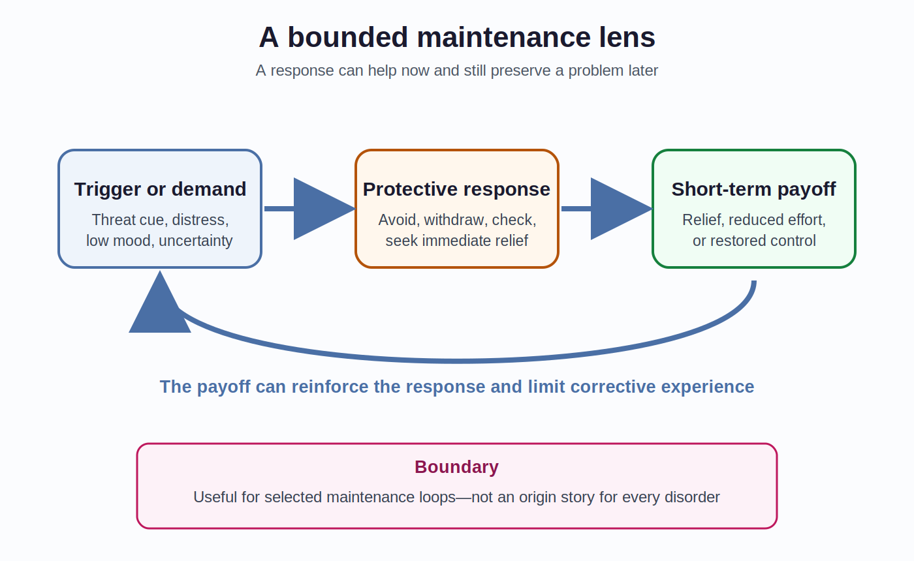
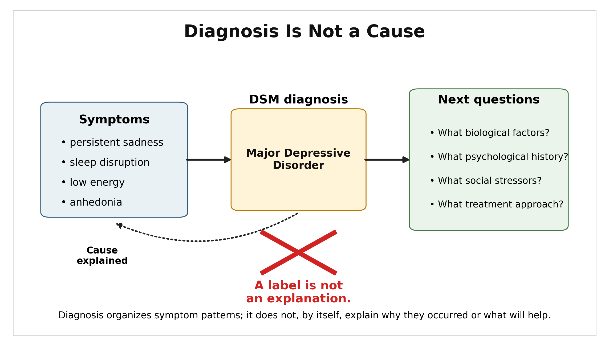
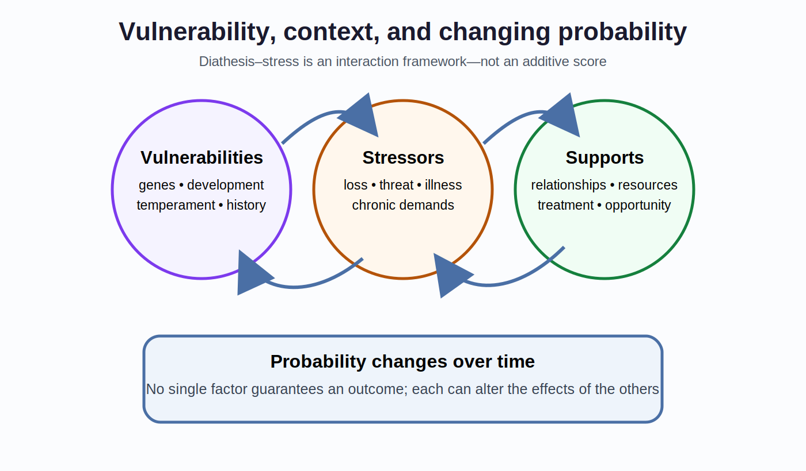
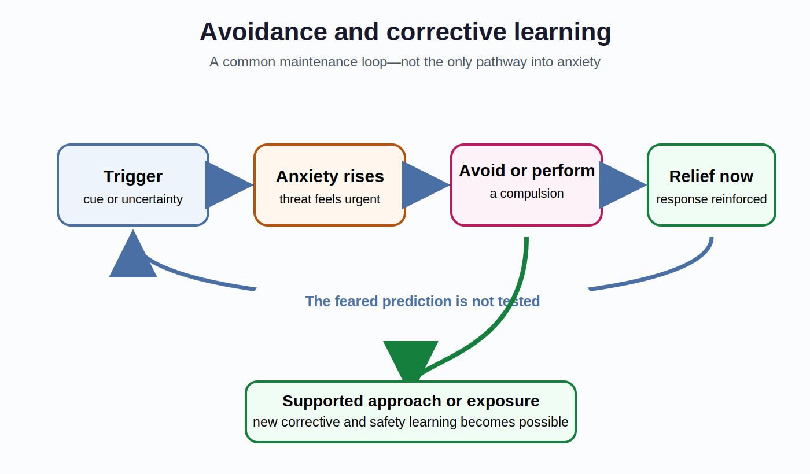
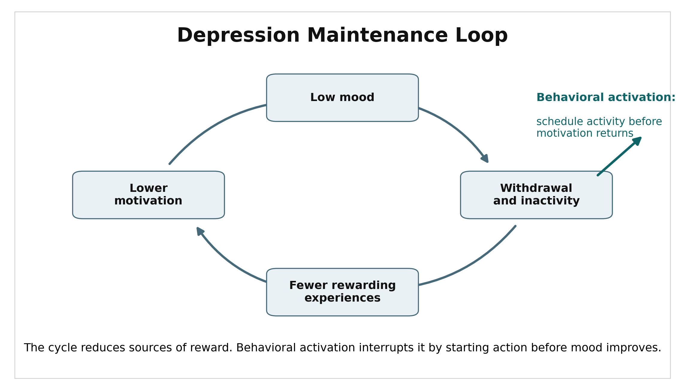
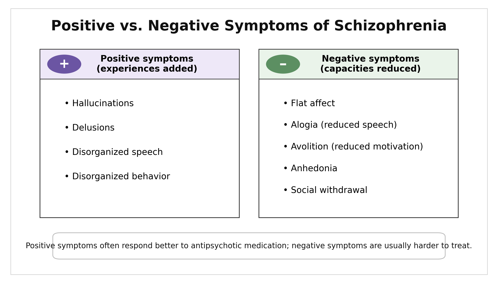

# Chapter 13: Psychological Disorders & Therapy

> Drafting history and provenance: see `_provenance/ch13-psychological-disorders-therapy.md` and the git log.

---

## Misconception Opener

*“You can usually tell what disorder someone has from a short description of the symptoms.”*

A student—call them Casey—has stopped attending class, sleeps at odd hours, and has not answered friends for two weeks. You might already be forming a diagnosis. Hold it.

Now add information. Casey is working overnight shifts because a parent is recovering from surgery. The withdrawal began after the schedule changed. Casey reports exhaustion but not persistent sadness, loss of pleasure, elevated mood, hallucinations, or thoughts of self-harm. A medical appointment later identifies anemia.

The first description justified concern. It did not establish a diagnosis. The later information changed the causal possibilities, the urgency, and the appropriate response. That is the central discipline of this chapter: **symptoms are evidence, not verdicts**.

Roughly one in five U.S. adults lives with a mental illness in a given year, although prevalence estimates depend on definitions and survey methods (National Institute of Mental Health [NIMH], 2024). Psychological disorders are common, consequential, and often treatable. They are also easy to discuss badly—by turning distress into a label, a label into a cause, or a treatment response into proof of a simple biological defect.

---

## Where This Fits

Chapter 3 introduced genes, neural systems, and chemical signaling without reducing behavior to one brain region or one neurotransmitter. Chapter 7 showed how short-term consequences can maintain behavior. Chapters 8 and 9 showed that memory and judgment are constructive, not recordings. Chapter 10 emphasized development, and Chapter 11 emphasized situations and social interpretation. Chapter 12 showed that stress responses can be adaptive in one context and costly when demands persist.

This chapter brings those levels together. A diagnosis organizes a clinically significant pattern. It does not, by itself, explain where that pattern came from. Biological vulnerability, development, learning, cognition, relationships, culture, opportunity, and stress can interact differently in different people who receive the same diagnosis.

One recurring lens remains useful: an ordinary process can become rigid or poorly matched to present conditions. Avoidance can reduce anxiety now while preserving it later. Withdrawal can conserve effort today while shrinking access to reward tomorrow. A compulsion can buy relief while strengthening the next compulsion. This is a **maintenance lens**, not a general theory of psychopathology. It fits some problems better than others, and it does not explain the origins of every disorder.

*Figure 13.1. A response can make sense in the short term yet help maintain a problem over time. This lens is especially useful for avoidance, compulsions, trauma-related threat learning, and behavioral withdrawal; it is not a universal architecture of psychological disorder. Original figure.*

---

## Learning Objectives

By the end of this chapter, you should be able to:

1. Explain what diagnosis does and does not establish, using duration, impairment, context, exclusions, and differential evidence.
2. Apply diathesis-stress and biopsychosocial reasoning without treating either framework as a single cause or literal score.
3. Distinguish representative anxiety, mood, psychotic, substance-use, personality, and neurodevelopmental patterns while calibrating mechanistic claims.
4. Explain how avoidance, compulsions, and behavioral withdrawal can maintain selected problems without treating maintenance as origin.
5. Evaluate psychological, medication, and somatic treatments by indication, evidence, risks, client preferences, access, and clinical context.

---

## Section 1: Diagnosis Is Classification Under Uncertainty

### The 3Ds Are a Heuristic, Not a Diagnostic Rule

Introductory courses often begin with three questions:

- Is the pattern **distressing**?
- Is it **dysfunctional**, meaning that it interferes with important areas of life?
- Is it **deviant**, meaning unusual relative to cultural expectations?

These “3Ds” are useful because they interrupt a common mistake: unusual does not mean disordered. A culturally expected ritual, an unconventional identity, or an eccentric hobby may be statistically uncommon without being pathological. Distress also matters, but it is not universally required; some conditions produce limited subjective distress while causing serious harm or impairment. Dysfunction is often central, but clinicians still need to ask what is causing it.

The 3Ds therefore open an inquiry. They do not close one. Diagnosis also requires disorder-specific symptoms, duration, severity, developmental and cultural context, exclusion of medical or substance-related explanations, and comparison with plausible alternatives.

*Figure 13.2. The 3Ds are preliminary questions that can identify concern. A diagnosis requires substantially more: disorder-specific criteria, duration, context, exclusions, differential diagnosis, and trained clinical judgment. Original figure.*

> **Do Not Confuse: Distress, disorder, and diagnosis.** Distress can be severe without meeting criteria for a disorder, and a disorder can be present even when the person reports little distress. A diagnosis is a clinical classification based on a pattern of evidence—not a synonym for suffering.

### What the DSM Does

The **Diagnostic and Statistical Manual of Mental Disorders, Fifth Edition, Text Revision** (**DSM-5-TR**) is the principal diagnostic classification used in U.S. mental-health practice. It provides criteria sets, descriptive text, duration requirements, exclusions, course information, cultural considerations, differential diagnoses, and functional consequences. The American Psychiatric Association explicitly states that the criteria are for trained professionals using clinical judgment, not for self-diagnosis (American Psychiatric Association, 2022).

The DSM improves **reliability** when it helps different clinicians use the same language and reach the same classification. Reliability is not the same as **validity**. Clinicians could agree consistently about a category while researchers remain uncertain whether the category maps onto one causal process. DSM-5 field trials illustrate the distinction: test-retest agreement varied substantially across diagnoses rather than reaching one uniformly high level (Regier et al., 2013).

*Figure 13.3. A diagnosis organizes a clinically significant pattern. It does not, by itself, explain why that pattern occurred or determine which treatment will help. Those require further evidence. Original figure.*

A **case formulation** goes beyond the label. It is a provisional account of how biological vulnerabilities, developmental history, current stressors, learned patterns, relationships, strengths, and maintaining conditions may interact for this person. A formulation can change as new evidence arrives. That is a feature, not a failure.

### Labels Direct Attention

Diagnostic categories are useful because they compress information. Compression also directs attention. Once a label is present, clinicians may notice confirming evidence more readily or attribute a new symptom to the existing diagnosis.

**Diagnostic overshadowing** occurs when a physical symptom is incorrectly attributed to a psychiatric condition or disability, delaying investigation of another cause. Interviews with clinicians in four emergency departments documented examples and the practical pressures that make this error more likely (Shefer et al., 2014). The lesson is not “labels are useless.” It is that a useful classification must not replace continued causal investigation.

Rosenhan’s 1973 hospital study remains historically famous, but later investigation identified serious questions about its records and reported participants (Cahalan, 2019). It is best treated as a contested episode in the history of diagnosis—not clean proof that psychiatric classification is impossible.

> **Stop and Retrieve:** A clinician and a diagnosis manual agree that a patient meets criteria for panic disorder. What has been established? What still has to be investigated?

### Vulnerability, Context, and Probability

The **diathesis-stress model** proposes that vulnerability and stress interact. A diathesis may involve genes, prenatal development, temperament, prior learning, health, or earlier adversity. Stress may involve acute events, chronic demands, discrimination, isolation, sleep disruption, or loss of resources. Neither side acts as destiny.

The model is often drawn as a threshold because the picture is memorable. Here is the problem: a literal additive score can imply more precision than the framework provides. Vulnerabilities can alter exposure to stress; stress can alter biological systems; support can buffer risk; development can change all three. The relationship is probabilistic and dynamic.

*Figure 13.4. Diathesis-stress reasoning asks how vulnerabilities, stressors, and protective resources interact over time. It changes probabilities; it does not calculate a person’s fate from a fixed vulnerability-plus-stress score. Original figure.*

The **biopsychosocial model** widens the frame further. Biological, psychological, and social explanations are not competing teams. Poverty can alter exposure to threat and access to treatment. Repeated threat can alter sleep and stress physiology. Learning history can influence avoidance. Medication effects can change the conditions under which new learning becomes possible. The point is interaction across levels.

[Try the Chapter 13 Clinical Reasoning Lab: Diagnosis Under Uncertainty](../../docs/labs/ch13/diagnosis-under-uncertainty.html)

> **Think About It:** A campus screening form flags a fictional student as “high risk.” What useful action could that result support, and what would still be unjustified without a clinical assessment?

---

## Section 2: Representative Disorders and Selected Maintenance Processes

### Anxiety, Fear, and Avoidance

**Fear** responds to a present threat. **Anxiety** anticipates a possible threat. Both are normal. Anxiety disorders involve patterns that are excessive or persistent relative to context and that cause clinically significant distress or impairment.

| Pattern | Central feature | What not to infer |
|---|---|---|
| **Generalized anxiety disorder** | Difficult-to-control worry across several domains, with associated tension, fatigue, concentration, or sleep problems | Ordinary worry about one difficult week is not enough |
| **Specific phobia** | Marked fear and avoidance of a particular object or situation | Every strong dislike or reasonable danger response is not a phobia |
| **Social anxiety disorder** | Fear of scrutiny or negative evaluation that restricts functioning | Shyness alone is not a disorder |
| **Panic disorder** | Recurrent unexpected panic attacks plus persistent concern or behavioral change | A single panic attack does not establish panic disorder |
| **Obsessive-compulsive disorder** | Intrusive obsessions and compulsions performed to reduce distress or prevent a feared event | Repetitive preferences or neatness alone are not OCD |
| **Post-traumatic stress disorder** | Intrusion, avoidance, changes in cognition or mood, and arousal after qualifying trauma exposure | Trauma exposure does not make PTSD inevitable |

Avoidance offers a clean example of maintenance. Leaving a feared situation reduces anxiety quickly. That relief is **negative reinforcement**: removing an aversive state makes the escape response more likely next time. The person therefore receives less opportunity to learn that anxiety can decline without escape or that the feared outcome may not occur.

*Figure 13.5. Avoidance and compulsions can be maintained by immediate relief. Exposure-based treatment creates conditions for corrective or inhibitory learning; it does not promise that the original fear memory is erased. Original figure.*

This loop is common, not universal. Anxiety can also be shaped by temperament, uncontrollable stress, social conditions, health, and biological sensitivity. A maintenance account explains why a pattern continues. It may not explain how it began.

PTSD makes this distinction especially important. Traumatic memories can be vivid, fragmented, cue-sensitive, and difficult to place safely in the past. Dual-representation theory is one influential account of how sensory and contextual representations can become poorly integrated (Brewin, Dalgleish, & Joseph, 1996). Exposure-based and trauma-focused treatments can help, but researchers continue to debate the exact contributions of extinction, inhibitory learning, reconsolidation, meaning change, and emotion regulation. Treatment efficacy does not settle one mechanism.

> **Stop and Retrieve:** Why can immediate relief make avoidance more likely even when avoidance worsens the long-term problem? Distinguish the reinforcer from the feared cue.

### Depression and Bipolar Disorders

**Major depressive disorder** involves depressed mood or loss of interest or pleasure, accompanied by additional cognitive, motivational, and bodily symptoms, for at least two weeks and with clinically significant distress or impairment. The diagnosis requires more than sadness. Grief, medical illness, substances, bipolar history, and other explanations must be considered.

One maintenance pathway is behavioral withdrawal. Low mood and fatigue reduce activity. Reduced activity produces fewer opportunities for mastery, connection, or reward. Motivation then falls further.

*Figure 13.6. Behavioral withdrawal is one possible maintenance pathway in depression. Behavioral activation interrupts the loop by scheduling useful or rewarding action before waiting for motivation to return. Original figure.*

Depression is not simply a serotonin shortage. An umbrella review found that the familiar serotonin-deficiency story is not supported as a general causal account (Moncrieff et al., 2022). Antidepressants can still reduce symptoms for some people (Cipriani et al., 2018). A treatment can be effective without proving that the untreated disorder was a simple deficiency of the chemical the treatment alters.

Reward processing, inflammation, sleep, stress physiology, cognition, and social adversity are all active research areas. Findings are heterogeneous. Some may characterize subgroups, consequences, or maintaining conditions rather than one universal mechanism.

**Persistent depressive disorder** involves a long-lasting depressive pattern. Major depressive episodes may occur during that persistent course; the condition is not defined merely as depression that never reaches the intensity of major depression.

**Bipolar I disorder** requires at least one manic episode. Mania involves a distinct period of elevated, expansive, or irritable mood and increased activity or energy, with features such as reduced need for sleep, pressured speech, grandiosity, racing thoughts, and risky behavior. **Bipolar II disorder** involves hypomanic episodes and major depressive episodes. Hypomania is not simply “mild happiness”; it is a marked change from usual functioning, though it does not reach the severity of mania.

> **Do Not Confuse: Depression with bipolar depression.** A current depressive episode does not reveal whether a person has unipolar or bipolar disorder. A history of mania or hypomania materially changes diagnosis and treatment decisions.

### Schizophrenia and Psychosis

Schizophrenia includes psychosis-related, cognitive, motivational, and functional disturbances. **Positive symptoms** add experiences or behaviors, such as hallucinations, delusions, and disorganized speech. **Negative symptoms** reduce expected capacities, such as emotional expression, speech, motivation, or social engagement.

*Figure 13.7. Positive symptoms add experiences such as hallucinations or delusions; negative symptoms reduce capacities such as motivation or expression. Depression, medication effects, and other causes must be considered when evaluating apparent negative symptoms. Original figure.*

The **dopamine hypothesis** captures part of the picture, especially altered presynaptic dopamine function associated with psychosis and the reduction of many positive symptoms by D2-blocking medications. It is not a complete explanation of schizophrenia. Glutamate signaling, development, cognition, stress, and distributed circuits also matter (Howes & Kapur, 2009). Antipsychotic efficacy does not prove that schizophrenia is merely “too much dopamine.”

Schizophrenia is substantially heritable, but identical-twin concordance is far below 100 percent. Genes alter probability; they do not determine a single inevitable outcome (Cardno & Gottesman, 2000).

### Substance-Use Disorders

Using a substance is not the same as having a **substance-use disorder** (**SUD**). Diagnosis concerns a problematic pattern: impaired control, persistent use despite harm, major role disruption, hazardous use, and related criteria over time.

**Tolerance** means that more of a substance may be needed for the same effect. **Withdrawal** is a characteristic syndrome after reducing or stopping some substances. Neither feature alone establishes SUD. A patient taking a medication exactly as prescribed can develop physiological tolerance or withdrawal without showing the broader behavioral pattern of a disorder.

Treatment may include behavioral therapy, medications for particular substances, harm-reduction strategies, recovery support, mutual-help resources, attention to housing or employment, and treatment of co-occurring conditions. Recurrence after improvement is clinically informative. It is not proof of weak character or proof that treatment was pointless (National Institute on Drug Abuse [NIDA], 2020).

Chapters 3 and 7 covered reward circuitry, prediction, and reinforcement. Here the additional point is diagnostic: mechanism, pattern, impairment, and treatment are related questions, not interchangeable ones.

> **Stop and Retrieve:** Why do tolerance and withdrawal fail as stand-alone tests for substance-use disorder? What additional evidence would matter?

> **Think About It:** A news story says a newly identified brain difference “explains depression.” What questions would you ask before accepting that causal claim?

---

## Section 3: Personality and Neurodevelopmental Conditions

### Personality Disorders

Personality disorders involve enduring, inflexible patterns of inner experience and behavior that deviate from cultural expectations, appear across contexts, and cause distress or impairment. The diagnosis concerns pervasive organization—not one selfish act, one unstable relationship, or one unusual trait.

The DSM groups ten personality disorders into three descriptive clusters: A (odd or eccentric), B (dramatic, emotional, or erratic), and C (anxious or fearful). The clusters are memory aids, not established causal systems.

**Antisocial personality disorder** involves a pervasive pattern of disregard for and violation of others’ rights, with evidence of conduct problems before age 15. It is not synonymous with criminality, psychopathy, or the legal standard of insanity.

**Borderline personality disorder** includes instability in relationships, self-image, and affect, often with impulsivity, intense fears of abandonment, or self-harm. Linehan’s biosocial account emphasizes transactions between emotional sensitivity and invalidating environments. It is an influential clinical model, not a demonstrated single origin for every case.

> **Do Not Confuse: Trait, diagnosis, and moral judgment.** A diagnosis describes a pervasive pattern and associated impairment. It does not convert disliked behavior into a medical fact, erase responsibility, or justify stigma.

### ADHD and Autism

**Attention-deficit/hyperactivity disorder** (**ADHD**) is a neurodevelopmental condition involving developmentally inappropriate inattention, hyperactivity-impulsivity, or both, across settings with functional impairment. Executive-function and catecholamine systems are relevant, but “underactive dopamine” is too simple to serve as the diagnosis or cause. Stimulant response likewise does not prove a dopamine deficiency.

**Autism spectrum disorder** (**ASD**) is a neurodevelopmental condition involving persistent differences in social communication and interaction together with restricted or repetitive patterns of behavior, interests, or sensory experience. Support needs, language, intellectual ability, sensory profile, and adaptive functioning vary widely.

Autism is strongly influenced by genetics and early development, but no single brain finding defines the spectrum. Studies of cortical organization, growth trajectories, connectivity, and synapses identify possible pathways and subgroup differences. They do not yet form one settled causal chain. The “broken mirror neuron” explanation is not well supported, and difficulty on a theory-of-mind task is neither universal nor a complete account of autistic social experience.

Neurodevelopmental conditions are not failed versions of the maintenance loop from Figure 13.1. Learning and environment still shape functioning, but the chapter’s avoidance-and-relief lens is not their origin story.

> **Stop and Retrieve:** What makes ADHD and autism neurodevelopmental conditions? Name one reason a group-level brain finding cannot diagnose an individual student.

> **Think About It:** A fictional accommodation request lists a diagnosis but not the student’s functional needs. Why is the label alone insufficient for deciding what support would help?

---

## Section 4: Treatment Is a Matching Problem

### Common Processes and Specific Methods

Psychotherapy is not one intervention. Neither is “the therapeutic relationship.” Several bona fide therapies help many clients, average differences among therapies are sometimes small, and specific methods matter more for some problems than others.

The **therapeutic alliance**—agreement on goals, collaboration on tasks, and an effective working bond—predicts outcome across therapy approaches (Flückiger et al., 2018). Prediction does not automatically establish causation. Early improvement can strengthen alliance, alliance can support later change, therapist skill can influence both, and the processes can reinforce one another.

Specific techniques also matter. Exposure and response prevention is central for OCD. Trauma-focused methods have evidence for PTSD. Behavioral activation targets depressive withdrawal. Skills-based treatments such as **dialectical behavior therapy** (**DBT**) were developed for problems involving severe emotion dysregulation and self-harm. For depression, several psychotherapies show broadly comparable average efficacy; for generalized anxiety disorder, comparative evidence more strongly favors CBT-based approaches. “All therapies are equal” is too strong. “Only technique matters” is also too strong.

| Approach | Primary work | Useful boundary |
|---|---|---|
| **Psychodynamic therapy** | Recurring relational patterns, conflict, emotion, and insight | Evidence of benefit does not prove every classical Freudian mechanism |
| **Client-centered therapy** | Empathy, genuineness, nonjudgmental exploration, client agency | Warmth alone is not sufficient treatment for every condition |
| **CBT** | Relationships among thoughts, behavior, emotion, and context | CBT is a family of methods, not one script |
| **Exposure-based therapy** | New learning in the presence of feared cues without avoidance or ritual | Distress is approached deliberately and safely; fear need not be erased |
| **DBT** | Acceptance plus change, skills, behavioral analysis, and treatment structure | DBT is more than generic mindfulness |
| **Behavioral activation** | Re-engagement with activities linked to mastery, meaning, or reward | Action may precede motivation rather than wait for it |

### Medication and Somatic Treatments

Medication decisions balance indication, expected benefit, adverse effects, prior response, health conditions, interactions, monitoring burden, access, and client preference.

**Antidepressants** include SSRIs, SNRIs, and older classes. They can be effective, especially for moderate-to-severe depression, but average effects do not predict one person’s response. Starting, switching, and stopping should be managed clinically because adverse effects and discontinuation symptoms vary.

**Antipsychotic medications** reduce acute psychotic symptoms for many patients, but efficacy and adverse-effect profiles differ. First- and second-generation categories do not create a simple “old drugs cause movement problems; new drugs do not” division. Metabolic, cardiovascular, neurological, hormonal, and subjective effects all matter. Clozapine is especially important for treatment-resistant schizophrenia and requires monitoring because of serious risks. Current guidance emphasizes individualized selection and monitoring rather than a universally best drug (World Health Organization [WHO], 2023).

**Mood stabilizers**, including lithium, can reduce mania and recurrence in bipolar disorder. Lithium requires blood-level and health monitoring because its effective and toxic doses are relatively close.

**Electroconvulsive therapy** (**ECT**) is performed under anesthesia with muscle relaxation. It can produce rapid, substantial improvement in severe depression, including some urgent or life-threatening presentations, and is also used for selected cases of catatonia and mania. ECT is not a punishment and does not resemble its common film portrayal.

The important qualification is memory. Cognitive effects vary with treatment parameters and the person. They can include anterograde and retrograde impairment, and some autobiographical memory difficulties may persist. Consent should therefore address expected benefit, alternatives, uncertainty, and cognitive risks rather than promising that memory effects will always be brief (National Institute for Health and Care Excellence [NICE], 2022).

*Figure 13.8. Treatment is selected by matching evidence and clinical context to the person and problem. Relationship processes matter within psychotherapy, but medication and ECT are not extensions of a psychotherapy common-factors hub. Original figure.*

> **Stop and Retrieve:** Why does a medication’s efficacy fail to prove a simple chemical-deficiency theory of the untreated disorder? Give one alternative interpretation.

### AI in Mental-Health Contexts

“AI therapy” combines tools with very different purposes and evidence.

| Tool type | Plausible use | Questions that must be asked |
|---|---|---|
| **General-purpose chatbot** | Information, reflection, drafting questions for a clinician | Was it designed or tested for this use? What happens to sensitive data? How does it respond to risk? |
| **Wellness or coaching product** | Structured exercises, reminders, mood tracking | Is the product making clinical claims? What evidence supports those claims? |
| **Clinically evaluated digital intervention** | A defined intervention studied for a defined population and outcome | What was the comparison group? Were harms assessed? Does the evidence generalize? |
| **Clinician-integrated tool** | Documentation, monitoring, screening support, between-session practice | Who reviews outputs? Who is accountable? How are errors and escalation handled? |
| **Regulated clinical product** | A specified medical function under an applicable regulatory pathway | What exactly is authorized, for whom, and under what supervision? |

A 2025 randomized wait-list-controlled trial found symptom improvement for a purpose-built generative therapeutic chatbot, demonstrating that categorical claims that such systems can never produce clinical benefit are untenable (Heinz et al., 2025). The study did not establish equivalence to licensed therapy, superiority to an active treatment, or safety across products and populations.

Privacy is also product-specific. HIPAA applies when a tool is operated by or for a covered entity or business associate under relevant conditions; it does not automatically protect every consumer health app or general-purpose chatbot (U.S. Department of Health and Human Services [HHS], 2026). Regulation, data handling, clinical oversight, and crisis procedures must be checked rather than inferred from a conversational interface.

The responsible question is not “Can AI replace therapists?” as one timeless yes-or-no proposition. Ask: **Which tool, for which function, supported by what evidence, with what safeguards, and accountable to whom?**

> **Think About It:** A wellness app reports symptom improvement in a wait-list-controlled study. What additional comparison, safety, privacy, and follow-up evidence would you want before calling it a clinical treatment?

---

## Chapter Summary

A diagnosis classifies a clinically significant pattern. It does not, by itself, establish cause, mechanism, prognosis, or treatment. The 3Ds—distress, dysfunction, and deviance—are useful preliminary questions, not a universal checklist. Trained diagnosis also considers disorder-specific criteria, duration, impairment, development, culture, medical and substance exclusions, and differential evidence.

Diathesis-stress and biopsychosocial frameworks organize interacting vulnerabilities, demands, resources, and levels of explanation. They change probabilities; they do not calculate destiny. Maintenance loops are narrower still. Avoidance, compulsions, and behavioral withdrawal can produce short-term consequences that preserve some problems over time, but those loops are not universal origin stories.

Representative disorders differ in pattern and course. Anxiety disorders involve persistent fear, worry, panic, or rituals; mood disorders require more than ordinary sadness or energy variation; schizophrenia includes positive, negative, cognitive, and functional disturbances; substance-use disorders concern a problematic pattern rather than substance exposure alone. Personality and neurodevelopmental diagnoses require pervasive or developmental evidence, not one trait or one brain finding.

Treatment is a matching problem. Psychotherapy alliance predicts outcome, while condition-specific techniques also matter. Medication and ECT require explicit tradeoffs among benefit, risk, urgency, preference, and monitoring. Treatment response does not prove a simple etiology. Mental-health AI must likewise be evaluated by product type, evidence, privacy, governance, and clinical integration.

---

## Connections to Other Chapters

| This chapter | Connects to | How |
|---|---|---|
| Diagnosis versus explanation | Chapter 2 | Reliability, validity, measurement, and inference are different questions |
| Neural and genetic vulnerability | Chapter 3 | Biological factors influence probability without becoming one-region or one-chemical explanations |
| Panic, substances, and altered states | Chapter 5 | Bodily state and substances can mimic or modify psychological symptoms |
| Avoidance and compulsions | Chapter 7 | Negative reinforcement can maintain behavior through immediate relief |
| PTSD and depression | Chapter 8 | Memory is constructive; retrieval and context matter without making one memory mechanism universal |
| Diagnostic anchoring | Chapter 9 | Labels can guide attention and produce premature closure |
| Neurodevelopment | Chapter 10 | Developmental timing and trajectories matter for ADHD and autism |
| Stigma, alliance, and support | Chapter 11 | Social judgment and relationships influence help-seeking and treatment |
| Chronic demands and coping | Chapter 12 | Stress and coping alter risk and resources without defining a disorder |

---

## Review Questions

1. **Multiple choice.** A student reports three days of intense worry before a major licensing exam but continues sleeping, attending class, and studying. Which conclusion is best supported?

   a. The student has generalized anxiety disorder because the worry is excessive.  
   b. The student has a psychological disorder because the experience is distressing.  
   c. The description indicates distress, but duration, breadth, impairment, and context do not establish a disorder.  
   d. No clinical concern could ever be justified unless all three Ds are present.

   

Answer and rationale
<strong>c.</strong> Distress is real evidence, but a short, context-linked episode without demonstrated impairment does not establish generalized anxiety disorder. The 3Ds initiate questions; they are not a required intersection or a self-diagnostic rule.

2. **Open response.** A clinician assigns a reliable diagnosis after a structured interview. Explain three questions that remain unanswered by the diagnosis alone.

   

Model answer
The diagnosis does not by itself establish etiology, identify which biological or psychosocial factors are most relevant for this person, or determine the best treatment. Prognosis, strengths, risks, preferences, access, and medical or substance contributors also require additional evidence.

3. **Multiple choice.** Two people experience similar job loss. One develops major depression and the other does not. Which statement best represents diathesis-stress reasoning?

   a. The person who developed depression must have had a genetic defect.  
   b. Vulnerabilities, stressors, supports, and prior history can interact differently; the outcome does not reveal one hidden cause.  
   c. Both people experienced the same stress score, so the difference is diagnostic error.  
   d. The person without depression used the correct coping style.

   

Answer and rationale
<strong>b.</strong> The framework is probabilistic. The outcome alone cannot identify a particular vulnerability, and the two people’s actual stress exposure and resources may also differ.

4. **Open response.** Explain how avoidance can be negatively reinforced. Then distinguish a maintenance explanation from an origin explanation.

   

Model answer
Leaving a feared situation removes anxiety, so escape becomes more likely next time. That explains one process that can keep the pattern going. It does not show how the fear first developed; conditioning, temperament, trauma, modeling, health, and context may contribute to origin.

5. **Multiple choice.** Which statement about persistent depressive disorder is most accurate?

   a. It can never include a major depressive episode.  
   b. It is diagnosed whenever sadness lasts longer than two weeks.  
   c. It involves a long-duration depressive pattern, and major depressive episodes may occur during that course.  
   d. It is the mild phase of bipolar II disorder.

   

Answer and rationale
<strong>c.</strong> Persistent depressive disorder concerns chronic course. It is not defined by never reaching major-depression intensity, and it is not a bipolar diagnosis.

6. **Open response.** Why does antipsychotic response not prove that schizophrenia is simply caused by excess dopamine?

   

Model answer
A treatment can alter a pathway that reduces symptoms without reversing the original cause. Dopamine findings are strongest for parts of psychosis and do not account fully for negative symptoms, cognition, development, glutamate, stress, or heterogeneity across people.

7. **Multiple choice.** A patient taking prescribed opioids after surgery develops tolerance and withdrawal but follows the prescription and shows no impaired control, hazardous use, or continued use despite harm. What follows?

   a. Tolerance automatically establishes opioid-use disorder.  
   b. Withdrawal automatically establishes opioid-use disorder.  
   c. Physiological adaptation is present, but the information does not by itself establish a substance-use disorder.  
   d. Prescribed substances cannot contribute to a substance-use disorder.

   

Answer and rationale
<strong>c.</strong> Tolerance and withdrawal can occur during medically supervised use. SUD diagnosis depends on the broader behavioral and functional pattern.

8. **Open response.** A client with OCD is considering supportive counseling or exposure and response prevention. Explain how both alliance and technique should enter the decision.

   

Model answer
A collaborative, trustworthy alliance can support engagement in any psychotherapy. OCD also has condition-specific evidence for exposure and response prevention. The accurate conclusion is not that relationship replaces technique or that technique makes relationship irrelevant; both affect whether an indicated treatment is delivered and sustained.

9. **Multiple choice.** Which statement about ECT is most accurate?

   a. It is administered while the patient is awake so clinicians can monitor memory.  
   b. It is used only after every medication has failed and has no role in urgent presentations.  
   c. It can be highly effective for selected severe conditions, but consent must include variable cognitive and autobiographical-memory risks.  
   d. Any memory disruption reliably resolves within days.

   

Answer and rationale
<strong>c.</strong> Modern ECT uses anesthesia and muscle relaxation. It may be considered in severe or urgent cases, and memory outcomes vary; they should not be guaranteed to be brief.

10. **Open response.** A company calls its general-purpose chatbot “AI therapy.” List four pieces of evidence or governance information you would need before evaluating that claim.

    

Model answer
Relevant questions include the intended population and function, comparison condition and outcomes in trials, adverse-event and crisis procedures, privacy and data-use rules, clinician oversight, regulatory status, accountability for errors, and whether findings generalize beyond the tested product.

---

## Key Terms

- **Antipsychotic medication** — Medication used to reduce psychotic symptoms; drugs differ in benefits, adverse effects, and monitoring needs.
- **Biopsychosocial model** — Framework organizing interacting biological, psychological, and social influences.
- **Case formulation** — Provisional account of how relevant vulnerabilities, stressors, strengths, and maintaining processes may interact for a particular person.
- **Cognitive-behavioral therapy (CBT)** — Family of treatments targeting relationships among cognition, behavior, emotion, physiology, and context.
- **Diagnostic overshadowing** — Misattributing a new symptom to an existing psychiatric or disability label instead of adequately investigating alternatives.
- **Diagnostic reliability** — Degree to which clinicians or assessments agree on a classification.
- **Diagnostic validity** — Degree to which a classification captures a meaningful phenomenon for its intended purpose.
- **Diathesis-stress model** — Framework in which vulnerabilities and environmental demands interact probabilistically.
- **Dialectical behavior therapy (DBT)** — Structured treatment integrating acceptance and change strategies, behavioral analysis, skills, and coaching.
- **DSM-5-TR** — Current text revision of the principal U.S. manual for classifying mental disorders.
- **Electroconvulsive therapy (ECT)** — Treatment using a controlled seizure under anesthesia for selected severe psychiatric conditions.
- **Exposure therapy** — Treatment involving structured contact with feared cues to support new learning without habitual avoidance.
- **Maintenance process** — Process that helps a problem continue, which may differ from the process that originally produced it.
- **Negative reinforcement** — Strengthening behavior by removing or reducing an aversive state.
- **Positive and negative symptoms** — In schizophrenia, experiences added to functioning versus capacities reduced.
- **Substance-use disorder (SUD)** — Clinically significant pattern of impaired control, continued use despite harm, or related functional problems.
- **Therapeutic alliance** — Collaborative working relationship involving bond, goals, and tasks.
- **Three Ds** — Distress, dysfunction, and deviance; introductory questions rather than a formal universal diagnostic checklist.

---

## Further Reading

- American Psychiatric Association. [About DSM-5-TR](https://www.psychiatry.org/psychiatrists/practice/dsm/about-dsm). — A concise official explanation of criteria sets, clinical judgment, differential diagnosis, and the descriptive text.
- Cahalan, S. (2019). *The Great Pretender*. Grand Central Publishing. — Investigative history of Rosenhan’s study and the risks of building a field-wide conclusion on a famous but disputed account.
- Linehan, M. M. (2020). *Building a Life Worth Living*. Random House. — Memoir and history of the development of DBT.
- National Institute on Drug Abuse. [Treatment and Recovery](https://nida.nih.gov/publications/drugs-brains-behavior-science-addiction/treatment-recovery). — Evidence-calibrated overview of treatment, recurrence, and recovery.
- U.S. Department of Health and Human Services. [Resources for Mobile Health Apps Developers](https://www.hhs.gov/hipaa/for-professionals/special-topics/health-apps/index.html). — Explains why privacy obligations depend on who operates a health tool and how it is connected to covered care.

---

## References

American Psychiatric Association. (2022). *Diagnostic and statistical manual of mental disorders* (5th ed., text rev.). American Psychiatric Association Publishing.

Barth, J., Munder, T., Gerger, H., Nüesch, E., Trelle, S., Znoj, H., Jüni, P., & Cuijpers, P. (2013). Comparative efficacy of seven psychotherapeutic interventions for patients with depression: A network meta-analysis. *PLoS Medicine, 10*(5), e1001454. https://doi.org/10.1371/journal.pmed.1001454

Beck, A. T., Rush, A. J., Shaw, B. F., & Emery, G. (1979). *Cognitive therapy of depression*. Guilford Press.

Brewin, C. R., Dalgleish, T., & Joseph, S. (1996). A dual representation theory of posttraumatic stress disorder. *Psychological Review, 103*(4), 670–686. https://doi.org/10.1037/0033-295X.103.4.670

Cahalan, S. (2019). *The great pretender: The undercover mission that changed our understanding of madness*. Grand Central Publishing.

Cardno, A. G., & Gottesman, I. I. (2000). Twin studies of schizophrenia: From bow-and-arrow concordances to Star Wars Mx and functional genomics. *American Journal of Medical Genetics, 97*(1), 12–17.

Cipriani, A., Furukawa, T. A., Salanti, G., Chaimani, A., Atkinson, L. Z., Ogawa, Y., et al. (2018). Comparative efficacy and acceptability of 21 antidepressant drugs for the acute treatment of adults with major depressive disorder: A systematic review and network meta-analysis. *The Lancet, 391*(10128), 1357–1366. https://doi.org/10.1016/S0140-6736(17)32802-7

Craske, M. G., Treanor, M., Conway, C. C., Zbozinek, T., & Vervliet, B. (2014). Maximizing exposure therapy: An inhibitory learning approach. *Behaviour Research and Therapy, 58*, 10–23. https://doi.org/10.1016/j.brat.2014.04.006

Flückiger, C., Del Re, A. C., Wampold, B. E., & Horvath, A. O. (2018). The alliance in adult psychotherapy: A meta-analytic synthesis. *Psychotherapy, 55*(4), 316–340. https://doi.org/10.1037/pst0000172

Heinz, M. V., Mackin, D. M., Trudeau, B. M., Bhattacharya, S., & Wang, Y. (2025). Randomized trial of a generative AI chatbot for mental health treatment. *NEJM AI*. https://doi.org/10.1056/AIoa2400802

Howes, O. D., & Kapur, S. (2009). The dopamine hypothesis of schizophrenia: Version III—the final common pathway. *Schizophrenia Bulletin, 35*(3), 549–562. https://doi.org/10.1093/schbul/sbp006

Linehan, M. M. (1993). *Cognitive-behavioral treatment of borderline personality disorder*. Guilford Press.

Moncrieff, J., Cooper, R. E., Stockmann, T., Amendola, S., Hengartner, M. P., & Horowitz, M. A. (2022). The serotonin theory of depression: A systematic umbrella review of the evidence. *Molecular Psychiatry, 27*(8), 3369–3380. https://doi.org/10.1038/s41380-022-01661-0

National Institute for Health and Care Excellence. (2022). *Depression in adults: Treatment and management (NG222).* https://www.nice.org.uk/guidance/ng222

National Institute of Mental Health. (2024). *Mental illness.* https://www.nimh.nih.gov/health/statistics/mental-illness

National Institute on Drug Abuse. (2020). *Treatment and recovery.* https://nida.nih.gov/publications/drugs-brains-behavior-science-addiction/treatment-recovery

Regier, D. A., Narrow, W. E., Clarke, D. E., Kraemer, H. C., Kuramoto, S. J., Kuhl, E. A., & Kupfer, D. J. (2013). DSM-5 field trials in the United States and Canada, Part II: Test-retest reliability of selected categorical diagnoses. *American Journal of Psychiatry, 170*(1), 59–70. https://doi.org/10.1176/appi.ajp.2012.12070999

Rogers, C. R. (1957). The necessary and sufficient conditions of therapeutic personality change. *Journal of Consulting Psychology, 21*(2), 95–103. https://doi.org/10.1037/h0045357

Shefer, G., Henderson, C., Howard, L. M., Murray, J., & Thornicroft, G. (2014). Diagnostic overshadowing and other challenges involved in the diagnostic process of patients with mental illness who present in emergency departments with physical symptoms: A qualitative study. *PLoS ONE, 9*(11), e111682. https://doi.org/10.1371/journal.pone.0111682

U.S. Department of Health and Human Services. (2026). *Resources for mobile health apps developers.* https://www.hhs.gov/hipaa/for-professionals/special-topics/health-apps/index.html

World Health Organization. (2023). *Antipsychotic medicines for psychotic disorders.* https://www.who.int/teams/mental-health-and-substance-use/treatment-care/mental-health-gap-action-programme/evidence-centre/psychosis-and-bipolar-disorders/antipsychotic-medicines-for-psychotic-disorders
