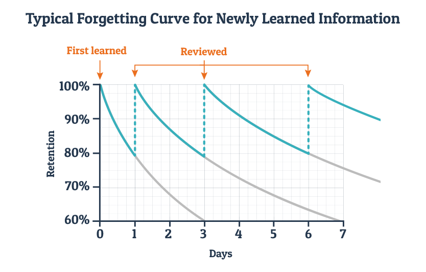
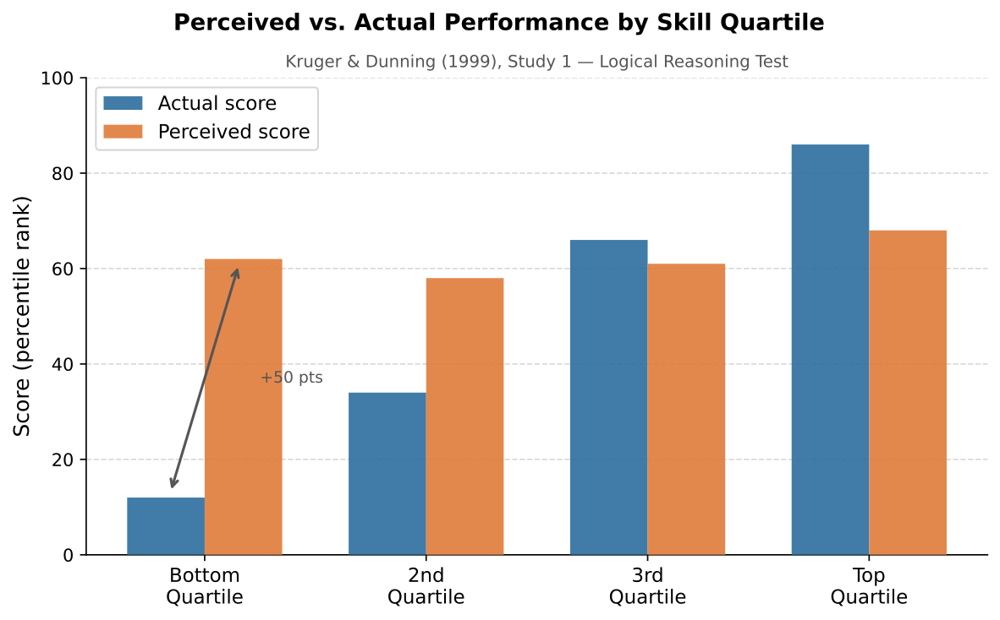

# Prologue: How to Actually Learn This Stuff

> **Draft status:** v0.1 — new this session. Adapted from `psych101_awesome-sauce` (Jon's own original material). Added: metacognition/Dunning-Kruger section (with figure), AI unit (Clark & Brennan grounding theory, illusion of fluency), Ebbinghaus forgetting curve figure, connections table, review questions, key terms, further reading.
>
> **Figures available:**
> - `docs/images/prologue/fig_forgetting_curve_ebbinghaus.png` — Ebbinghaus forgetting curve with spaced-review intervals (use in Section 4)
> - `docs/images/prologue/fig_dunning_kruger_actual_data.svg/.png` — Kruger & Dunning (1999) Study 1 actual bar data — NOT the popular "Mount Stupid" spike curve (use in Section 7)
>
> **Demo embeds:** Demos from `psych101_awesome-sauce` can be embedded via iframe — confirm live URLs with Jon before HTML conversion. Working memory demo: https://jkoxford-a11y.github.io/psych101_awesome-sauce/working-memory-demo.html

---

## Misconception Opener

You studied. You spent two hours with the textbook open, highlighted a dozen passages, read through your notes. At some point the material started to feel familiar. By the end, you felt ready.

Then the exam asked you to explain a concept in your own words, or apply it to a new example, and the feeling of readiness turned out to be hollow.

Here is the uncomfortable truth: **the activities that feel most like studying are often the worst ways to learn.** Rereading produces familiarity, not recall. Highlighting gives your hand something to do while your mind drifts. Passive review creates the *feeling* of knowing without changing what you can actually do with the material.

This is not a generic study-skills handout. It is a chapter about how the mind works. Once you understand attention, working memory, encoding, retrieval, sleep, and reinforcement, many ordinary student experiences start to make psychological sense. And once those concepts make sense, you have a much better shot at using them on yourself.

Read this before you start Chapter 1. The rest of the book was designed with these principles built in.

---

## Learning Objectives

By the end of this prologue, you should be able to:

1. Distinguish exposure from learning and explain why familiarity after rereading is unreliable.
2. Explain how attention and working memory create the conditions for encoding.
3. Describe why deep processing produces more durable memories than shallow processing.
4. Explain the testing effect and its implications for study practice.
5. Describe why distributed practice outperforms massed practice for long-term retention.
6. Use operant conditioning to explain procrastination and phone-checking during study sessions.
7. Define metacognition and explain what the Kruger & Dunning (1999) data actually show.
8. Evaluate whether a given use of AI supports learning or replaces the cognitive work that learning requires.

---

## Opening Case: Three Students

Students often say, "I studied, but I still did badly on the exam." Sometimes that is exactly what happened. The student spent time. Effort was made. The material was encountered again and again.

Psychology forces a more precise question: **did studying produce learning?**

Those are not the same thing. Learning is a relatively lasting change in knowledge or behavior produced by experience. Attention determines what information enters conscious processing. Memory is one way that learning persists. Sleep helps stabilize some of what was learned. Reinforcement shapes which habits we repeat.

Three students illustrate the difference.

**Emma: The Familiarity Trap.** Emma opens the textbook the night before the quiz. She reads carefully, highlights many sentences, and rereads the slides. The material starts to look familiar. She recognizes terms she saw in lecture. By midnight she feels reassured. "I know this," she thinks. The next morning, the quiz asks her to explain the difference between recognition and recall. Emma can picture the slide. She remembers seeing both words. But she cannot clearly explain the difference without looking. Emma studied. What she practiced was familiarity, not retrieval.

**Luis: The Retrieval System.** Luis studies differently. Several days before the quiz, he looks over the learning objectives and tries to answer them without notes. This feels uncomfortable. He gets several answers partly wrong. He checks the textbook, corrects his explanations, and tries again later. He studies in short sessions spread across the week. He asks: "Could I give a new example of this?" The night before the quiz, he reviews what he missed and goes to sleep. Luis's studying feels harder than Emma's because he keeps exposing what he does not know. That is why it works.

**Nia: The AI Fluency Trap.** Nia asks an AI to summarize the chapter. The summary is clear and easier to read than the textbook. Nia reads it twice and feels prepared. On the quiz, she recognizes many terms, but when asked to apply them she struggles. The explanation made sense when AI produced it. But she had not practiced producing the explanation herself. Nia's problem is not that she used AI — it can be a powerful learning tool — but that she used it in a way that replaced retrieval instead of strengthening it.

> **Core distinction:** Exposure means the information was present. Learning means the information changed what you can retrieve, explain, apply, or judge later.

---

## The Learning System

| Process | What it does | Study implication |
|---|---|---|
| Attention | Selects information for conscious processing | You cannot deeply process everything at once |
| Working memory | Holds and organizes information actively | Overload weakens understanding |
| Encoding | Builds memory traces | Meaning and organization matter more than time spent |
| Retrieval | Reconstructs information from memory | Trying to remember strengthens future access |
| Spacing | Spreads practice across time | Durable learning beats temporary fluency |
| Sleep | Supports attention and consolidation | Sleep is part of studying, not time stolen from it |
| Reinforcement | Shapes repeated behavior | Bad study habits survive because they feel good now |

Notice what this list does not say: it does not say re-read more, highlight more, or summarize more. The best study behaviors — retrieval practice, spaced review, deep encoding — are the ones that feel harder in the moment and work better in the long run. Psychologists call this **desirable difficulty**: a challenge that hurts short-term fluency while building long-term retention.

---

## Section 1: Attention Is the Gateway

Your mind cannot fully process everything available to it. This is not a flaw. It is the evolved design of a system built to select what matters from a constantly overwhelming sensory world. **Selective attention** is your ability to focus conscious processing on one stimulus or task while filtering out others. It is what lets you follow a lecture while ignoring hallway noise, or read a paragraph while someone nearby is talking.

But selective attention has a cost: when you focus on one thing, you become less aware of others. Psychologists call the failure to notice unexpected stimuli **inattentional blindness**. Students who read with their phone visible divide attention without noticing how much encoding they lose.

Once information passes through the attentional filter, it depends on **working memory** — the active mental workspace where you hold and manipulate information. Working memory is what you use when you follow a long argument, compare two theories, or try to keep a definition in mind while reading the example that follows it. It is powerful and limited. Dense, unfamiliar, fast-moving material overloads it. When working memory is overloaded, pieces fall out before you can integrate them.

Emma's mistake is not laziness. Her mistake is confusing being near information with attending to it. Being near information is not the same as attending to it, and attending to it is not the same as encoding it.

> **Stop & Retrieve:** Before moving on — in your own words, what is the difference between selective attention and working memory?

**Think About It:** Think of a time this semester when you were physically in class but mentally somewhere else. What was competing for your attention? What do you remember from that part of the lecture?

*(Connects forward → Ch. 5 States of Consciousness: attention and inattentional blindness; Ch. 7 Memory: the Atkinson-Shiffrin model)*

---

## Section 2: Encoding — Depth Matters

Attention gets information into the mental workspace. But attention alone is not enough. You can focus carefully on a page and still remember very little from it, because memory depends not only on whether information was noticed but on **how it was processed**.

**Shallow processing** touches the surface of material — noticing a word's appearance, where it appeared on a page, or that it was bolded. **Deep processing** connects material to meaning: what does this idea mean, how does it connect to other ideas, why does it matter, how does it apply to a situation you have actually been in?

Craik and Lockhart's (1972) levels-of-processing framework showed that deeper encoding at the time of study produces better later recall. This is not a small effect. Students in a classic demonstration who were asked to rate words as pleasant/unpleasant later recalled them at more than twice the rate of students asked to notice whether words contained the letter *e*.

Several specific encoding strategies are well supported:

**The self-reference effect.** Information is more memorable when connected to yourself. "Negative reinforcement" is a dry term. "Negative reinforcement is why I check my phone when I feel anxious about a deadline — checking removes the discomfort" creates a durable hook. Every "Think About It" prompt in this book uses this principle deliberately.

**Chunking.** Separate pieces of information become easier to hold and remember when they are organized into a meaningful unit. Classical conditioning abbreviations (US, UR, CS, CR) look like random letters until you understand the system they describe — then they become four parts of one structure.

**Dual coding.** Information encoded both verbally and visually is recalled better than information encoded in one modality alone (Paivio, 1971). The figures in this book are not decoration. They carry content.

> **Stop & Retrieve:** What is the difference between shallow and deep processing? Give one example of each from your studying last week.

**Think About It:** The last time you read a textbook chapter, did you notice whether you were processing meaning or just recognizing words? What would you have had to do differently to process more deeply?

*(Connects forward → Ch. 7 Memory: levels-of-processing, self-reference effect; Ch. 4 Sensation & Perception: dual coding and visual imagery)*

---

## Section 3: Retrieval Is Learning

Most students think testing comes *after* learning. That is only partly true. Testing can measure learning, but it also *creates* it. Every time you try to pull information out of memory, you practice the exact cognitive process you will need later. The act of retrieval strengthens access to the memory.

This is called the **testing effect**, and it is one of the most robust findings in the learning-science literature (Roediger & Karpicke, 2006). Students who read a passage once and then practiced recalling it outperformed students who simply reread the passage three times — on a test administered one week later. The rereaders felt more prepared. The retrievers performed better.

There are three levels of memory performance worth distinguishing:

| Level | What it requires | Example |
|---|---|---|
| Recognition | Identify correct information when it is present | Pick the correct definition from four choices |
| Recall | Produce information without seeing it | Define "working memory" from memory |
| Application | Use information in a new situation | Diagnose why a student's study method failed |

Recognition is usually easier than recall because the answer is already in front of you. This is why multiple-choice exams often feel easier than they test — you are recognizing, not recalling. Most real-world use of knowledge requires recall or application. "If I recognize the answer, I know the concept" is the familiarity trap in its purest form.

**How to use retrieval practice:** Before rereading any section, take out a blank page and write everything you remember about the topic. Then check. Mark what you got right, what you got partly right, and what you missed completely. The missed items are not failure — they are information. They tell you exactly where the retrieval pathway is weak.

The **Stop & Retrieve** prompts throughout this book interrupt passive reading at natural pause points for the same reason. Answer them without looking back. That discomfort is the learning.

> **Stop & Retrieve:** What is the testing effect? Why does it matter for how you study?

**Think About It:** Think about the last time you got something wrong on a practice question. Did you treat it as failure, or as a signal about what to review? What would it look like to treat errors as information rather than defeat?

*(Connects forward → Ch. 7 Memory: retrieval, encoding specificity; Ch. 6 Learning: reinforcement and feedback)*

---

## Section 4: Spacing Beats Cramming

**Figure P.1 — Ebbinghaus Forgetting Curve**

*Figure P.1. Ebbinghaus (1885) documented how rapidly memory for new material decays without review — over 50% within an hour, roughly 75% within a day. Each spaced review resets the curve, and the rate of forgetting slows after successive retrievals. This is the empirical basis for spacing and retrieval practice.*

Hermann Ebbinghaus spent years memorizing meaningless syllable strings and then testing his own recall at intervals. The result was the forgetting curve in Figure P.1: memory for new material drops sharply within the first hour and continues to fall. Without retrieval, roughly three-quarters of new material is gone within a day.

But each act of retrieval resets the curve — and critically, it resets it at a higher level. The rate of forgetting slows after successive retrievals. This is the empirical foundation for spacing.

**Massed practice** (cramming) concentrates study in one session. **Distributed practice** spreads it across multiple shorter sessions separated by time. Distributed practice nearly always produces better long-term retention, even when total study time is equal. The mechanism is partly straightforward: each return to material after a delay is a retrieval event, and retrieval strengthens memory. Studying across three sessions on three different days gives you three retrieval events. An equivalent three-hour cram session gives you one.

There is a subtler mechanism too. When material is slightly forgotten and then retrieved, the memory is reconstructed rather than simply re-activated — and reconstruction strengthens the memory trace in a way that smooth re-recognition does not. This is why spacing can feel *less effective* than cramming even when it *is more effective*: the effort of partial forgetting and re-retrieval is mistaken for inefficiency.

**Interleaving** extends this principle. Once you know the basics, mix related concepts during practice rather than blocking them by type. Instead of drilling only positive reinforcement examples for ten minutes, mix reinforcement and punishment examples and ask: Is the behavior increasing or decreasing? Is something added or removed? Is this reinforcement or punishment, positive or negative? Interleaving is harder because you must categorize each new example. That diagnostic demand is exactly what builds the flexible knowledge that exams and real-world situations require.

> **Stop & Retrieve:** Why does distributed practice typically outperform massed practice? What is the mechanism, not just the result?

**Think About It:** How many days before the next exam are you reading this? Map out what a spaced review schedule for this material would actually look like — specific sessions on specific days — rather than a vague intention to "review later."

*(Connects forward → Ch. 6 Learning: reinforcement schedules, extinction; Ch. 7 Memory: forgetting curves, storage)*

---

## Section 5: Sleep Is Part of Studying

Many students treat sleep as the time left over after studying is finished. Neuroscience says otherwise.

Sleep does at least three things that matter for learning. First, it restores the attentional capacity that sustained study depletes. A sleep-deprived student reading at 1 a.m. has a different attentional system than that same student reading at 9 p.m. after adequate sleep the night before. Attention is the gateway to encoding. Degraded attention means degraded encoding, regardless of how long the book stays open.

Second, sleep supports **memory consolidation** — the neural process by which recently encoded memories become more stable. The hippocampus, which is critical for forming explicit memories of facts and events, is especially active during certain sleep stages. Material studied before sleep benefits from consolidation; material crammed until 3 a.m. and then recovered without sleep does not get the same consolidation window.

Third, sleep deprivation impairs emotional regulation in ways that compound the first two problems. When the prefrontal cortex is fatigued, small setbacks feel larger, difficult paragraphs feel impossible, and a challenging concept on a quiz feels catastrophic rather than informative. The amygdala becomes more reactive; context-sensitive regulation weakens. This is not a character flaw — it is neuroscience.

The all-nighter trade is worse than it appears. You gain hours of exposure while degrading the attention that makes exposure into encoding, the consolidation that makes encoding into lasting memory, and the emotional regulation that makes errors into learning rather than threat.

The practical implication is not "never study at night." It is: protect sleep as part of the study plan, not as the sacrifice you make when the plan fails.

> **Stop & Retrieve:** What three functions of sleep are most relevant to learning? Which one do you think students underestimate most?

*(Connects forward → Ch. 5 States of Consciousness: sleep stages, memory consolidation during sleep)*

---

## Section 6: Study Habits Are Learned Behaviors

Students often describe study habits as if they were personality traits: "I'm a procrastinator." "I can only work under pressure." "I can't resist my phone." Psychology offers a more precise and, importantly, more actionable account: these patterns are **learned behaviors shaped by consequences**.

**Procrastination as negative reinforcement.** Consider this sequence: You think about an upcoming exam. The thought produces anxiety. You open a different tab. Anxiety drops. Opening a different tab has been negatively reinforced — a behavior increased because it removed something aversive. Negative reinforcement does not mean punishment. It means the removal of something unpleasant following a behavior. Avoidance works, in the short term, to reduce anxiety. That is exactly why it persists even when it makes the long-term problem worse. (You will meet this mechanism again in Chapter 13 when we discuss anxiety disorders and the maintenance cycle that keeps them going.)

**Phone-checking and variable reinforcement.** Phones are difficult to ignore because they are built around a variable reinforcement schedule — sometimes a notification is boring, sometimes funny, sometimes socially important, sometimes absent. Variable reinforcement produces persistent behavior precisely because the next check might be rewarding. The machine that pays out on every pull eventually becomes predictable and less compelling. The machine that pays out unpredictably is very hard to put down. This is not weakness. It is operant conditioning applied at scale.

**AI and immediate relief.** The same logic applies to how students use AI. You are stuck on a concept. The stuck feeling is unpleasant. You ask the AI for the answer. The answer appears immediately. Confusion drops. That relief reinforces asking AI early — before you have made a genuine attempt. Over time, the retrieval event that would have strengthened the memory gets replaced by an outsourcing event that provides relief without building skill.

None of these patterns means you are bad at studying. They mean your habits have been shaped by consequences, as all behaviors are, and that consequences can be redesigned. Reward retrieval, not time spent. Protect attention during study blocks. Use effort as a signal that learning is happening, not as a signal to stop.

> **Stop & Retrieve:** Explain procrastination using the concept of negative reinforcement. Do not just use the words — show the mechanism step by step.

**Think About It:** Think of a study habit you have that you know does not work well. Walk it through the reinforcement framework: What behavior? What consequence followed? What made the consequence reinforcing? What would a better reinforcement structure look like?

*(Connects forward → Ch. 6 Learning: negative reinforcement, variable reinforcement schedules, habit formation)*

---

## Section 7: Knowing What You Don't Know

**Figure P.2 — Competence and Confidence**

*Figure P.2. Kruger & Dunning (1999) Study 1. Actual vs. perceived test performance by quartile on a logical reasoning task. The bottom-quartile group dramatically overestimated their performance (perceived ~62nd percentile; actual ~12th). The top-quartile group slightly underestimated theirs (perceived ~68th; actual ~86th). This is the actual finding — not the popular "Mount Stupid" spike curve, which does not appear in the paper.*

**Metacognition** is thinking about your own thinking — the ability to monitor what you know, recognize what you do not know, and adjust accordingly. It is one of the strongest predictors of academic performance (Flavell, 1979; Dunning, 2011), and it is shockingly easy to get wrong.

Kruger and Dunning (1999) gave participants tests of logical reasoning and then asked them to estimate their own performance. Figure P.2 shows what they found. The lowest-performing group overestimated their scores by roughly 50 percentile points. The highest-performing group slightly underestimated theirs. The gap between the two groups is not simply that low performers know less — it is that knowing less makes it harder to recognize how much you do not know. Competence in a domain is partly what allows you to evaluate your own competence in that domain.

What makes this especially relevant for students: the same exposure that produces familiarity also produces the *feeling* of knowing. Emma felt ready. That feeling was real. It was also wrong. The rereading that produced her confidence did not produce the retrievable knowledge the exam required.

This means you cannot fully trust your own sense of how well you know something. You need external tests — actual retrieval attempts, practice questions, explaining to someone else — not because you are a bad judge but because the psychological mechanism that produces confidence is partly independent of the mechanism that produces retrieval.

A calibrated learner is not one who is always uncertain. It is one who knows *when* to be uncertain — who can distinguish genuine retrieval from comfortable recognition, and who uses that distinction to decide where to put more effort.

> **Stop & Retrieve:** What did Kruger and Dunning actually find? (Be specific — describe the pattern in Figure P.2.) What does this suggest about relying on your feelings of confidence to decide when you are done studying?

**Think About It:** Think of a topic where you feel highly confident. What would you actually have to do to find out whether that confidence is calibrated? What would discovering a gap feel like, and how would you want to respond to it?

*(Connects forward → Ch. 8 Thinking, Language & Intelligence: heuristics, dual-process theory, System 1 fluency; Ch. 2 Research Methods: reliability and validity applied to self-assessment)*

---

## Section 8: Working With AI

A final note before you start the book, because you are already using AI and the question is not whether but how.

**AI has no access to your mental state.** Clark and Brennan (1991) described how communication requires *grounding* — establishing shared context and common ground between parties. When you talk to another person, they bring background knowledge, read your tone, ask clarifying questions, and flag when they have lost the thread. AI has none of that unless you provide it. Every conversation starts from zero. The cognitive work of establishing what you mean, what you already know, what kind of help you need, and what level of detail you are looking for — that work is entirely on your side.

This is not a technical limitation that will be fixed next year. It is a structural feature of how language models work. The quality of what AI gives you is determined largely by the quality of what you put in. Prompt specificity is not a tech skill. It is a clarity-of-thought skill. You cannot prompt well for a topic you do not understand.

**AI produces fluent output that can feel like comprehension.** When AI explains something clearly, the explanation is easy to read, organized, and coherent. That fluency activates the same metacognitive signal as genuine understanding — the feeling that you have got it, that it makes sense, that you are ready. Nia felt that. It was not learning. Polished, confident output short-circuits the sense-checking system that would otherwise flag confusion.

This means: never let AI's first explanation be the last thing that happens. Use it as a starting point for retrieval, not as a substitute for it.

**What AI is good for in this course:**

- Generating practice questions and quizzing you one at a time, holding the answer until you respond
- Critiquing your explanation: "Here is my understanding of X — correct me where I'm wrong"
- Giving alternative examples and asking which one fits the concept
- Explaining a confusing passage in different language — then stepping aside while you close the window and explain it back without looking

**What AI is not good for:**

- Replacing your first attempt at retrieval (doing this to you instead of for you)
- Reading for you and summarizing what the chapter says
- Confirming that your understanding is correct without you actually demonstrating it
- Removing the useful struggle from a task where the struggle is where the learning lives

One diagnostic question worth asking before you open AI: *Am I stuck, or am I avoiding effort?* If you have made a genuine attempt and hit a real wall, AI may help. If you have not attempted yet, the AI will practice the thinking and you will practice the relief.

> **Stop & Retrieve:** What is the Clark & Brennan grounding problem as it applies to AI? What practical implication does it have for how you set up prompts?

**Think About It:** Think of one specific way you have used AI in a course that might have replaced retrieval rather than supported it. What would you do differently now?

*(Connects forward → Ch. 7 Memory: cognitive offloading, illusion of knowing; Ch. 8 Thinking: dual-process theory, System 1 fluency heuristic; Ch. 10 Social Psychology: ELM peripheral processing, sycophancy)*

---

## Chapter Summary

**Attention and working memory** determine what gets encoded in the first place. Selective attention is limited; multitasking during study degrades encoding. Working memory is the active mental workspace — limited in capacity, quickly overloaded by dense or unfamiliar material.

**Encoding depth** predicts memory durability. Shallow processing (noticing surface features) produces worse recall than deep processing (connecting to meaning, generating examples, linking to prior knowledge). The self-reference effect and dual coding both exploit this principle. Familiarity after reading is not the same as retrievable knowledge.

**Retrieval practice** creates learning, not just measures it. The testing effect is robust: retrieving information strengthens future access to it more than equivalent time spent re-reading. Recognition is easier than recall; recall is easier than application; most real-world and exam demands fall in the harder categories.

**Spacing** beats cramming for long-term retention. The Ebbinghaus forgetting curve shows rapid initial forgetting without review. Spaced retrieval resets the curve and slows the rate of forgetting. Interleaving related concepts builds flexible, discriminating knowledge.

**Sleep** is part of the learning system. It restores attentional capacity, supports memory consolidation, and maintains emotional regulation. Sacrificing sleep for study time is a worse trade than it feels.

**Study habits are learned behaviors** shaped by reinforcement. Procrastination is negatively reinforced because avoidance removes anxiety in the short run. Phone-checking is maintained by variable reinforcement schedules. AI use can enter the same avoidance loop: asking AI to remove confusion produces relief that reinforces early outsourcing.

**Metacognition** — knowing what you know and don't know — is a learned skill that external tests calibrate better than internal confidence does. The Kruger & Dunning (1999) data show that low performance and low metacognitive accuracy travel together: not knowing much makes it harder to recognize how much you don't know. The antidote is retrieval practice, not more rereading.

**AI works best** when it supports retrieval rather than replacing it. It has no access to your context, intentions, or prior knowledge unless you provide them. Fluent AI output feels like comprehension. The test of whether you have learned something is whether you can produce it without looking — not whether it made sense when you read it.

---

## Connections

| Concept from this prologue | Reappears in | Why it matters there |
|---|---|---|
| Selective attention and inattentional blindness | Ch. 5 — States of Consciousness | Attention is the entry point to the consciousness chapter; change blindness and inattentional blindness are demonstrated phenomena |
| Working memory limits | Ch. 7 — Memory | Baddeley's working memory model; why cognitive load matters for learning new material |
| Encoding depth and the self-reference effect | Ch. 7 — Memory | Levels-of-processing framework; why self-referential encoding outperforms semantic encoding |
| Retrieval and the testing effect | Ch. 7 — Memory | Every Stop & Retrieve prompt in the book applies this principle |
| Spaced practice and the forgetting curve | Ch. 6 — Learning | Ebbinghaus connects to the operant conditioning literature on schedules and extinction |
| Dual coding and visual imagery | Ch. 4 — Sensation & Perception | How the visual system processes spatial and relational information differently than verbal working memory |
| Negative reinforcement and procrastination | Ch. 6 — Learning | The same mechanism drives avoidance behavior and phobia maintenance; see Ch. 13 |
| Variable reinforcement schedules | Ch. 6 — Learning | The most persistent behavior patterns are maintained by the most unpredictable rewards |
| Metacognition and calibration | Ch. 8 — Thinking, Language & Intelligence | Dual-process theory: System 1 fluency as the signal that fools metacognitive monitoring |
| AI fluency and the illusion of knowing | Ch. 8 — Thinking, Language & Intelligence | Availability heuristic, schema-driven output; why polished text activates comprehension signals prematurely |
| AI and social desirability / sycophancy | Ch. 10 — Social Psychology | AI systems trained on human preference ratings may systematically agree — same mechanism as social desirability bias |

---

## Review Questions

1. Emma and Luis both spend two hours studying the same chapter. Emma rereads and highlights; Luis uses retrieval practice. Explain why their outcomes are likely to differ, using the concepts of encoding depth and the testing effect. **Why the wrong answer is tempting:** It is tempting to say Luis simply worked harder. The psychological answer is more specific: Luis's method practiced a different cognitive process (retrieval) that strengthens memory access, not just effort or time.

2. What is the difference between recognition and recall? Give an example of each from a psychology exam context. **Why the wrong answer is tempting:** Students often conflate recognizing the correct answer on a multiple-choice question with knowing the concept. The distinction is in what cognitive process the task actually demands.

3. Explain why familiarity after rereading is an unreliable guide to how well you know material. Use the concept of metacognition in your answer. **Why the wrong answer is tempting:** Familiarity *feels* like knowing. The issue is that the mechanism producing familiarity (exposure, fluency) is partly independent of the mechanism producing retrievable knowledge.

4. A student claims she learns better by studying everything in one long Sunday session rather than across multiple shorter sessions. What does the research on massed vs. distributed practice predict about her long-term retention? **Why the wrong answer is tempting:** She may perform fine immediately after cramming — cramming does produce short-term familiarity. The key distinction is between short-term performance and long-term durable learning.

5. Use operant conditioning to explain why a student who feels anxious before studying might end up checking Instagram instead. Be specific about what is being reinforced and how. **Why the wrong answer is tempting:** It is tempting to describe this as laziness or poor willpower. The operant account is more precise: a specific behavior (avoidance) is negatively reinforced by anxiety reduction, making it more likely in the future.

6. Why does sleep deprivation harm learning in more than one way? Name at least two distinct mechanisms. **Why the wrong answer is tempting:** Students often think of sleep purely as rest. The learning-relevant functions — restored attention, memory consolidation, emotional regulation — are each distinct mechanisms, not a single effect.

7. According to Kruger and Dunning (1999), which group showed the largest gap between perceived and actual performance? What does this finding suggest about using your own confidence as a study signal? **Why the wrong answer is tempting:** Students often assume overconfidence is a problem for mediocre performers but not for very low performers. The data show the reverse: the lowest-performing group showed the largest overestimation.

8. Nia used AI to get a chapter summary and felt prepared for the quiz. Apply the concept of AI fluency and metacognition to explain what went wrong, and describe one thing she could have done differently to use AI in a way that would have supported learning. **Why the wrong answer is tempting:** It is easy to say "she should not use AI." The better answer distinguishes AI use that replaces retrieval from AI use that scaffolds it.

---

## Key Terms

**chunking** — Organizing separate pieces of information into a single, meaningful unit that is easier to hold in working memory.

**cognitive offloading** — Using an external tool (notes, phone, AI) to store or process information that would otherwise require internal cognitive effort.

**desirable difficulty** — A challenge that makes learning feel harder in the moment but improves long-term retention or transfer. Examples: retrieval practice, spacing, interleaving.

**distributed practice** — Spreading study across multiple sessions separated by time; contrasted with massed practice (cramming).

**encoding** — The process of getting information into the memory system through attention and meaningful processing.

**illusion of knowing** — The experience of feeling that you know something — based on familiarity or fluent processing — that you cannot actually retrieve or apply without external cues.

**inattentional blindness** — Failure to notice an unexpected but clearly visible stimulus when attention is focused elsewhere.

**interleaving** — Mixing different but related concepts during practice rather than studying each type in a block.

**memory consolidation** — The neural process by which recently encoded memories become more stable over time; occurs partly during sleep.

**metacognition** — Thinking about one's own thinking; the ability to monitor and evaluate one's own knowledge, understanding, and reasoning.

**retrieval practice** — Deliberately attempting to recall information from memory without looking at notes; strengthens later access to the memory.

**selective attention** — The ability to focus conscious processing on one stimulus or task while filtering out competing information.

**self-reference effect** — The finding that information connected to oneself is encoded more deeply and remembered better than semantically equivalent information that is not self-referential.

**testing effect** — The finding that retrieving information improves later memory for that information more than equivalent re-study time does; also called retrieval-practice effect.

**working memory** — The active, limited-capacity mental workspace where information is held and manipulated during ongoing cognitive tasks.

---

## Further Reading

**Roediger, H. L., & Karpicke, J. D. (2006).** Test-enhanced learning: Taking memory tests improves long-term retention. *Psychological Science, 17*(3), 249–255. — The primary empirical paper behind the testing effect. Short and readable. The graphs tell the story clearly.

**Dunning, D. (2011).** The Dunning-Kruger effect: On being ignorant of one's own ignorance. *Advances in Experimental Social Psychology, 44*, 247–296. — A full review of the metacognitive accuracy literature by one of the original authors. More nuanced than the internet's version of the finding.

**Walker, M. (2017).** *Why we sleep: Unlocking the power of sleep and dreams.* Scribner. — Popular science, accessible, and grounded in the neurobiological literature on sleep and memory. Note: some specific claims are contested; treat as an evidence-based survey, not gospel. *(Caution: Walker's book has received criticism for overstating some findings — read alongside the primary literature for major claims.)*

**Noba Project — "Metacognition and Learning" (Schwartz & Son).** Free, peer-reviewed, open-access module. A good companion to Section 7 of this prologue. Available at noba.to.

**Noba Project — "Memory (Encoding, Storage, Retrieval)" (Sherrill).** The memory-science background for Sections 2–4 of this prologue. Available at noba.to.
